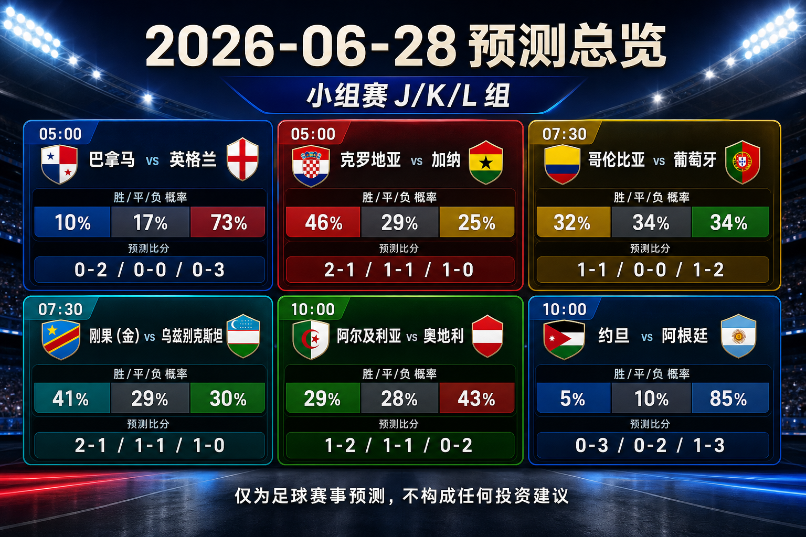

# WorldCup-Predictor-2026

[English](README.md) | [简体中文](docs/README.zh-CN.md) | [Changelog](CHANGELOG.md)


Track the 2026 FIFA World Cup schedule, publish match-by-match predictions, and review every prediction after the final whistle.

## Dashboard

| Item | Status |
| --- | --- |
| Data snapshot | 2026-06-27 |
| Tournament window | 2026-06-11 to 2026-07-19 |
| Official match count | 104 |
| Tracked matches in repository | 72 |
| Predictions published | 72 |
| Final results tracked | 66 |
| Post-match reviews published | 66 |
## Next Matches

| Match | Stage | Kickoff | Venue | Prediction |
| --- | --- | --- | --- | --- |
| Panama vs England | Group L | 2026-06-27 21:00 UTC / 2026-06-28 05:00 China time | New York New Jersey Stadium | [England win, 0-2](predictions/match-067-pan-eng.md) / [简体中文](predictions/match-067-pan-eng.zh-CN.md) |
| Croatia vs Ghana | Group L | 2026-06-27 21:00 UTC / 2026-06-28 05:00 China time | Philadelphia Stadium | [Croatia win, 2-1](predictions/match-068-cro-gha.md) / [简体中文](predictions/match-068-cro-gha.zh-CN.md) |
| Colombia vs Portugal | Group K | 2026-06-27 23:30 UTC / 2026-06-28 07:30 China time | Miami Stadium | [Draw, 1-1](predictions/match-069-col-por.md) / [简体中文](predictions/match-069-col-por.zh-CN.md) |
| Congo DR vs Uzbekistan | Group K | 2026-06-27 23:30 UTC / 2026-06-28 07:30 China time | Atlanta Stadium | [Congo DR win, 2-1](predictions/match-070-cod-uzb.md) / [简体中文](predictions/match-070-cod-uzb.zh-CN.md) |
| Algeria vs Austria | Group J | 2026-06-28 02:00 UTC / 2026-06-28 10:00 China time | Kansas City Stadium | [Austria win, 1-2](predictions/match-071-alg-aut.md) / [简体中文](predictions/match-071-alg-aut.zh-CN.md) |
| Jordan vs Argentina | Group J | 2026-06-28 02:00 UTC / 2026-06-28 10:00 China time | Dallas Stadium | [Argentina win, 0-3](predictions/match-072-jor-arg.md) / [简体中文](predictions/match-072-jor-arg.zh-CN.md) |
## Daily Overview Card

[](reports/daily/2026-06-28.md)

The overview card groups the same China-time date into one share image and links each scoreline scenario to its own rationale.
## Featured Prediction Image Sets

[](predictions/match-001-mex-rsa.md)
[](predictions/match-002-kor-cze.md)
[](predictions/match-003-can-bih.md)
[](predictions/match-004-usa-par.md)
[](predictions/match-005-hai-sco.md)
[](predictions/match-006-aus-tur.md)
[](predictions/match-007-bra-mar.md)
[](predictions/match-008-qat-sui.md)
[](predictions/match-009-civ-ecu.md)
[](predictions/match-010-ger-cuw.md)
[](predictions/match-011-ned-jpn.md)
[](predictions/match-012-swe-tun.md)
[](predictions/match-013-ksa-uru.md)
[](predictions/match-014-esp-cpv.md)
[](predictions/match-015-irn-nzl.md)
[](predictions/match-016-bel-egy.md)
[](predictions/match-017-fra-sen.md)
[](predictions/match-018-irq-nor.md)
[](predictions/match-019-arg-alg.md)
[](predictions/match-020-aut-jor.md)
[](predictions/match-021-gha-pan.md)
[](predictions/match-022-eng-cro.md)
[](predictions/match-023-por-cod.md)
[](predictions/match-024-uzb-col.md)
[](predictions/match-025-cze-rsa.md)
[](predictions/match-026-sui-bih.md)
[](predictions/match-027-can-qat.md)
[](predictions/match-028-mex-kor.md)
[](predictions/match-029-bra-hai.md)
[](predictions/match-030-sco-mar.md)
[](predictions/match-031-tur-par.md)
[](predictions/match-032-usa-aus.md)
[](predictions/match-033-ger-civ.md)
[](predictions/match-034-ecu-cuw.md)
[](predictions/match-035-ned-swe.md)
[](predictions/match-036-tun-jpn.md)
[](predictions/match-037-uru-cpv.md)
[](predictions/match-038-esp-ksa.md)
[](predictions/match-039-bel-irn.md)
[](predictions/match-040-nzl-egy.md)
[](predictions/match-041-nor-sen.md)
[](predictions/match-042-fra-irq.md)
[](predictions/match-043-arg-aut.md)
[](predictions/match-044-jor-alg.md)
[](predictions/match-045-eng-gha.md)
[](predictions/match-046-pan-cro.md)
[](predictions/match-047-por-uzb.md)
[](predictions/match-048-col-cod.md)
[](predictions/match-049-sco-bra.md)
[](predictions/match-050-mar-hai.md)
[](predictions/match-051-sui-can.md)
[](predictions/match-052-bih-qat.md)
[](predictions/match-053-cze-mex.md)
[](predictions/match-054-rsa-kor.md)
[](predictions/match-055-cuw-civ.md)
[](predictions/match-056-ecu-ger.md)
[](predictions/match-057-jpn-swe.md)
[](predictions/match-058-tun-ned.md)
[](predictions/match-059-tur-usa.md)
[](predictions/match-060-par-aus.md)
[](predictions/match-061-nor-fra.md)
[](predictions/match-062-sen-irq.md)
[](predictions/match-063-egy-irn.md)
[](predictions/match-064-nzl-bel.md)
[](predictions/match-065-cpv-ksa.md)
[](predictions/match-066-uru-esp.md)
[](predictions/match-067-pan-eng.md)
[](predictions/match-068-cro-gha.md)
[](predictions/match-069-col-por.md)
[](predictions/match-070-cod-uzb.md)
[](predictions/match-071-alg-aut.md)
[](predictions/match-072-jor-arg.md)

Share images live under [`assets/cards/`](assets/cards/). Each prediction embeds a fixture-only lead image first and the result prediction card second.
## Today

Reviews are now complete for all verified finals through Match 066. The next China-time matchday window covers Panama vs England, Croatia vs Ghana, Colombia vs Portugal, Congo DR vs Uzbekistan, Algeria vs Austria, and Jordan vs Argentina. Calibration now raises favorite-margin tails after Belgium, France, and Senegal blowouts while keeping draw protection for tight final-round qualification games.
## Reasoning Model

All prediction reasoning is specified to use the ChatGPT 5.5 ultra-high reasoning model.

The repository publishes concise reasoning summaries only. It does not store hidden chain-of-thought or private reasoning traces.

## Platform Announcement Copy

During the World Cup, social-platform posts explain that the account uses ChatGPT's highest reasoning model for match-by-match football predictions, including outcome lean, projected scoreline, confidence, and key risks. Ready-to-publish English and Simplified Chinese copy is maintained in [Platform Publishing Copy](docs/platform-copy.md).

## How The Repository Works

- `data/` stores structured schedule, team, venue, ranking, prediction, result, and review indexes.
- `predictions/` stores immutable pre-match prediction files.
- `reviews/` stores post-match reviews after official results are confirmed.
- `reports/daily/` stores daily tracking reports.
- `docs/` stores methodology, sources, and data schema documentation.

Each match moves through this lifecycle:

```text
scheduled -> predicted -> live -> final -> reviewed
```

## Current Artifacts

- Latest prediction: [Match 072: Jordan vs Argentina](predictions/match-072-jor-arg.md)
- Latest review: [Match 066: Uruguay vs Spain](reviews/match-066-uru-esp.md)
- Latest daily report: [2026-06-28](reports/daily/2026-06-28.md)
- Methodology: [Prediction and review methodology](docs/methodology.md) / [简体中文](docs/methodology.zh-CN.md)
- Calibration: [Prediction calibration](docs/prediction-calibration.md) / [简体中文](docs/prediction-calibration.zh-CN.md)
- Data schema: [Repository data schema](docs/data-schema.md) / [简体中文](docs/data-schema.zh-CN.md)
- Sources: [Source policy and current source list](docs/sources.md) / [简体中文](docs/sources.zh-CN.md)
## Roadmap

- [x] Create the repository and bilingual documentation.
- [x] Document the prediction reasoning model.
- [x] Add data, prediction, review, and report structure.
- [x] Publish the first pre-match prediction.
- [ ] Expand `data/matches.json` to the full 104-match official schedule.
- [ ] Add full squad snapshots for all 48 teams.
- [ ] Create daily updates during the tournament.
- [ ] Publish post-match reviews after each final result.
