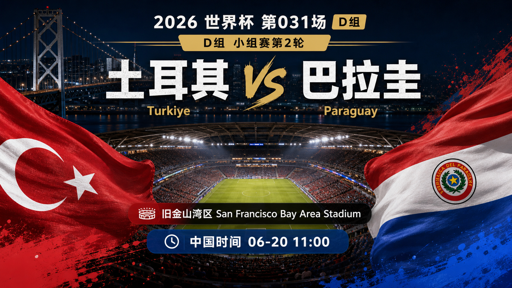
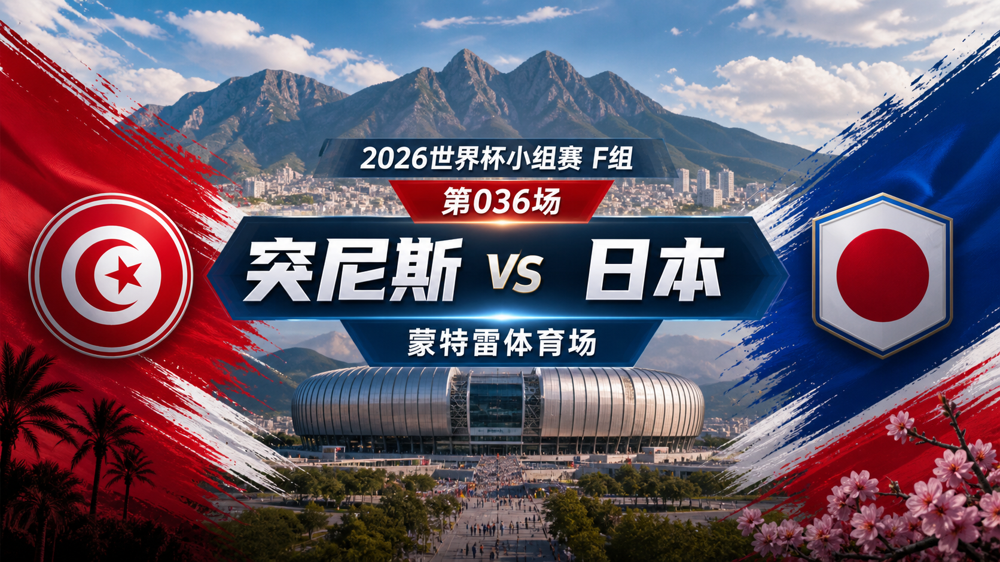
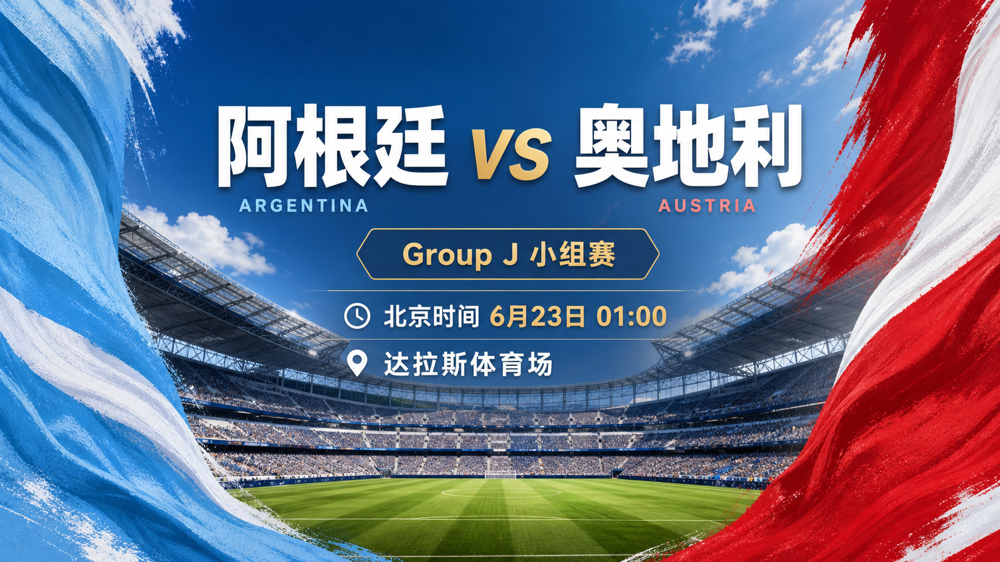
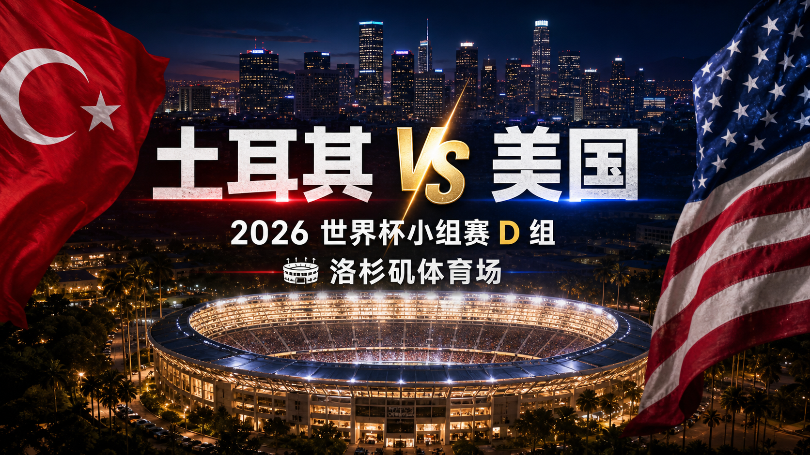

# WorldCup-Predictor-2026

[English](../README.md) | [更新日志](../CHANGELOG.md)

本仓库跟踪 2026 年 FIFA 世界杯赛程，发布逐场赛前预测，并在终场后复盘每一条预测。

## 仪表盘

| 项目 | 状态 |
| --- | --- |
| 数据快照 | 2026-07-01 |
| 赛事窗口 | 2026-06-11 至 2026-07-19 |
| 官方比赛总数 | 104 |
| 仓库已跟踪比赛 | 82 |
| 已发布预测 | 82 |
| 已跟踪完赛结果 | 79 |
| 已发布赛后复盘 | 79 |
## 近期比赛

| 比赛 | 阶段 | 开球 | 场地 | 预测 |
| --- | --- | --- | --- | --- |
| 英格兰 vs 刚果（金） | 32 强赛 | 2026-07-01 16:00 UTC / 2026-07-02 00:00 中国时间 | Atlanta Stadium | [英格兰胜，1-0](../predictions/match-080-eng-cod.zh-CN.md) / [English](../predictions/match-080-eng-cod.md) |
| 比利时 vs 塞内加尔 | 32 强赛 | 2026-07-01 20:00 UTC / 2026-07-02 04:00 中国时间 | Seattle Stadium | [比利时胜，2-1](../predictions/match-082-bel-sen.zh-CN.md) / [English](../predictions/match-082-bel-sen.md) |
| 美国 vs 波黑 | 32 强赛 | 2026-07-02 00:00 UTC / 2026-07-02 08:00 中国时间 | San Francisco Bay Area Stadium | [美国胜，2-1](../predictions/match-081-usa-bih.zh-CN.md) / [English](../predictions/match-081-usa-bih.md) |
## 每日总览图

[](../reports/daily/2026-07-02.zh-CN.md)

总览图记录这个中国时间三场 32 强赛窗口，包含概率、比分情景和赛程路径策略备注。
## 预测首图

[](../predictions/match-001-mex-rsa.zh-CN.md)
[](../predictions/match-002-kor-cze.zh-CN.md)
[](../predictions/match-003-can-bih.zh-CN.md)
[](../predictions/match-004-usa-par.zh-CN.md)
[](../predictions/match-005-hai-sco.zh-CN.md)
[](../predictions/match-006-aus-tur.zh-CN.md)
[](../predictions/match-007-bra-mar.zh-CN.md)
[](../predictions/match-008-qat-sui.zh-CN.md)
[](../predictions/match-009-civ-ecu.zh-CN.md)
[](../predictions/match-010-ger-cuw.zh-CN.md)
[](../predictions/match-011-ned-jpn.zh-CN.md)
[](../predictions/match-012-swe-tun.zh-CN.md)
[](../predictions/match-013-ksa-uru.zh-CN.md)
[](../predictions/match-014-esp-cpv.zh-CN.md)
[](../predictions/match-015-irn-nzl.zh-CN.md)
[](../predictions/match-016-bel-egy.zh-CN.md)
[](../predictions/match-017-fra-sen.zh-CN.md)
[](../predictions/match-018-irq-nor.zh-CN.md)
[](../predictions/match-019-arg-alg.zh-CN.md)
[](../predictions/match-020-aut-jor.zh-CN.md)
[](../predictions/match-021-gha-pan.zh-CN.md)
[](../predictions/match-022-eng-cro.zh-CN.md)
[](../predictions/match-023-por-cod.zh-CN.md)
[](../predictions/match-024-uzb-col.zh-CN.md)
[](../predictions/match-025-cze-rsa.zh-CN.md)
[](../predictions/match-026-sui-bih.zh-CN.md)
[](../predictions/match-027-can-qat.zh-CN.md)
[](../predictions/match-028-mex-kor.zh-CN.md)
[](../predictions/match-029-bra-hai.zh-CN.md)
[](../predictions/match-030-sco-mar.zh-CN.md)
[](../predictions/match-031-tur-par.zh-CN.md)
[](../predictions/match-032-usa-aus.zh-CN.md)
[](../predictions/match-033-ger-civ.zh-CN.md)
[](../predictions/match-034-ecu-cuw.zh-CN.md)
[](../predictions/match-035-ned-swe.zh-CN.md)
[](../predictions/match-036-tun-jpn.zh-CN.md)
[](../predictions/match-037-uru-cpv.zh-CN.md)
[](../predictions/match-038-esp-ksa.zh-CN.md)
[](../predictions/match-039-bel-irn.zh-CN.md)
[](../predictions/match-040-nzl-egy.zh-CN.md)
[](../predictions/match-041-nor-sen.zh-CN.md)
[](../predictions/match-042-fra-irq.zh-CN.md)
[](../predictions/match-043-arg-aut.zh-CN.md)
[](../predictions/match-044-jor-alg.zh-CN.md)
[](../predictions/match-045-eng-gha.zh-CN.md)
[](../predictions/match-046-pan-cro.zh-CN.md)
[](../predictions/match-047-por-uzb.zh-CN.md)
[](../predictions/match-048-col-cod.zh-CN.md)
[](../predictions/match-049-sco-bra.zh-CN.md)
[](../predictions/match-050-mar-hai.zh-CN.md)
[](../predictions/match-051-sui-can.zh-CN.md)
[](../predictions/match-052-bih-qat.zh-CN.md)
[](../predictions/match-053-cze-mex.zh-CN.md)
[](../predictions/match-054-rsa-kor.zh-CN.md)
[](../predictions/match-055-cuw-civ.zh-CN.md)
[](../predictions/match-056-ecu-ger.zh-CN.md)
[](../predictions/match-057-jpn-swe.zh-CN.md)
[](../predictions/match-058-tun-ned.zh-CN.md)
[](../predictions/match-059-tur-usa.zh-CN.md)
[](../predictions/match-060-par-aus.zh-CN.md)
[](../predictions/match-061-nor-fra.zh-CN.md)
[](../predictions/match-062-sen-irq.zh-CN.md)
[](../predictions/match-063-egy-irn.zh-CN.md)
[](../predictions/match-064-nzl-bel.zh-CN.md)
[](../predictions/match-065-cpv-ksa.zh-CN.md)
[](../predictions/match-066-uru-esp.zh-CN.md)
[](../predictions/match-067-pan-eng.zh-CN.md)
[](../predictions/match-068-cro-gha.zh-CN.md)
[](../predictions/match-069-col-por.zh-CN.md)
[](../predictions/match-070-cod-uzb.zh-CN.md)
[](../predictions/match-071-alg-aut.zh-CN.md)
[](../predictions/match-072-jor-arg.zh-CN.md)

[](../predictions/match-073-rsa-can.zh-CN.md)
[](../predictions/match-074-ger-par.zh-CN.md)
[](../predictions/match-075-ned-mar.zh-CN.md)
[](../predictions/match-076-bra-jpn.zh-CN.md)
[](../predictions/match-077-fra-swe.zh-CN.md)
[](../predictions/match-078-civ-nor.zh-CN.md)
[](../predictions/match-079-mex-ecu.zh-CN.md)
[](../predictions/match-080-eng-cod.zh-CN.md)
[](../predictions/match-081-usa-bih.zh-CN.md)
[](../predictions/match-082-bel-sen.zh-CN.md)
分享图片位于 [`assets/cards/`](../assets/cards/)。每场预测先嵌入不含赛果暗示的首图，再嵌入结果预测配图。
## 今日状态

第 073 场已经完成复盘：加拿大 1-0 击败南非，命中加拿大胜出方向，但实际总进球更低。下一组中国时间窗口包括巴西 vs 日本、德国 vs 巴拉圭、荷兰 vs 摩洛哥；所有预测都把淘汰赛路径激励处理为胜出后的资源管理，而不是输球获益。
## 推理模型

全部预测指定使用 ChatGPT 5.5 ultra-high reasoning model。

仓库只发布精简推理摘要，不保存隐藏推理链或私有推理轨迹。

## 平台说明文案

世界杯期间，社交平台发布内容会说明账号使用 ChatGPT 最高推理模型进行逐场足球预测，包括赛果倾向、预测比分、置信度和关键风险。可直接发布的中英文说明文案维护在 [平台发布文案](platform-copy.zh-CN.md)。

## 仓库结构

- `data/` 存储赛程、球队、场馆、排名、预测、结果和复盘索引。
- `predictions/` 存储赛前预测文件。
- `reviews/` 存储官方结果确认后的赛后复盘。
- `reports/daily/` 存储每日跟踪报告。
- `docs/` 存储方法论、来源和数据结构文档。

比赛生命周期：

```text
scheduled -> predicted -> live -> final -> reviewed
```

## 当前产物

- 最新预测：[第 082 场：比利时 vs 塞内加尔](../predictions/match-082-bel-sen.zh-CN.md)
- 最新复盘：[第 079 场：墨西哥 vs 厄瓜多尔](../reviews/match-079-mex-ecu.zh-CN.md)
- 最新日报：[2026-07-02](../reports/daily/2026-07-02.zh-CN.md)
- 方法论：[Prediction and review methodology](methodology.md) / [简体中文](methodology.zh-CN.md)
- 校准：[Prediction calibration](prediction-calibration.md) / [简体中文](prediction-calibration.zh-CN.md)
- 数据结构：[Repository data schema](data-schema.md) / [简体中文](data-schema.zh-CN.md)
- 来源：[Source policy and current source list](sources.md) / [简体中文](sources.zh-CN.md)
## 路线图

- [x] 创建仓库和双语文档。
- [x] 记录预测推理模型。
- [x] 增加数据、预测、复盘和日报结构。
- [x] 发布首场赛前预测。
- [ ] 将 `data/matches.json` 扩展到官方 104 场完整赛程。
- [ ] 增加 48 支球队完整名单快照。
- [ ] 赛事期间持续创建每日更新。
- [ ] 每场完赛后发布赛后复盘。
