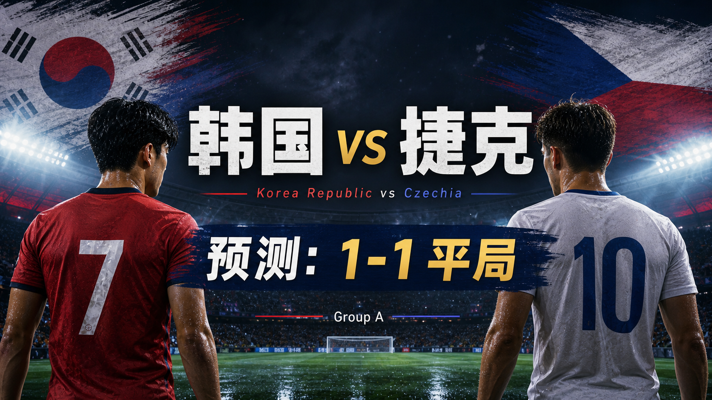

# Match 002: Korea Republic vs Czechia

[Dashboard](../README.md) | [简体中文](match-002-kor-cze.zh-CN.md) | [Daily report](../reports/daily/2026-06-11.md)

## Share Image



Image generation instruction:

```text
$imagegen: 生成【社交平台赛事预测配图】，16:9 横版，主标题使用简体中文“韩国 vs 捷克”，副标题可保留英文“Korea Republic vs Czechia”，世界杯小组赛氛围，足球场、球队配色元素，真实位图图片，用于抖音、小红书、微博和微信分享；不要生成 SVG，不要生成 HTML，不要生成代码图，不要生成线框图，不要使用官方 FIFA 标志或水印；不要出现任何诱导性金融词汇。
```

## Prediction

| Outcome | Probability |
| --- | ---: |
| Korea Republic win | 34% |
| Draw | 35% |
| Czechia win | 31% |

- Predicted winner: Draw
- Predicted scoreline: Korea Republic 1-1 Czechia
- Confidence: medium-low
- Model: ChatGPT 5.5 ultra-high reasoning

## Factual Basis

- Official fixture: Korea Republic vs Czechia is Match 002 in Group A, scheduled for 2026-06-12 02:00 UTC at Estadio Guadalajara.
- Beijing-time context: kickoff is 2026-06-12 10:00 CST, the second match starting on 2026-06-12 for the China audience.
- Group context: the result follows the opening Mexico vs South Africa match and shapes the first Group A table.
- Ranking snapshot: the repository records Korea Republic at FIFA rank 25 and Czechia at rank 41, so Korea Republic hold a narrow ranking edge but not a decisive one.
- Squad context: FIFA has published final squad lists. Public previews highlight Korea Republic's Son Heung-min, Lee Kang-in, Hwang Hee-chan, Kim Min-jae, and Czechia's Tomas Soucek, Patrik Schick, Vladimir Coufal, and Antonin Barak as important reference points.
- Availability context: Sports Mole reports no confirmed unavailable players for either side in its current preview. The repository still does not store final matchday lineups.
- Venue and weather context: Guadalajara is neutral for both teams. AccuWeather's tournament weather tracker flags shower and thunderstorm risk around the Guadalajara night match window, which can slow tempo and favor structured teams.
- Data limits: no repository-stored player-level records, final starting lineups, official injury bulletin, live weather feed, or verified public forecast movement snapshot is available.

## Prediction Coverage Checklist

| Dimension | Snapshot status | Confidence impact |
| --- | --- | --- |
| Tactics | Korea Republic should seek faster wide-to-inside combinations through Son, Lee, and Hwang profiles; Czechia can lean on compact midfield spacing, aerial duels, set pieces, and Schick as a penalty-area reference. | Makes the match tactically balanced rather than a clear ranking-led favorite call. |
| Players | Key-player profiles are covered from FIFA squad publication and public previews, but the repository lacks full player records and confirmed roles. | Supports a cautious draw lean. |
| Injuries / suspensions | Current public preview checked lists no confirmed unavailable players for either side. | Keeps both match plans credible. |
| Schedule / rest / travel | Both teams play in Mexico at a neutral venue in the first group window. Neither side has home-country advantage. | Reduces asymmetry and supports a narrow-margin forecast. |
| Head-to-head and tournament history | No decisive recent tournament-history signal is stored. The forecast relies more on current team shape, style, and venue context. | History does not move the call. |
| Public sentiment / media narrative | Fox and MLS-style Group A previews frame this as a tight second match after the opener, with Korea Republic's star power balanced by Czechia's physical structure. | Supports low-margin expectations. |
| Weather / venue conditions | Guadalajara evening rain/thunderstorm risk is a current watch item. A wet pitch can reduce clean passing speed and increase set-piece value. | Slightly supports the draw and Czechia resistance. |
| Psychology / pressure / motivation | Both teams will know the opening-match result. A draw may remain useful if the game is level late. | Raises late-game risk management likelihood. |
| Public forecast movement | No repository-stored movement snapshot is available; promotional or financial language is intentionally excluded from this prediction. | Not used as confirmed evidence. |
| Expert views | Sports Mole projects a draw; other current previews emphasize Korea Republic's ranking/star edge but do not make it a heavy-favorite setup. | Supports the 1-1 call. |

## Prediction Logic

1. **Korea Republic start slightly ahead, but not enough to dominate the forecast.** Ranking and attacking star profiles give them the first edge, especially through Son and Lee between lines.
2. **Czechia are built to keep this kind of match close.** Their route is not just defensive. Soucek and Schick raise set-piece and penalty-area value, while the midfield can slow Korea Republic's transitions.
3. **Neutral venue and weather risk reduce the favorite premium.** Guadalajara does not add a home advantage for either side, and a wet surface would make execution more uneven.
4. **The match-state incentives point toward caution.** If it is level after 60 minutes, both teams may avoid overextending in the first group game.
5. **Scoreline call: 1-1.** Korea Republic are more likely to create the cleaner transition moments, but Czechia have enough physical and set-piece threat to answer.

## Risk Factors

- A confirmed aggressive Korea Republic front four could raise their win probability.
- Czechia set pieces are the clearest path to flipping the match.
- Rain, pitch speed, or an early goal could push the game away from the draw script.
- If Korea Republic score first and force Czechia to chase, the match may open up quickly.
- If Czechia control aerial duels and second balls, Korea Republic's transition edge may be muted.

## Platform Share Copy

### Douyin / 抖音

世界杯 A 组预测：韩国 vs 捷克。
我倾向 1-1 平局。韩国有排名和前场球星优势，但捷克的身体对抗、定位球和禁区支点足以把比赛拉回均势。
仅为足球赛事预测，不构成任何投资建议。

### Xiaohongshu / 小红书

韩国 vs 捷克赛前预测：1-1。
韩国的优势在于前场个人能力和转换速度；捷克的优势在于防守纪律、二点球和定位球。中立场地加上可能的雨战，让这场更像一球差或平局。
仅为足球赛事预测，不构成任何投资建议。

### Weibo / 微博

A 组预测：韩国 1-1 捷克。韩国略占排名和球星优势，但捷克的身体对抗、定位球和禁区支点会让比赛很难拉开。信心等级：中低。
仅为足球赛事预测，不构成任何投资建议。#世界杯# #WorldCup2026#

### WeChat / 微信

韩国 vs 捷克的预测是 1-1 平局。

韩国的优势来自前场个人能力、转换速度和排名信号；捷克的优势来自中场对抗、定位球和禁区支点。比赛在 Guadalajara 中立场地进行，且当前天气信息提示夜间雨水风险，这会降低流畅推进的稳定性。

因此本场不是强倾向判断。若韩国先取得领先，胜率会上升；若捷克把比赛拖入身体对抗和定位球节奏，平局会成为更合理的落点。仅为足球赛事预测，不构成任何投资建议。

## Disclaimer

This is a football match prediction only. It does not constitute investment advice, financial advice, or any guarantee of outcome.

仅为足球赛事预测，不构成任何投资建议、财务建议或结果承诺。

## Source Snapshot

- FIFA schedule page: https://www.fifa.com/en/tournaments/mens/worldcup/canadamexicousa2026
- FIFA match schedule PDF: https://digitalhub.fifa.com/asset/4b5d4417-3343-4732-9cdf-14b6662af407/FWC26-Match-Schedule_English.pdf
- FIFA squad list PDF: https://fdp.fifa.org/assetspublic/ce281/pdf/SquadLists-English.pdf
- FIFA Korea Republic ranking page: https://inside.fifa.com/fifa-world-ranking/KOR?gender=men
- FIFA Czechia ranking page: https://inside.fifa.com/fifa-world-ranking/CZE?gender=men
- Fox matchday-one overview: https://www.foxsports.com/stories/soccer/world-cup-match-day-1-mexico-south-africa-south-korea-czechia
- MLS Group A preview: https://www.mlssoccer.com/news/2026-fifa-world-cup-group-a-preview-mexico-south-africa-south-korea-czechia
- Sports Mole Korea Republic vs Czechia team news and preview: https://www.sportsmole.co.uk/football/south-korea/world-cup-2026/preview/south-korea-vs-czech-republic-prediction-team-news-lineups_598872.html
- AccuWeather World Cup weather tracker: https://www.accuweather.com/en/sports/live-news/world-cup-2026-weather-updates-forecasts-for-key-matches-stadium-conditions-and-fan-impacts/1898671
