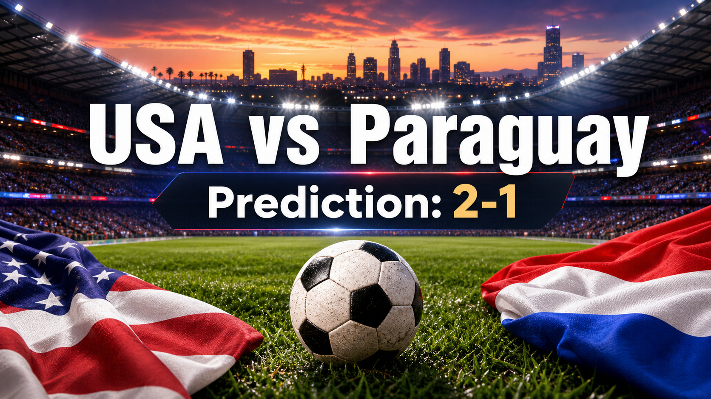

# 第 004 场：美国 vs 巴拉圭

[首页](../docs/README.zh-CN.md) | [English](match-004-usa-par.md) | [日报](../reports/daily/2026-06-10.zh-CN.md)

## 预测配图



配图生成指令：

```text
$imagegen: 生成【社交平台赛事预测配图】，16:9 横版，主标题使用简体中文“美国 vs 巴拉圭”，副标题可保留英文“USA vs Paraguay”，世界杯小组赛氛围，足球场、球队配色元素，真实位图图片，用于抖音、小红书、微博和微信分享；不要生成 SVG，不要生成 HTML，不要生成代码图，不要生成线框图，不要使用官方 FIFA 标志或水印。
```

## 预测

| 结果 | 概率 |
| --- | ---: |
| 美国胜 | 55% |
| 平局 | 25% |
| 巴拉圭胜 | 20% |

- 预测胜者：美国
- 预测比分：USA 2-1 Paraguay
- 信心等级：中等
- 模型：ChatGPT 5.5 ultra-high reasoning

## 事实依据

- 官方赛程：USA vs Paraguay 是 2026 年 FIFA 世界杯 D 组 比赛。
- 开球时间和场地：2026-06-13 01:00 UTC，Los Angeles Stadium。
- 当前仓库快照已纳入官方赛程、球队、场地和 FIFA 排名信息。
- 数据缺口：当前快照尚未包含确认首发、球员级名单、伤病停赛、赔率变动或专家观点数据。

## 预测覆盖检查

| 维度 | 快照状态 | 对信心的影响 |
| --- | --- | --- |
| 战术 | 已按基础比赛脚本覆盖：美国拥有主场和排名优势，但巴拉圭防守硬度、转换和定位球会压低确定性。 | 支持当前倾向，但具体战术尚未确认。 |
| 球员 | 已通过球队强度、排名和名单发布状态进行团队层面覆盖。 | 球员级数据不足限制信心。 |
| 伤病 / 停赛 | 当前仓库快照未确认。 | 可用性缺口降低确定性。 |
| 赛程 / 休息 / 旅行 | 已覆盖开球时间、场地和开赛窗口。 | 支持赛程风险判断。 |
| 历史 | 当前快照仅作小组赛首轮和场地背景参考。 | 不作为决定性依据。 |
| 舆情 | 尚未从可靠当前来源验证。 | 不作为已确认信号使用。 |
| 天气 / 场馆条件 | 已覆盖场地；比赛日天气尚未验证。 | 天气仍需赛前跟踪。 |
| 心理 | 已覆盖首轮压力和小组赛动机。 | 提高比赛方差。 |
| 赔率变动 | 暂未纳入，因为仓库尚未保存可靠赔率快照。 | 缺少市场确认。 |
| 专家观点 | 暂未纳入，因为仓库尚未保存专家来源快照。 | 缺少专家共识参考。 |

## 预测逻辑

1. **基础实力先定基准。** 当前排名和场地背景是主要量化信号。
2. **小组赛首轮降低激进程度。** 首场比赛通常更重视风险控制。
3. **弱势方仍有明确路径。** 防守阵型、定位球、转换进攻或早段事件都可能改变局面。
4. **比分判断来自预期比赛脚本。** 当前比分预测在优势方条件和杯赛波动之间做平衡。

## 风险因素

- 最终首发、伤病和战术选择尚未锁定到仓库快照中。
- 定位球、早段进球、红牌或门将失误可能显著改变比赛状态。
- 如果优势方不能先进球，平局概率会上升。

## 平台发布文案

### 抖音

世界杯 D 组 预测：美国 vs 巴拉圭。我倾向 USA 2-1 Paraguay。判断依据包括官方赛程、场地、排名快照和主要风险路径。仅为足球赛事预测，不构成任何投资建议。

### 小红书

美国 vs 巴拉圭 赛前预测：USA 2-1 Paraguay。我会把战术、球员、伤病、赛程、历史、舆情、天气、心理、赔率和专家观点都作为检查维度；当前缺口会降低信心等级。仅为足球赛事预测，不构成任何投资建议。

### 微博

D 组 预测：USA 2-1 Paraguay。依据是官方赛程、排名快照、场地环境和比赛风险。仅为足球赛事预测，不构成任何投资建议。#世界杯# #WorldCup2026#

### 微信

美国 vs 巴拉圭 的预测是 USA 2-1 Paraguay。当前判断来自官方赛程、场地、FIFA 排名快照和小组赛首轮风险控制。仅为足球赛事预测，不构成任何投资建议。

## 免责声明

This is a football match prediction only. It does not constitute investment advice, betting advice, financial advice, or any guarantee of outcome.

仅为足球赛事预测，不构成任何投资建议、博彩建议、财务建议或结果承诺。

## 来源快照

- FIFA 赛程页：https://www.fifa.com/en/tournaments/mens/worldcup/canadamexicousa2026/articles/match-schedule-fixtures-results-teams-stadiums
- FIFA 更新时间表公告：https://vod.fifa.com/organisation/media-releases/updated-world-cup-2026-match-schedule-venues-kick-off-times-104-matches
- FIFA 赛程 PDF：https://digitalhub.fifa.com/asset/4b5d4417-3343-4732-9cdf-14b6662af407/FWC26-Match-Schedule_English.pdf
- FIFA USA 排名页：https://inside.fifa.com/fifa-world-ranking/USA?gender=men
- FIFA PAR 排名页：https://inside.fifa.com/fifa-world-ranking/PAR?gender=men
