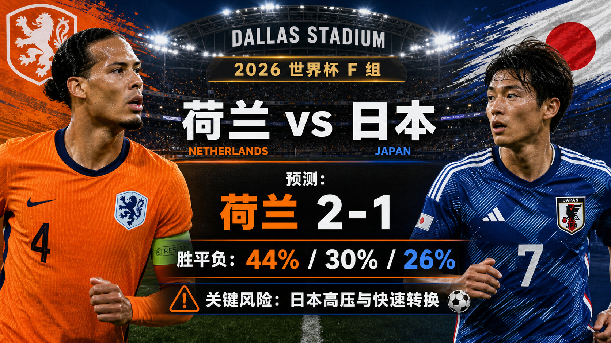

# Match 011: Netherlands vs Japan

[Dashboard](../README.md) | [简体中文](match-011-ned-jpn.zh-CN.md) | [Daily report](../reports/daily/2026-06-15.md)

## Share Image




Lead image generation instruction:

```text
$imagegen: Generate a social-platform fixture lead image, 16:9 landscape, realistic raster bitmap, showing only matchup, stage, city/venue atmosphere, and team colors; Simplified Chinese must be used for main match information on Chinese document artwork, with English team names/event text allowed only as secondary text; no scoreline, no predicted winner, no probability, no win/draw/loss or result-hint words; do not generate SVG, HTML, code images, wireframes, official FIFA logos, or watermarks.
```

Prediction card generation instruction:

```text
$imagegen: Generate a social-platform match prediction card, 16:9 landscape, realistic raster bitmap, for Douyin, Xiaohongshu, Weibo, and WeChat sharing; Simplified Chinese must be used for main match information on Chinese document artwork, with English team names/event text allowed only as secondary text; do not generate SVG, HTML, code images, wireframes, official FIFA logos, or watermarks.
```

## Prediction

| Outcome | Probability |
| --- | ---: |
| Netherlands win | 44% |
| Draw | 30% |
| Japan win | 26% |

- Predicted winner: NED
- Predicted scoreline: 2-1
- Confidence: medium-low
- Model: ChatGPT 5.5 ultra-high reasoning

## Scoreline Scenarios

| Scenario | Scoreline | Single-score estimate | Rationale |
| --- | --- | ---: | --- |
| primary | 2-1 | 11% | Netherlands control more phases but concede one transition chance. |
| conservative_draw_path | 1-1 | 10% | Japan's press keeps the match level and the favorite edge never fully materializes. |
| upside_alternate | 1-2 | 8% | A Japanese first goal turns the match into transition-heavy chasing for the Netherlands. |

## Factual Basis

- Official schedule context: Group F, Netherlands vs Japan, Dallas Stadium; China-time kickoff is 2026-06-15 04:00.
- FIFA's 2026-06-11 ranking snapshot has the Netherlands at No. 8 and Japan at No. 18.
- FOX/ESPN/RotoWire market and preview context give the Netherlands only a modest edge, with draw risk prominent.
- Final lineups and official late availability remain data gaps; this suppresses confidence.

## Prediction Coverage Checklist

| Dimension | Snapshot | Lean |
| --- | --- | --- |
| Tactics | Netherlands have the stronger defensive structure; Japan's high press and transition speed are credible upset paths. | mixed |
| Players | Netherlands hold the ranking and defensive-quality edge, but Japan's technical speed narrows the gap. | supports Netherlands |
| Injuries | Public previews mention availability concerns, but official matchday teams are not confirmed. | mixed |
| Schedule | Neutral-site opener with no clear rest or travel edge. | mixed |
| History | Older meetings exist but are too stale for heavy weight. | mixed |
| Public sentiment | Market/previews lean Netherlands while still treating Japan as a live challenger. | mixed |
| Weather | Dallas Stadium limits weather risk, but final match operations are not confirmed. | mixed |
| Psychology | Netherlands carry favorite pressure; Japan can lean into their recent tournament upset identity. | mixed |
| Odds movement | Available market pages show a tight favorite, so the draw floor stays around 30%. | supports draw |
| Expert views | Preview analysis points to Netherlands control against Japan's pressing/transition threat. | mixed |

## Prediction Logic

1. The Netherlands remain the better baseline team, especially through center-back quality and game control.
2. Japan's pressure can create high-value mistakes, so the favorite probability is pulled down and the draw stays high.
3. 2-1 best captures a match where the Netherlands edge control but cannot fully suppress Japan's transition chances.

## Risk Factors

- Japan's press can turn a Dutch buildup error into the first goal.
- If the Netherlands lack width or tempo, 1-1 becomes more likely.
- Late availability and starting elevens are still not confirmed.

## Platform Share Copy

### Douyin

World Cup Group F prediction: Netherlands vs Japan. I lean Netherlands win, 2-1. Key risk: the non-primary path remains live because final lineups are not confirmed. This is a match prediction only and does not constitute investment advice.

### Xiaohongshu

Netherlands vs Japan prediction: Netherlands win, 2-1. The latest calibration keeps draw risk visible instead of forcing a single-score story. This is a match prediction only and does not constitute investment advice.

### Weibo

Group F prediction: Netherlands win, 2-1. Probability split: NED 44%, draw 30%, JPN 26%. Confidence: medium-low. This is a match prediction only and does not constitute investment advice. #WorldCup2026#

### WeChat

Netherlands vs Japan prediction: Netherlands win, 2-1. The forecast uses official schedule/ranking checks plus current market and preview context. It is a football match prediction only and does not constitute investment advice.

Chinese copy for mainland platforms: 荷兰 vs 日本预测：荷兰 2-1。荷兰更稳，但日本高压和转换让平局、爆冷路径都很现实。仅为足球赛事预测，不构成任何投资建议。

## Disclaimer

This is a football match prediction only. It does not constitute investment advice, financial advice, betting advice, or any guarantee of outcome.

仅为足球赛事预测，不构成任何投资建议、财务建议、投注建议或结果承诺。

## Source Snapshot

- FIFA match centre: https://www.fifa.com/en/match-centre/match/17/285023/289273/400021470
- FOX Sports match page: https://www.foxsports.com/soccer/fifa-world-cup-men-netherlands-vs-japan-jun-14-2026-game-boxscore-647625
- Preview/market context: https://www.rotowire.com/soccer/article/netherlands-vs-japan-preview-predicted-lineups-team-news-tactical-analysis-2026-world-cup-group-f-117958
- FIFA home-team ranking: https://inside.fifa.com/fifa-world-ranking/NED?gender=men
- FIFA away-team ranking: https://inside.fifa.com/fifa-world-ranking/JPN?gender=men
- Verified at: 2026-06-14T13:14:35+08:00
