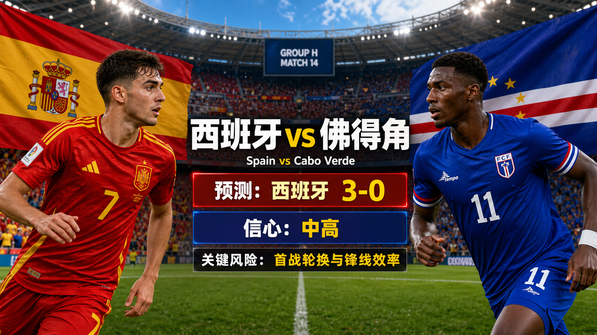

# Match 014: Spain vs Cabo Verde

[Dashboard](../README.md) | [简体中文](match-014-esp-cpv.zh-CN.md) | [Daily report](../reports/daily/2026-06-13.md)

## Share Image




Lead image generation instruction:

```text
$imagegen: 生成【社交平台赛事预测首图】，16:9 横版，真实位图图片，只展示赛事对阵、比赛阶段、城市/场馆氛围和球队色彩；中文文档配图的主要比赛信息必须使用简体中文，可在画面合适位置保留英文队名/赛事信息作为辅助文字；不输出比分，不输出预测胜负，不输出概率，不使用胜/平/负、晋级、爆冷等结果暗示词；不要生成 SVG，不要生成 HTML，不要生成代码图，不要生成线框图，不要使用官方 FIFA 标志或水印。
```

Result image generation instruction:

```text
$imagegen: 生成【社交平台赛事预测配图】，16:9 横版，真实位图图片，用于抖音、小红书、微博和微信分享；中文文档配图的主要比赛信息必须使用简体中文，可在画面合适位置保留英文队名/赛事信息作为辅助文字；不要生成 SVG，不要生成 HTML，不要生成代码图，不要生成线框图，不要使用官方 FIFA 标志或水印。
```

## Prediction

| Outcome | Probability |
| --- | ---: |
| Spain win | 78% |
| Draw | 15% |
| Cabo Verde win | 7% |

- Predicted winner: ESP
- Predicted scoreline: Spain vs Cabo Verde 3-0
- Confidence: medium-high
- Model: ChatGPT 5.5 ultra-high reasoning

## Scoreline Scenarios

| Scenario | Scoreline | Probability | Rationale |
| --- | --- | ---: | --- |
| Primary | 3-0 | 18% | Spain's possession control and counter-pressing pin Cabo Verde deep, creating enough volume for a multi-goal win. |
| Conservative / draw path | 1-1 | 6% | The draw path needs Spain to rotate or finish poorly while Cabo Verde convert one transition or set-piece chance. |
| Upside / alternate | 4-0 | 12% | An early Spain goal forces Cabo Verde out of their low block and opens wide-area overloads for a larger margin. |

## Factual Basis

- Official fixture: Match 014 is Spain vs Cabo Verde in Group H at Atlanta Stadium.
- Kickoff is 2026-06-15T16:00:00Z (2026-06-16 00:00 CST), placing it on the 2026-06-16 China-time slate.
- FIFA's 2026-06-11 ranking pages list Spain 2 and Cabo Verde 67.
- FIFA has confirmed final squads, while the repository still lacks final starting XIs and official matchday injury bulletins.
- The June 14 Fox preview, current venue/weather context, and public market framing were checked; unresolved late variables are reflected in the confidence rating.

## Prediction Coverage Checklist

| Dimension | Snapshot status | Confidence impact |
| --- | --- | --- |
| Tactics | Spain's expected possession, counter-pressing, and wide rotations give them the clearest tactical edge. | supports base lean with stated risk |
| Players | Ranking and squad-depth signals strongly favor Spain; Cabo Verde need goalkeeper performance, set pieces, and transition efficiency. | supports lean, but not high confidence alone |
| Injuries / suspensions | No official matchday medical bulletin or final starting XI is stored yet. | data gap lowers confidence |
| Schedule / rest / travel | FIFA kickoff, venue, local time, and China-time date were verified; all four matches are opening group fixtures. | mixed |
| History | Tournament history is low weight because current squads, coaching, and match state matter more. | low weight |
| Public sentiment | Preview context frames Spain as a clear Group H favorite, but the scoreline still depends on finishing and rotation choices. | context only, not proof |
| Weather / venue conditions | Atlanta's stadium environment lowers weather exposure, though roof and surface conditions still need matchday confirmation. | tactical and tempo risk |
| Psychology / pressure / motivation | Opening-match caution and favorite pressure are included; underdog motivation is not treated as a measurable edge. | mixed |
| Odds movement | Public preview and market framing were checked, but a timestamped odds-movement trail is not stored. | data gap |
| Expert views | FIFA ranking checks and the Fox June 14 preview support Spain as the strongest favorite among the four China-time matches. | supports published confidence |

## Prediction Logic

1. The three-way probabilities start from verified FIFA schedule/ranking data and are then adjusted for tactical matchup, squad depth, venue conditions, and first-match volatility.
2. The headline scoreline follows the strongest repeatable route: Spain's possession control and counter-pressing pin Cabo Verde deep, creating enough volume for a multi-goal win.
3. The draw or upset scenarios remain explicit because final lineups, injury/suspension details, odds movement, and matchday conditions are not fully stored.

## Risk Factors

- Spain rotation and finishing efficiency.
- Cabo Verde set pieces or a rare transition can change the first-half script.
- Final lineups and matchday medical bulletins are not yet stored.

## Platform Share Copy

### Douyin / 抖音

World Cup Group H prediction: Spain vs Cabo Verde. Lean: Spain win, 3-0. Scoreline paths: primary 3-0, draw-risk path 1-1, alternate 4-0.
仅为足球赛事预测，不构成任何投资建议。

### Xiaohongshu / 小红书

Spain vs Cabo Verde prediction: Spain win, 3-0. The main reason is tied to the primary scoreline: Spain's possession control and counter-pressing pin Cabo Verde deep, creating enough volume for a multi-goal win.
仅为足球赛事预测，不构成任何投资建议。

### Weibo / 微博

Group H prediction: Spain win, 3-0. Probability: ESP 78%, draw 15%, CPV 7%. Main alternate: 1-1 if the risk path lands.
仅为足球赛事预测，不构成任何投资建议。#WorldCup2026#

### WeChat / 微信

Spain vs Cabo Verde forecast: Spain win, 3-0. The prediction uses official fixture data, FIFA rankings, confirmed squad context, venue/weather checks, public preview context, and a specific rationale for each scoreline scenario. This is a football match prediction only and does not constitute investment advice. 仅为足球赛事预测，不构成任何投资建议。

## Disclaimer

This is a football match prediction only. It does not constitute investment advice, financial advice, or any guarantee of outcome.

仅为足球赛事预测，不构成任何投资建议、财务建议或结果承诺。

## Source Snapshot

- https://www.fifa.com/en/tournaments/mens/worldcup/canadamexicousa2026/articles/match-schedule-fixtures-results-teams-stadiums
- https://digitalhub.fifa.com/asset/4b5d4417-3343-4732-9cdf-14b6662af407/FWC26-Match-Schedule_English.pdf
- https://www.fourfourtwo.com/competition/world-cup-2026-fixtures-day-by-day
- https://www.fifa.com/en/articles/fifa-world-cup-2026-squads-confirmed
- https://www.fifa.com/en/match-centre/match/17/285023/289273/400021482
- https://www.foxsports.com/stories/soccer/world-cup-spain-cape-verde-uruguay-saudi-arabia-iran-belgium-egypt-new-zealand
- https://inside.fifa.com/fifa-world-ranking/ESP?gender=men
- https://inside.fifa.com/fifa-world-ranking/CPV?gender=men
- Verified at: 2026-06-15T21:49:26+08:00
