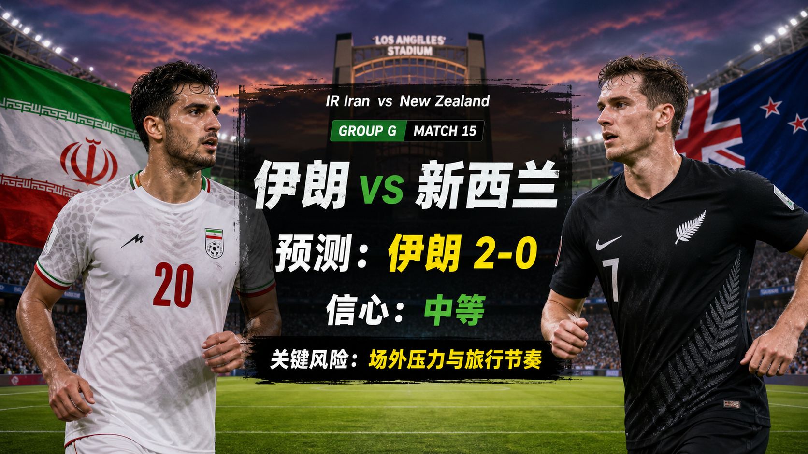

# Match 015: IR Iran vs New Zealand

[Dashboard](../README.md) | [简体中文](match-015-irn-nzl.zh-CN.md) | [Daily report](../reports/daily/2026-06-13.md)

## Share Image




Lead image generation instruction:

```text
$imagegen: 生成【社交平台赛事预测首图】，16:9 横版，真实位图图片，只展示赛事对阵、比赛阶段、城市/场馆氛围和球队色彩；中文文档配图的主要比赛信息必须使用简体中文，可在画面合适位置保留英文队名/赛事信息作为辅助文字；不输出比分，不输出预测胜负，不输出概率，不使用胜/平/负、晋级、爆冷等结果暗示词；不要生成 SVG，不要生成 HTML，不要生成代码图，不要生成线框图，不要使用官方 FIFA 标志或水印。
```

Result image generation instruction:

```text
$imagegen: 生成【社交平台赛事预测配图】，16:9 横版，真实位图图片，用于抖音、小红书、微博和微信分享；中文文档配图的主要比赛信息必须使用简体中文，可在画面合适位置保留英文队名/赛事信息作为辅助文字；不要生成 SVG，不要生成 HTML，不要生成代码图，不要生成线框图，不要使用官方 FIFA 标志或水印。
```

## Prediction

| Outcome | Probability |
| --- | ---: |
| IR Iran win | 62% |
| Draw | 24% |
| New Zealand win | 14% |

- Predicted winner: IRN
- Predicted scoreline: IR Iran vs New Zealand 2-0
- Confidence: medium
- Model: ChatGPT 5.5 ultra-high reasoning

## Factual Basis

- Official fixture: Match 015 is IR Iran vs New Zealand in Group G at Los Angeles Stadium.
- Kickoff is 2026-06-16T01:00:00Z; this falls inside the current 72-hour window from the actual automation run time.
- FIFA's 2026-06-11 ranking pages list IR Iran 20 and New Zealand 85.
- FIFA has confirmed final squads, but full player-level squad ingestion and final matchday injury bulletins remain data gaps.

## Prediction Coverage Checklist

| Dimension | Snapshot status | Confidence impact |
| --- | --- | --- |
| Tactics | Style matchup, pressing, transitions, and set pieces checked from group previews and team profiles. | mixed |
| Players | Key ranking, squad status, and headline player context checked. | supports lean |
| Injuries / suspensions | Official matchday medical bulletin is not stored yet. | data gap lowers confidence |
| Schedule / rest / travel | Kickoff, venue, neutral-site travel, and local timing verified. | mixed |
| History | Tournament history considered lightly because squads and coaches change. | low weight |
| Public sentiment | Media narrative and fan expectation checked as context, not proof. | mixed |
| Weather / venue conditions | City and venue context checked; matchday forecast is not stored. | data gap lowers confidence |
| Psychology | Opening-match caution, favorite pressure, and underdog motivation considered. | mixed |
| Odds movement | Public preview odds/context checked where available; movement snapshot not stored. | data gap |
| Expert views | Reputable group previews reviewed, with uncertainty kept in the confidence rating. | supports medium or lower confidence |

## Prediction Logic

1. The probability split prices the ranking and squad-quality signal while preserving draw risk for a first group match.
2. The match script leans toward IR Iran win, 2-0 because external pressure and New Zealand set pieces is the main route that can pull the game away from the base case.
3. Confidence stays below high because lineups, weather, and odds-movement snapshots are not fully verified in the repository.

## Risk Factors

- external pressure and New Zealand set pieces
- Final lineups and matchday medical bulletins are not yet stored.
- An early set-piece goal would materially change game state.

## Platform Share Copy

### Douyin / 抖音

World Cup Group G prediction: IR Iran vs New Zealand. I lean IR Iran win, 2-0; key risk: external pressure and New Zealand set pieces.
仅为足球赛事预测，不构成任何投资建议。

### Xiaohongshu / 小红书

IR Iran vs New Zealand prediction: IR Iran win, 2-0. Built from official schedule, FIFA rankings, squad status, and current preview context.
仅为足球赛事预测，不构成任何投资建议。

### Weibo / 微博

Group G prediction: IR Iran win, 2-0. Probability: IRN 62%, draw 24%, NZL 14%. Confidence: medium.
仅为足球赛事预测，不构成任何投资建议。#WorldCup2026#

### WeChat / 微信

IR Iran vs New Zealand forecast: IR Iran win, 2-0. This is based on verified fixture data, FIFA ranking pages, squad confirmation, and reputable preview context. This is a football match prediction only and does not constitute investment advice. 仅为足球赛事预测，不构成任何投资建议。

## Disclaimer

This is a football match prediction only. It does not constitute investment advice, financial advice, or any guarantee of outcome.

仅为足球赛事预测，不构成任何投资建议、财务建议或结果承诺。

## Source Snapshot

- https://www.fifa.com/en/tournaments/mens/worldcup/canadamexicousa2026/articles/match-schedule-fixtures-results-teams-stadiums
- https://digitalhub.fifa.com/asset/4b5d4417-3343-4732-9cdf-14b6662af407/FWC26-Match-Schedule_English.pdf
- https://www.fourfourtwo.com/competition/world-cup-2026-fixtures-day-by-day
- https://www.fifa.com/en/articles/fifa-world-cup-2026-squads-confirmed
- https://www.fifa.com/en/match-centre/match/17/285023/289273/400021476
- https://nypost.com/2026/06/10/sports/world-cup-2026-group-g-preview-prediction-odds-full-team-overviews/
- https://inside.fifa.com/fifa-world-ranking/IRN?gender=men
- https://inside.fifa.com/fifa-world-ranking/NZL?gender=men
- Verified at: 2026-06-13T10:39:10+08:00
