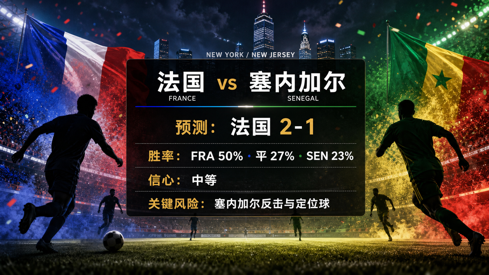

# Match 017: France vs Senegal

[Dashboard](../README.md) | [简体中文](match-017-fra-sen.zh-CN.md) | [Daily report](../reports/daily/2026-06-14.md)

## Share Image




Lead image generation instruction:

```text
$imagegen: 生成【社交平台赛事预测首图】，16:9 横版，真实位图图片，只展示赛事对阵、比赛阶段、城市/场馆氛围和球队色彩；中文文档配图的主要比赛信息必须使用简体中文，可在画面合适位置保留英文队名/赛事信息作为辅助文字；不输出比分，不输出预测胜负，不输出概率，不使用胜/平/负、晋级、爆冷等结果暗示词；不要生成 SVG，不要生成 HTML，不要生成代码图，不要生成线框图，不要使用官方 FIFA 标志或水印。
```

Result image generation instruction:

```text
$imagegen: 生成【社交平台赛事预测配图】，16:9 横版，真实位图图片，用于抖音、小红书、微博和微信分享；中文文档配图的主要比赛信息必须使用简体中文，可在画面合适位置保留英文队名/赛事信息作为辅助文字；不要生成 SVG，不要生成 HTML，不要生成代码图，不要生成线框图，不要使用官方 FIFA 标志或水印。
```

## Prediction

| Outcome | Probability |
| --- | ---: |
| France win | 50% |
| Draw | 27% |
| Senegal win | 23% |

- Predicted winner: FRA
- Predicted scoreline: France vs Senegal 2-1
- Confidence: medium
- Model: ChatGPT 5.5 ultra-high reasoning

## Factual Basis

- Official fixture: Match 017 is France vs Senegal in Group I at New York New Jersey Stadium.
- Kickoff is 2026-06-16T16:00:00Z; this falls inside the current 72-hour window from the automation run time.
- FIFA's 2026-06-11 ranking pages list France 3 and Senegal 21.
- FIFA has confirmed final squads, but full player-level squad ingestion and final matchday injury bulletins remain data gaps.

## Prediction Coverage Checklist

| Dimension | Snapshot status | Confidence impact |
| --- | --- | --- |
| Tactics | France project as the higher-possession side; Senegal transition and set-piece threat keep the matchup live. | supports France, with mixed risk |
| Players | FIFA squad confirmation and ranking signals favor France depth; Senegal still have high-impact athletic profiles. | supports France |
| Injuries / suspensions | No official matchday medical bulletin is stored yet. | data gap lowers confidence |
| Schedule / rest / travel | Kickoff, venue, local timing, and neutral-site travel were verified. | mixed |
| History | Tournament history is considered lightly because current squads and coaches matter more. | low weight |
| Public sentiment | Public narrative treats France as favorite but respects Senegal as a dangerous opponent. | supports France with caution |
| Weather / venue conditions | Venue/city context checked; repository does not yet store a matchday forecast snapshot. | data gap |
| Psychology | Opening-match favorite pressure and Senegal underdog motivation both matter. | mixed |
| Odds movement | No complete odds-movement trail is stored. | data gap |
| Expert views | Reputable schedule and group-preview context reviewed; disagreement is reflected in medium confidence. | supports medium confidence |

## Prediction Logic

1. France carry the stronger ranking baseline and deeper attacking/defensive options, but Senegal are strong enough in transition to keep the distribution tight.
2. The 2-1 scoreline matches a favorite lean without overstating control, because Senegal can punish turnovers and dead-ball moments.
3. Confidence stays at medium because final lineups, matchday injuries, weather, and odds-movement snapshots are not fully stored in the repository.

## Risk Factors

- Senegal transition speed and set pieces.
- Final lineups and matchday medical bulletins are not yet stored.
- Weather and pitch conditions may shift tempo or chance quality.

## Platform Share Copy

### Douyin / 抖音

World Cup Group I prediction: France vs Senegal. I lean France win, 2-1; key risk: Senegal transition speed and set pieces.
仅为足球赛事预测，不构成任何投资建议。

### Xiaohongshu / 小红书

France vs Senegal prediction: France win, 2-1. Built from official schedule, FIFA rankings, squad status, and current preview context.
仅为足球赛事预测，不构成任何投资建议。

### Weibo / 微博

Group I prediction: France win, 2-1. Probability: FRA 50%, draw 27%, SEN 23%. Confidence: medium.
仅为足球赛事预测，不构成任何投资建议。#WorldCup2026#

### WeChat / 微信

France vs Senegal forecast: France win, 2-1. This is based on verified fixture data, FIFA ranking pages, squad confirmation, and reputable schedule context. This is a football match prediction only and does not constitute investment advice. 仅为足球赛事预测，不构成任何投资建议。

## Disclaimer

This is a football match prediction only. It does not constitute investment advice, financial advice, or any guarantee of outcome.

仅为足球赛事预测，不构成任何投资建议、财务建议或结果承诺。

## Source Snapshot

- https://www.fifa.com/en/tournaments/mens/worldcup/canadamexicousa2026/articles/match-schedule-fixtures-results-teams-stadiums
- https://vod.fifa.com/organisation/media-releases/updated-world-cup-2026-match-schedule-venues-kick-off-times-104-matches
- https://digitalhub.fifa.com/asset/4b5d4417-3343-4732-9cdf-14b6662af407/FWC26-Match-Schedule_English.pdf
- https://www.espn.com/soccer/story/_/id/48939282/2026-fifa-world-cup-fixtures-results-match-schedule-group-stage-knockout-rounds-bracket
- https://www.fifa.com/en/articles/fifa-world-cup-2026-squads-confirmed
- https://inside.fifa.com/fifa-world-ranking/FRA?gender=men
- https://inside.fifa.com/fifa-world-ranking/SEN?gender=men
- Verified at: 2026-06-14T11:12:46+08:00
