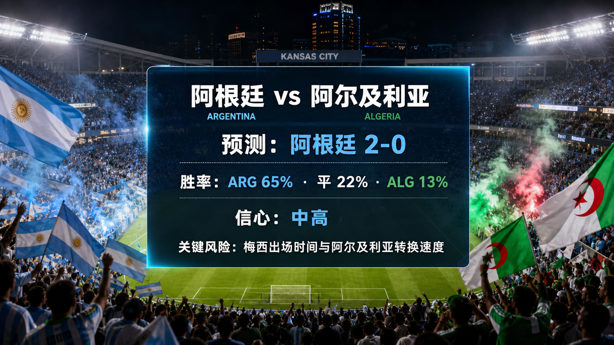

# 第 019 场：阿根廷 vs 阿尔及利亚

[首页](../docs/README.zh-CN.md) | [English](match-019-arg-alg.md) | [日报](../reports/daily/2026-06-14.zh-CN.md)

## 预测配图




首图生成指令：

```text
$imagegen: 生成【社交平台赛事预测首图】，16:9 横版，真实位图图片，只展示赛事对阵、比赛阶段、城市/场馆氛围和球队色彩；中文文档配图的主要比赛信息必须使用简体中文，可在画面合适位置保留英文队名/赛事信息作为辅助文字；不输出比分，不输出预测胜负，不输出概率，不使用胜/平/负、晋级、爆冷等结果暗示词；不要生成 SVG，不要生成 HTML，不要生成代码图，不要生成线框图，不要使用官方 FIFA 标志或水印。
```

结果图生成指令：

```text
$imagegen: 生成【社交平台赛事预测配图】，16:9 横版，真实位图图片，用于抖音、小红书、微博和微信分享；中文文档配图的主要比赛信息必须使用简体中文，可在画面合适位置保留英文队名/赛事信息作为辅助文字；不要生成 SVG，不要生成 HTML，不要生成代码图，不要生成线框图，不要使用官方 FIFA 标志或水印。
```

## 预测

| 结果 | 概率 |
| --- | ---: |
| 阿根廷胜 | 65% |
| 平局 | 22% |
| 阿尔及利亚胜 | 13% |

- 预测胜者：ARG
- 预测比分：阿根廷 vs 阿尔及利亚 2-0
- 信心等级：中高
- 模型：ChatGPT 5.5 ultra-high reasoning

## 比分情景

| 情景 | 比分 | 概率 | 判断 |
| --- | --- | ---: | --- |
| 主情景 | 2-0 | 16% | 阿根廷通过控球和阵容质量优势打出受控热门结果。 |
| 保守 / 平局路径 | 1-1 | 8% | 阿尔及利亚转换速度以及最终出场时间 / 首发不确定性保留平局路径。 |
| 上限 / 替代路径 | 3-1 | 10% | 如果早早进球，阿根廷可能把场面控制转化为更大比分。 |

## 事实依据

- 官方赛程：第 019 场是J 组 阿根廷 vs 阿尔及利亚，场地为 Kansas City Stadium。
- 开球时间：2026-06-17T01:00:00Z；按本次自动化实际运行时间，处于未来 72 小时窗口内。
- FIFA 2026-06-11 排名页显示阿根廷第 1、阿尔及利亚第 35。
- FIFA 已确认最终名单，但完整球员级名单导入和比赛日官方伤病公告仍是数据缺口。

## 预测覆盖检查

| 维度 | 快照状态 | 对信心的影响 |
| --- | --- | --- |
| 战术 | 阿根廷的控球、压迫控制和定位球质量高于阿尔及利亚转换威胁。 | 支持阿根廷 |
| 球员 | 排名和阵容质量信号明显支持阿根廷；阿尔及利亚速度是主要反击点。 | 支持阿根廷 |
| 伤病 / 停赛 | 仓库尚未存入官方比赛日医疗公告；梅西出场时间被明确列为风险。 | 数据缺口降低信心 |
| 赛程 / 休息 / 旅行 | 已核验开球、堪萨斯城场地、中立场旅行和当地时间。 | 混合 |
| 历史 | 赛事历史只作轻量背景输入。 | 低权重 |
| 舆情 | 公开叙事明显看好阿根廷，并预期阿尔及利亚依赖转换。 | 支持阿根廷 |
| 天气 / 场馆条件 | 已检查堪萨斯城场馆背景；比赛日天气尚未存入。 | 数据缺口 |
| 心理 | 阿根廷有热门压力，但大赛经验支持比赛管理。 | 支持阿根廷 |
| 赔率变化 | 仓库尚未保存完整赔率变化轨迹。 | 数据缺口 |
| 专家观点 | 已复核可靠赛程和小组预览背景，主要反向观点是阿尔及利亚转换波动。 | 支持阿根廷 |

## 预测逻辑

1. 阿根廷在这组对位中拥有最强排名和阵容质量基础，因此基础判断是控场取胜。
2. 阿尔及利亚有转换速度，能制造开局风险，但阿根廷控球和机会控制支持 2-0 预测。
3. 信心为中高而非高，是因为仓库仍缺少最终首发、医疗、天气和赔率变化快照。

## 风险因素

- 梅西出场时间与阿尔及利亚转换速度。
- 最终首发和比赛日医疗公告尚未存入仓库。
- 天气和草皮条件可能改变节奏或机会质量。

## 平台发布文案

### 抖音

世界杯 J 组 预测：阿根廷 vs 阿尔及利亚。我倾向阿根廷胜，2-0，关键风险是梅西出场时间与阿尔及利亚转换速度。
仅为足球赛事预测，不构成任何投资建议。

### 小红书

阿根廷 vs 阿尔及利亚 预测：阿根廷胜，2-0。判断基于官方赛程、FIFA 排名、名单状态和当前赛程背景。
仅为足球赛事预测，不构成任何投资建议。

### 微博

J 组 预测：阿根廷胜，2-0。概率：ARG 65%，平局 22%，ALG 13%。信心：中高。
仅为足球赛事预测，不构成任何投资建议。#世界杯# #WorldCup2026#

### 微信

阿根廷 vs 阿尔及利亚 的预测是阿根廷胜，2-0。当前判断来自官方赛程、FIFA 排名页、名单确认和可靠赛程背景。This is a football match prediction only and does not constitute investment advice. 仅为足球赛事预测，不构成任何投资建议。

## 免责声明

This is a football match prediction only. It does not constitute investment advice, financial advice, or any guarantee of outcome.

仅为足球赛事预测，不构成任何投资建议、财务建议或结果承诺。

## 来源快照

- https://www.fifa.com/en/tournaments/mens/worldcup/canadamexicousa2026/articles/match-schedule-fixtures-results-teams-stadiums
- https://vod.fifa.com/organisation/media-releases/updated-world-cup-2026-match-schedule-venues-kick-off-times-104-matches
- https://digitalhub.fifa.com/asset/4b5d4417-3343-4732-9cdf-14b6662af407/FWC26-Match-Schedule_English.pdf
- https://www.espn.com/soccer/story/_/id/48939282/2026-fifa-world-cup-fixtures-results-match-schedule-group-stage-knockout-rounds-bracket
- https://www.fifa.com/en/articles/fifa-world-cup-2026-squads-confirmed
- https://inside.fifa.com/fifa-world-ranking/ARG?gender=men
- https://inside.fifa.com/fifa-world-ranking/ALG?gender=men
- 核验时间：2026-06-14T11:12:46+08:00
