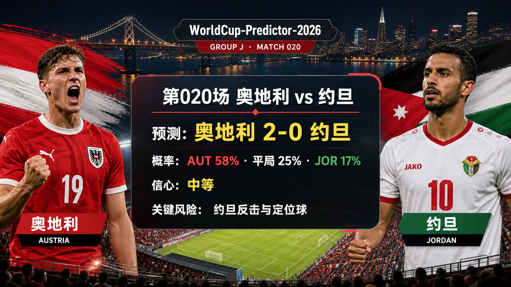

# 第 020 场：奥地利 vs 约旦

[首页](../docs/README.zh-CN.md) | [English](match-020-aut-jor.md)

## 预测配图




首图生成指令：

```text
$imagegen: 生成【社交平台赛事预测首图】，16:9 横版，真实位图图片，只展示赛事对阵、比赛阶段、城市/场馆氛围和球队色彩；中文文档配图的主要比赛信息必须使用简体中文，可在画面合适位置保留英文队名/赛事信息作为辅助文字；不输出比分，不输出预测胜负，不输出概率，不使用胜/平/负、晋级、爆冷等结果暗示词；不要生成 SVG，不要生成 HTML，不要生成代码图，不要生成线框图，不要使用官方 FIFA 标志或水印。
```

结果图生成指令：

```text
$imagegen: 生成【社交平台赛事预测配图】，16:9 横版，真实位图图片，用于抖音、小红书、微博和微信分享；中文文档配图的主要比赛信息必须使用简体中文，可在画面合适位置保留英文队名/赛事信息作为辅助文字；不要生成 SVG，不要生成 HTML，不要生成代码图，不要生成线框图，不要使用官方 FIFA 标志或水印。
```

## 预测

| 结果 | 概率 |
| --- | ---: |
| 奥地利胜 | 58% |
| 平局 | 25% |
| 约旦胜 | 17% |

- 预测胜者：AUT
- 预测比分：奥地利 vs 约旦 2-0
- 信心等级：中等
- 模型：ChatGPT 5.5 ultra-high reasoning

## 比分情景

| 情景 | 比分 | 概率 | 判断 |
| --- | --- | ---: | --- |
| 主情景 | 2-0 | 14% | 奥地利通过高位压迫、二点球争夺和场地位置优势打出受控热门结果。 |
| 保守 / 平局路径 | 1-1 | 10% | 约旦保持阵型紧凑，保护中路，并通过 Al-Taamari 或定位球惩罚一次开放转换。 |
| 上限 / 替代路径 | 2-1 | 11% | 奥地利仍能制造更多机会，但约旦通过一次反击或重启球追回一球。 |

## 事实依据

- 官方赛程：第 020 场是 J 组奥地利 vs 约旦，场地为 San Francisco Bay Area Stadium。
- 开球时间为 2026-06-17T04:00:00Z，对应中国时间 2026-06-17 12:00。
- FIFA 排名页在当前仓库快照中记录奥地利第 24、约旦第 63。
- 可靠球队指南和赛前预览显示，奥地利更偏高节奏压迫，约旦作为世界杯新军更依赖紧凑防守与转换路线。
- 截至第 016 场的复盘给热门大胜、零封和下风方转换变量加入校准折扣。
- 最终官方首发、临场医疗公告、实时天气和赔率变化尚未完全入库，因此信心维持中等。

## 预测覆盖检查

| 维度 | 快照状态 | 对信心的影响 |
| --- | --- | --- |
| 战术 | 奥地利预计压迫更高、场地控制更强；约旦主要依靠紧凑防守后的反击和定位球。 | 支持奥地利，但保留平局风险 |
| 球员 | 奥地利排名和阵容深度基础更强；约旦进攻路径取决于转换质量和关键攻击手可用性。 | 支持奥地利 |
| 伤病 / 停赛 | 已检查可靠临场球队新闻，但尚未存入官方最终医疗公告。 | 数据缺口降低信心 |
| 赛程 / 休息 / 旅行 | 已核验开球、场地和中立场旅行；两队面对同一西海岸场地背景。 | 混合 |
| 历史 | 约旦首次参加世界杯的心理意义高于陈旧交锋史。 | 低权重 |
| 舆情 | 公开叙事把奥地利视为热门；约旦首秀故事带来下风方关注。 | 支持奥地利但需谨慎 |
| 天气 / 场馆条件 | 已检查 Levi's Stadium / 湾区场馆背景；尚未存入比赛小时级天气快照。 | 数据缺口 |
| 心理 | 奥地利承受热门压力；约旦拥有首秀动力和更低外界预期。 | 混合 |
| 赔率变化 | 仓库尚未保存完整赔率变化轨迹。 | 数据缺口 |
| 专家观点 | Guardian、RotoWire、FIFA 和场馆预览背景支持奥地利倾向，但约旦转换路径仍然存在。 | 支持中等信心 |

## 预测逻辑

1. 奥地利拥有更强排名基础、更成熟的大赛画像和更容易持续制造场地优势的战术风格。
2. 约旦最现实的拿分路径是压缩中路，并通过一次转换、定位球或 Al-Taamari 的推进制造进球，因此 1-1 平局路径必须保留。
3. 2-0 是主预测，因为奥地利的压迫和阵容深度更能形成可重复机会；但第 006 场和第 009-016 场的复盘降低了零封和热门方大胜确定性。

## 风险因素

- 约旦反击、定位球和首次世界杯带来的开局情绪。
- 最终首发和官方医疗公告尚未入库。
- 湾区天气、草皮速度或奥地利早段失误可能把比赛拉向 1-1 或 2-1。
- 模型近期低估了紧凑下风方和门将波动，因此信心不高于中等。

## 平台发布文案

### 抖音

世界杯 J 组预测：奥地利 vs 约旦。我倾向奥地利胜，2-0；关键风险是约旦低位紧凑、反击和定位球。
仅为足球赛事预测，不构成任何投资建议。

### 小红书

奥地利 vs 约旦预测：奥地利胜，2-0。复盘后把 1-1 保留为真实路径，因为约旦首秀动力和转换路线不能忽略。
仅为足球赛事预测，不构成任何投资建议。

### 微博

J 组预测：奥地利胜，2-0。概率：AUT 58%，平局 25%，JOR 17%。信心：中等。
仅为足球赛事预测，不构成任何投资建议。#世界杯# #WorldCup2026#

### 微信

奥地利 vs 约旦预测：奥地利胜，2-0。判断基于官方赛程、FIFA 排名、当前球队指南背景，以及截至第 016 场已结束比赛的复盘经验。This is a football match prediction only and does not constitute investment advice. 仅为足球赛事预测，不构成任何投资建议。

## 免责声明

This is a football match prediction only. It does not constitute investment advice, financial advice, or any guarantee of outcome.

仅为足球赛事预测，不构成任何投资建议、财务建议或结果承诺。

## 来源快照

- https://www.fifa.com/en/match-centre/match/17/285023/289273/400021498
- https://inside.fifa.com/fifa-world-ranking/AUT?gender=men
- https://inside.fifa.com/fifa-world-ranking/JOR?gender=men
- https://www.theguardian.com/football/2026/jun/08/austria-world-cup-2026-team-guide
- https://www.theguardian.com/football/2026/jun/16/jordan-uzbekistan-debut-asia-world-cup-2026
- https://www.rotowire.com/soccer/article/2026-world-cup-group-j-preview-argentina-algeria-austria-jordan-tactics-lineups-set-pieces-odds-109964
- https://levisstadium.com/event/fifa-world-cup-group-stage-2026-06-16/
- https://www.sfchronicle.com/sports/article/austria-jordan-meet-lights-levi-s-stadium-22305810.php
- 核验时间：2026-06-16T16:13:02+08:00
