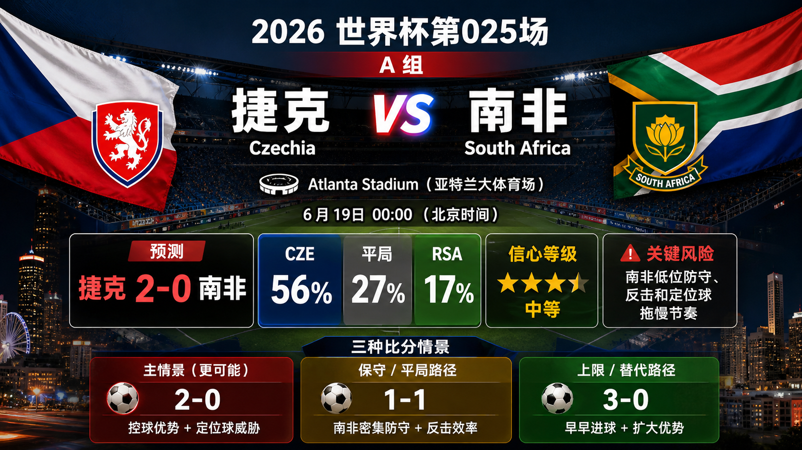

# Match 025: Czechia vs South Africa

[Dashboard](../README.md) | [简体中文](match-025-cze-rsa.zh-CN.md) | [Daily report](../reports/daily/2026-06-19.md)

## Share Image




Lead image generation instruction:

```text
$imagegen: 生成【社交平台赛事预测首图】，16:9 横版，真实位图图片，只展示赛事对阵、比赛阶段、城市/场馆氛围和球队色彩；中文文档配图的主要比赛信息必须使用简体中文，可在画面合适位置保留英文队名/赛事信息作为辅助文字；不输出比分，不输出预测胜负，不输出概率，不使用胜/平/负、晋级、爆冷等结果暗示词；不要生成 SVG，不要生成 HTML，不要生成代码图，不要生成线框图，不要使用官方 FIFA 标志或水印。
```

Result image generation instruction:

```text
$imagegen: 生成【社交平台赛事预测配图】，16:9 横版，真实位图图片，用于抖音、小红书、微博和微信分享；中文文档配图的主要比赛信息必须使用简体中文，可在画面合适位置保留英文队名/赛事信息作为辅助文字；不要生成 SVG，不要生成 HTML，不要生成代码图，不要生成线框图，不要使用官方 FIFA 标志或水印。
```

## Prediction

| Outcome | Probability |
| --- | ---: |
| Czechia win | 56% |
| Draw | 27% |
| South Africa win | 17% |

- Predicted winner: CZE
- Predicted scoreline: Czechia vs South Africa 2-0
- Confidence: medium
- Model: ChatGPT 5.5 ultra-high reasoning

## Scoreline Scenarios

| Scenario | Scoreline | Probability | Read |
| --- | --- | ---: | --- |
| Primary | 2-0 | 14% | Czechia use set pieces and territorial control against a South Africa side carrying suspension and defensive-timing risk. |
| Conservative / draw path | 1-1 | 10% | South Africa sit deep, slow the tempo, and answer through one counterattack or restart. |
| Upside / alternate | 3-0 | 10% | An early Czechia goal exposes the weakened South Africa back line and opens a late-margin route. |

## Factual Basis

- Czechia vs South Africa is scheduled at Atlanta Stadium on 2026-06-18T16:00:00Z, China time 2026-06-19 00:00.
- Current FIFA ranking pages list Czechia 40 and South Africa 60.
- Both teams need a response after opening defeats; Czechia keep the cleaner set-piece and ranking baseline.
- Today's reviews push the model toward low-margin favorites with serious draw routes.

## Prediction Coverage Checklist

| Dimension | Snapshot status | Confidence impact |
| --- | --- | --- |
| Tactics | Czechia should press for territory while South Africa rely on compact defending and transition. | medium confidence |
| Players | Current rankings: CZE 40, RSA 60. | baseline signal |
| Injuries / suspensions | No final official lineup or medical bulletin is stored. | lowers confidence |
| Schedule / rest / travel | Atlanta Stadium and China-time kickoff 2026-06-19 00:00 were checked. | mixed |
| History | High-weight head-to-head evidence is limited. | low weight |
| Public sentiment | Public favorite framing and group-table pressure coexist. | caution |
| Weather / venue conditions | Venue is identified; match-hour weather is not stored. | data gap |
| Psychology | Opening results increase the value of no-loss paths. | raises draw path |
| Odds movement | No complete odds-movement trail is stored. | data gap |
| Expert views | Available preview context was checked; final lineup sheet is not stored. | medium confidence |

## Prediction Logic

1. Czechia vs South Africa is scheduled at Atlanta Stadium on 2026-06-18T16:00:00Z, China time 2026-06-19 00:00.
2. Today's reviews push the model toward low-margin favorites with serious draw routes.
3. The primary scoreline balances the favorite baseline with draw and underdog routes learned from recent reviews.

## Risk Factors

- South Africa counterattacks and restarts.
- Final lineups, weather, odds movement, and disciplinary information are not fully stored.
- An early goal can materially change the match script.

## Platform Share Copy

### Douyin / 抖音

World Cup Group A prediction: Czechia vs South Africa. I lean Czechia win, 2-0; key risk: South Africa counterattacks and restarts.
仅为足球赛事预测，不构成任何投资建议。

### Xiaohongshu / 小红书

Czechia vs South Africa prediction: Czechia win, 2-0. The draw route stays live because late lineups, weather, and market movement are not fully stored.
仅为足球赛事预测，不构成任何投资建议。

### Weibo / 微博

Group A prediction: Czechia win, 2-0. Probability: CZE 56%, draw 27%, RSA 17%. Confidence: medium.
仅为足球赛事预测，不构成任何投资建议。#WorldCup2026#

### WeChat / 微信

Czechia vs South Africa forecast: Czechia win, 2-0. The forecast uses official fixture data, FIFA rankings, preview context, venue/travel notes, and review calibration through Match 024. This is a football match prediction only and does not constitute investment advice. 仅为足球赛事预测，不构成任何投资建议。

## Disclaimer

This is a football match prediction only. It does not constitute investment advice, financial advice, or any guarantee of outcome.

仅为足球赛事预测，不构成任何投资建议、财务建议或结果承诺。

## Source Snapshot

- https://www.fifa.com/en/tournaments/mens/worldcup/canadamexicousa2026/scores-fixtures
- https://www.roadtrips.com/world-cup/2026-world-cup-schedule/
- https://www.cbssports.com/soccer/news/2026-fifa-world-cup-schedule-locations-full-list-of-matchups-groups-dates-times-mexico-opener-copa-rematch/
- https://www.si.com/soccer/czechia-vs-south-africa-world-cup-preview-predictions-lineups-6-18-26
- https://inside.fifa.com/fifa-world-ranking/CZE?gender=men
- https://inside.fifa.com/fifa-world-ranking/RSA?gender=men
- Verified at: 2026-06-18T17:05:25+08:00
