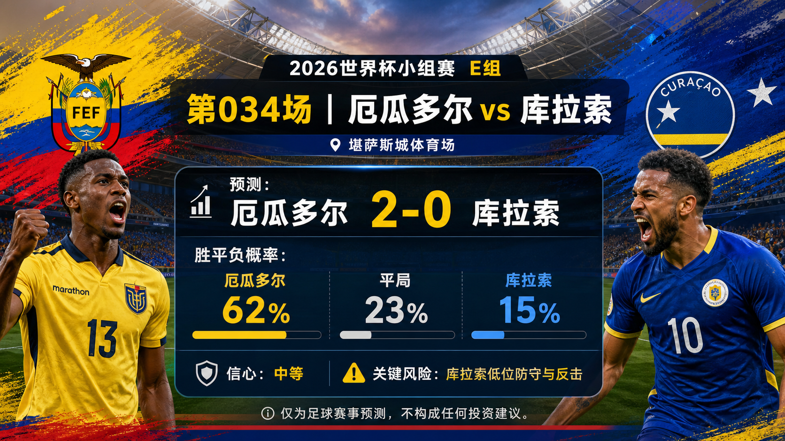

# 第 034 场：厄瓜多尔 vs 库拉索

[首页](../docs/README.zh-CN.md) | [English](match-034-ecu-cuw.md) | [日报](../reports/daily/2026-06-21.zh-CN.md)

## 预测配图




首图生成指令:

```text
$imagegen: 生成【社交平台赛事预测首图】，16:9 横版，真实位图图片，只展示赛事对阵、比赛阶段、城市/场馆氛围和球队色彩；中文文档配图的主要比赛信息必须使用简体中文，可在画面合适位置保留英文队名/赛事信息作为辅助文字；不输出比分，不输出预测胜负，不输出概率，不使用胜/平/负、晋级、爆冷等结果暗示词；不要生成 SVG，不要生成 HTML，不要生成代码图，不要生成线框图，不要使用官方 FIFA 标志或水印。
```

结果图生成指令:

```text
$imagegen: 生成【社交平台赛事预测配图】，16:9 横版，真实位图图片，用于抖音、小红书、微博和微信分享；中文文档配图的主要比赛信息必须使用简体中文，可在画面合适位置保留英文队名/赛事信息作为辅助文字；不要生成 SVG，不要生成 HTML，不要生成代码图，不要生成线框图，不要使用官方 FIFA 标志或水印。
```

## 预测

| 结果 | 概率 |
| --- | ---: |
| 厄瓜多尔胜 | 62% |
| 平局 | 23% |
| 库拉索胜 | 15% |

- 预测胜者：厄瓜多尔
- 预测比分：厄瓜多尔 vs 库拉索 2-0
- 信心等级：中等
- 模型：ChatGPT 5.5 ultra-high reasoning

## 比分情景

| 情景 | 比分 | 概率 | 判断 |
| --- | --- | ---: | --- |
| 主情景 | 2-0 | 14% | 厄瓜多尔中场压迫和防守结构压低库拉索反击质量。 |
| 保守 / 平局路径 | 1-1 | 9% | 库拉索拖慢比赛、守住禁区，并通过一次转换回应。 |
| 上限 / 替代路径 | 3-1 | 10% | 厄瓜多尔若早进球，库拉索低位阵型被迫打开，热门队比分可扩大。 |

## 事实依据

- 官方赛程显示厄瓜多尔 vs 库拉索在 Kansas City Stadium 进行，中国时间 2026-06-21 08:00 开球。
- 厄瓜多尔排名和阵容质量基础更强，尤其体现在中场对抗和防守结构。
- 库拉索低位防守和转换路线让平局路径仍需保留。

## 预测覆盖检查

| 维度 | 快照状态 | 倾向 |
| --- | --- | --- |
| 战术 | 厄瓜多尔中场紧凑和边路压迫应能压制库拉索低位阵型。 | 支持厄瓜多尔 |
| 球员 | 厄瓜多尔排名和高端球员画像更强。 | 支持厄瓜多尔 |
| 伤病 / 停赛 | 最终首发和官方医疗更新尚未入库。 | 数据缺口 |
| 赛程 / 休息 / 旅行 | 已核验堪萨斯城开球和中国时间窗口。 | 混合 |
| 历史 | 高权重交锋样本有限。 | 低权重 |
| 舆情 | 公开预览倾向厄瓜多尔，但尊重库拉索紧凑阵型。 | 支持厄瓜多尔 |
| 天气 / 场馆条件 | 场地已确认，比赛小时级天气未入库。 | 数据缺口 |
| 心理 | 厄瓜多尔需要主动压制；库拉索压力更低。 | 混合 |
| 赔率变化 | 仓库未保存完整赔率变化轨迹。 | 数据缺口 |
| 专家观点 | 赛前观点倾向厄瓜多尔，同时提醒低比分路径。 | 支持厄瓜多尔 |

## 预测逻辑

1. 官方赛程显示厄瓜多尔 vs 库拉索在 Kansas City Stadium 进行，中国时间 2026-06-21 08:00 开球。
2. 概率分布让热门或平局倾向与当前强度、战术和公开预览信号保持一致。
3. 比分情景保留一条保守平局路径和一条上限替代路径，因为最终首发、天气和赔率变化尚未完全入库。

## 风险因素

- 库拉索低位防守和反击。
- 最终首发、临场医疗信息、天气和赔率变化仍未完整入库。
- 早段进球或纪律事件会显著改变比赛脚本。

## 平台发布文案

### 抖音

世界杯 E 组 预测：厄瓜多尔 vs 库拉索。倾向：厄瓜多尔，2-0；关键风险是库拉索低位防守和反击。
仅为足球赛事预测，不构成任何投资建议。

### 小红书

厄瓜多尔 vs 库拉索 预测：厄瓜多尔，2-0。信心：中等。临场变量尚未完全入库，平局路径仍需保留。
仅为足球赛事预测，不构成任何投资建议。

### 微博

E 组 预测：厄瓜多尔 vs 库拉索 2-0。概率：ECU 62%，平局 23%，CUW 15%。
仅为足球赛事预测，不构成任何投资建议。#世界杯# #WorldCup2026#

### 微信

厄瓜多尔 vs 库拉索 预测：厄瓜多尔，2-0。判断基于官方赛程、FIFA 排名页、可靠赛前背景、场地/旅行因素，以及截至第 032 场的复盘校准。This is a football match prediction only and does not constitute investment advice. 仅为足球赛事预测，不构成任何投资建议。

## 免责声明

This is a football match prediction only. It does not constitute investment advice, financial advice, or any guarantee of outcome.

仅为足球赛事预测，不构成任何投资建议、财务建议或结果承诺。

## 来源快照

- https://www.fifa.com/en/match-centre/match/17/285023/289273/400021465
- https://www.si.com/soccer/ecuador-vs-curacao-world-cup-preview-predictions-lineups-6-20-26
- https://www.beinsports.com/en-us/soccer/fifa-world-cup-2026/articles/how-and-where-to-watch-ecuador-vs-cura%C3%A7ao-in-group-e-of-the-2026-fifa-world-cup-2026-06-19
- https://www.rotowire.com/soccer/article/ecuador-vs-curacao-preview-predicted-lineups-team-news-tactical-analysis-2026-world-cup-group-e-118799
- https://www.sportsmole.co.uk/football/ecuador/world-cup-2026/preview/ecuador-vs-curacao-prediction-team-news-lineups_599563.html
- https://inside.fifa.com/fifa-world-ranking/ECU?gender=men
- https://inside.fifa.com/fifa-world-ranking/CUW?gender=men
- 核验时间：2026-06-20T16:45:00+08:00
