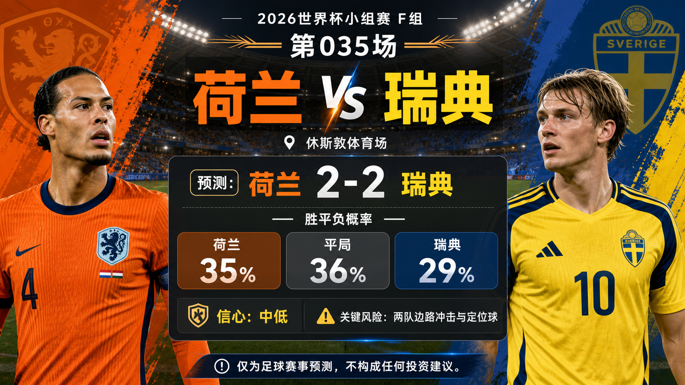

# Match 035: Netherlands vs Sweden

[Dashboard](../README.md) | [简体中文](match-035-ned-swe.zh-CN.md) | [Daily report](../reports/daily/2026-06-21.md)

## Share Image




Lead image generation instruction:

```text
$imagegen: 生成【社交平台赛事预测首图】，16:9 横版，真实位图图片，只展示赛事对阵、比赛阶段、城市/场馆氛围和球队色彩；中文文档配图的主要比赛信息必须使用简体中文，可在画面合适位置保留英文队名/赛事信息作为辅助文字；不输出比分，不输出预测胜负，不输出概率，不使用胜/平/负、晋级、爆冷等结果暗示词；不要生成 SVG，不要生成 HTML，不要生成代码图，不要生成线框图，不要使用官方 FIFA 标志或水印。
```

Result image generation instruction:

```text
$imagegen: 生成【社交平台赛事预测配图】，16:9 横版，真实位图图片，用于抖音、小红书、微博和微信分享；中文文档配图的主要比赛信息必须使用简体中文，可在画面合适位置保留英文队名/赛事信息作为辅助文字；不要生成 SVG，不要生成 HTML，不要生成代码图，不要生成线框图，不要使用官方 FIFA 标志或水印。
```

## Prediction

| Outcome | Probability |
| --- | ---: |
| Netherlands win | 35% |
| Draw | 36% |
| Sweden win | 29% |

- Predicted winner: Draw
- Predicted scoreline: Netherlands vs Sweden 2-2
- Confidence: medium-low
- Model: ChatGPT 5.5 ultra-high reasoning

## Scoreline Scenarios

| Scenario | Scoreline | Probability | Read |
| --- | --- | ---: | --- |
| primary | 2-2 | 11% | Both sides create from wide areas and set pieces, producing a volatile scoring draw. |
| conservative_draw_path | 1-1 | 12% | The game slows after the first goal and both managers protect the point. |
| upside_alternate | 2-1 | 9% | Netherlands' possession pressure turns one late box entry into the winner. |

## Factual Basis

- Official fixture data places Netherlands vs Sweden at Houston Stadium, China time 2026-06-21 01:00.
- The matchup is balanced enough that draw probability slightly leads the three-way distribution.
- Both teams have credible wide and set-piece routes, which points toward a scoring draw rather than a cagey 0-0.

## Prediction Coverage Checklist

| Dimension | Snapshot status | Lean |
| --- | --- | --- |
| Tactics | Netherlands' possession width meets Sweden's compact block, aerial threat, and direct counters. | supports draw |
| Players | Netherlands have more ball-dominant quality; Sweden have enough physical and set-piece answers. | mixed |
| Injuries / suspensions | No final lineup or official medical update is stored. | data gap |
| Schedule / rest / travel | Houston kickoff and China-time window were verified. | mixed |
| History | Historical matchup signal is secondary to current group context. | low weight |
| Public sentiment | Public previews are split enough to keep a draw-heavy forecast. | supports draw |
| Weather / venue conditions | Venue is identified; match-hour weather is not stored. | data gap |
| Psychology | Both sides can accept avoiding defeat if the game becomes stretched. | supports draw |
| Odds movement | No complete odds-movement trail is stored. | data gap |
| Expert views | Preview views lean competitive and close rather than one-sided. | supports draw |

## Prediction Logic

1. Official fixture data places Netherlands vs Sweden at Houston Stadium, China time 2026-06-21 01:00.
2. The probability split keeps the favorite or draw lean aligned with current team-strength, tactical, and public-preview signals.
3. The scoreline scenarios keep one conservative draw path and one upside alternate because final lineups, weather, and odds movement are not fully stored.

## Risk Factors

- Wide duels, set pieces, and both teams' transition quality.
- Final lineups, late medical news, weather, and odds movement are not fully stored.
- Early goals or disciplinary events can materially change the match script.

## Platform Share Copy

### Douyin / 抖音

World Cup Group F prediction: Netherlands vs Sweden. Lean: Draw, 2-2. Key risk: Wide duels, set pieces, and both teams' transition quality.
仅为足球赛事预测，不构成任何投资建议。

### Xiaohongshu / 小红书

Netherlands vs Sweden prediction: Draw, 2-2. Confidence: medium-low. The draw route stays live because late variables are not fully stored.
仅为足球赛事预测，不构成任何投资建议。

### Weibo / 微博

Group F prediction: Netherlands vs Sweden 2-2. Probability: NED 35%, draw 36%, SWE 29%.
仅为足球赛事预测，不构成任何投资建议。#WorldCup2026#

### WeChat / 微信

Netherlands vs Sweden forecast: Draw, 2-2. The forecast uses official fixture data, FIFA ranking pages, reputable preview context, venue/travel notes, and review calibration through Match 032. This is a football match prediction only and does not constitute investment advice. 仅为足球赛事预测，不构成任何投资建议。

## Disclaimer

This is a football match prediction only. It does not constitute investment advice, financial advice, or any guarantee of outcome.

仅为足球赛事预测，不构成任何投资建议、财务建议或结果承诺。

## Source Snapshot

- https://www.fifa.com/en/match-centre/match/17/285023/289273/400021472
- https://www.rotowire.com/soccer/article/netherlands-vs-sweden-preview-predicted-lineups-team-news-tactical-analysis-2026-world-cup-group-f-118797
- https://www.sportsmole.co.uk/football/netherlands/world-cup-2026/preview/netherlands-vs-sweden-prediction-team-news-lineups_599530.html
- https://vsin.com/soccer/netherlands-vs-sweden-same-game-parlay-2026-fifa-world-cup-prediction/
- https://www.houstonchronicle.com/world-cup/article/sweden-netherlands-preview-world-cup-22312449.php
- https://inside.fifa.com/fifa-world-ranking/NED?gender=men
- https://inside.fifa.com/fifa-world-ranking/SWE?gender=men
- Verified at: 2026-06-20T16:45:00+08:00
