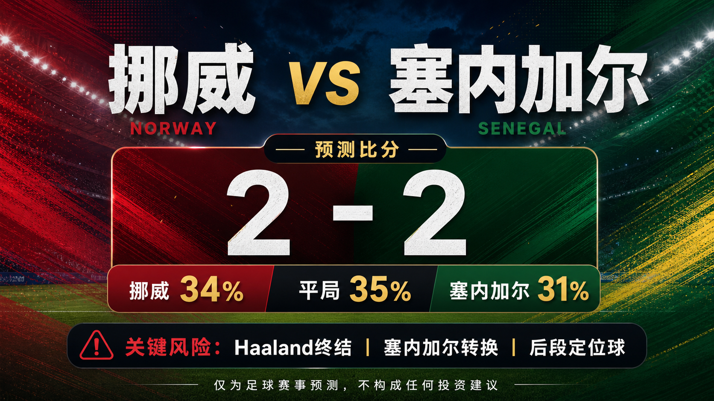

# Match 041: Norway vs Senegal

[Dashboard](../README.md) | [简体中文](match-041-nor-sen.zh-CN.md) | [Daily report](../reports/daily/2026-06-23.md)

## Share Image




Lead image generation instruction:

```text
$imagegen: 生成【社交平台赛事预测首图】，16:9 横版，真实位图图片，只展示赛事对阵、比赛阶段、城市/场馆氛围和球队色彩；中文文档配图的主要比赛信息必须使用简体中文，可在画面合适位置保留英文队名/赛事信息作为辅助文字；不输出比分，不输出预测胜负，不输出概率，不使用胜/平/负、晋级、爆冷等结果暗示词；不要生成 SVG，不要生成 HTML，不要生成代码图，不要生成线框图，不要使用官方 FIFA 标志或水印。
```

Result image generation instruction:

```text
$imagegen: 生成【社交平台赛事预测配图】，16:9 横版，真实位图图片，用于抖音、小红书、微博和微信分享；中文文档配图的主要比赛信息必须使用简体中文，可在画面合适位置保留英文队名/赛事信息作为辅助文字；不要生成 SVG，不要生成 HTML，不要生成代码图，不要生成线框图，不要使用官方 FIFA 标志或水印。
```

## Prediction

| Outcome | Probability |
| --- | ---: |
| Norway win | 34% |
| Draw | 35% |
| Senegal win | 31% |

- Predicted winner: Draw
- Predicted scoreline: Norway vs Senegal 2-2
- Confidence: medium-low
- Model: ChatGPT 5.5 ultra-high reasoning

## Scoreline Scenarios

| Scenario | Scoreline | Probability | Read |
| --- | --- | ---: | --- |
| primary | 2-2 | 11% | Norway's Haaland-led vertical threat and Senegal's response urgency both create high-value transition chances. |
| conservative_draw_path | 1-1 | 10% | Both teams protect the point after openers with very different margins, keeping the second half more controlled. |
| upside_alternate | 2-1 | 10% | Norway's first-game finishing form and set-piece size turn one late box entry into a narrow win. |

## Factual Basis

- FIFA fixture data and FOX match listing place Norway vs Senegal at New York New Jersey Stadium, China time 2026-06-23 08:00.
- FIFA ranking pages show Norway 11th and Senegal 21st; Norway opened with a 4-1 win over Iraq while Senegal lost 3-1 to France.
- SportsMole's preview points to a close, attacking matchup and does not preserve a complete late odds-movement trail.

## Prediction Coverage Checklist

| Dimension | Snapshot status | Lean |
| --- | --- | --- |
| Tactics | Norway can attack quickly through Haaland and Odegaard; Senegal have enough athleticism and wide speed to answer in transition. | mixed |
| Players | Norway's top-end creators are in form, but Senegal retain match-changing runners and set-piece power. | mixed |
| Injuries / suspensions | No major new absence was confirmed in the checked SportsMole preview; late lineups remain a gap. | mostly verified |
| Schedule / rest / travel | Both sides stay on the East Coast after opener travel; rest is broadly balanced. | neutral |
| History | Direct recent competitive history is limited, so opener form and tactical profiles carry more weight. | low weight |
| Public sentiment | Norway's 4-1 opener lifted expectations, while Senegal's France loss keeps urgency high. | mixed |
| Weather / venue conditions | Climate Central match page indicates manageable evening conditions, with heat risk below the southern venues. | neutral |
| Psychology | Norway can move toward qualification; Senegal cannot afford a second defeat, raising both risk appetite and pressure. | supports draw volatility |
| Odds movement | Available preview/market snippets suggest a narrow Norway lean, but no complete movement trail is stored. | data gap |
| Expert views | SportsMole projects a tight scoring draw rather than a clear favorite result. | supports draw |

## Prediction Logic

1. Norway's opener confirmed the attacking ceiling, but the model does not treat a four-goal win over Iraq as transferable one-for-one to Senegal.
2. Senegal's loss to France creates urgency without making them structurally weak; their wide runners can punish a stretched Norway press.
3. The probability split keeps all three outcomes live, with the draw narrowly ahead because both teams can score and neither needs to overcommit early.

## Risk Factors

- Haaland finishing variance, Senegal's first-goal route, and late set pieces.
- Final lineups, match-hour weather, and complete odds movement remain incomplete.
- An early goal could move the match away from the draw route quickly.

## Platform Share Copy

### Douyin / 抖音

World Cup Group I prediction: Norway vs Senegal. Lean: Draw, 2-2. Key risk: Haaland finishing variance, Senegal's first-goal route, and late set pieces.
仅为足球赛事预测，不构成任何投资建议。

### Xiaohongshu / 小红书

Norway vs Senegal prediction: Draw, 2-2. Confidence: medium-low. Late lineups and market movement remain the main data gaps.
仅为足球赛事预测，不构成任何投资建议。

### Weibo / 微博

Group I prediction: Norway vs Senegal 2-2. Probability: NOR 34%, draw 35%, SEN 31%.
仅为足球赛事预测，不构成任何投资建议。#WorldCup2026#

### WeChat / 微信

Norway vs Senegal forecast: Draw, 2-2. The forecast uses official fixture checks, FIFA ranking pages, reputable preview context, venue/weather notes, available market snapshots, and review calibration through Match 040. This is a football match prediction only and does not constitute investment advice. 仅为足球赛事预测，不构成任何投资建议。

## Disclaimer

This is a football match prediction only. It does not constitute investment advice, financial advice, or any guarantee of outcome.

仅为足球赛事预测，不构成任何投资建议、财务建议或结果承诺。

## Source Snapshot

- https://www.fifa.com/en/tournaments/mens/worldcup/canadamexicousa2026/scores-fixtures
- https://www.foxsports.com/soccer/fifa-world-cup-men-norway-vs-senegal-jun-22-2026-game-boxscore-647656
- https://www.sportsmole.co.uk/football/norway/world-cup-2026/preview/norway-vs-senegal-prediction-team-news-lineups_599682.html
- https://www.climatecentral.org/world-cup-2026/matches/41
- https://inside.fifa.com/fifa-world-ranking/NOR?gender=men
- https://inside.fifa.com/fifa-world-ranking/SEN?gender=men
- Verified at: 2026-06-22T15:01:00+08:00
