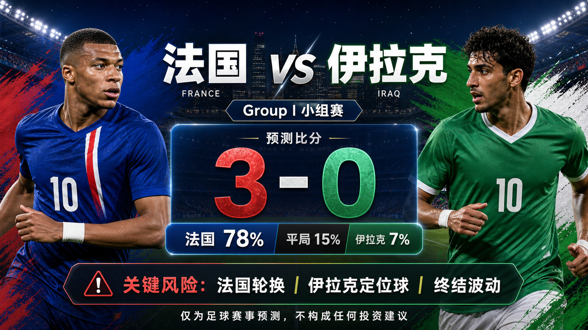

# Match 042: France vs Iraq

[Dashboard](../README.md) | [简体中文](match-042-fra-irq.zh-CN.md) | [Daily report](../reports/daily/2026-06-23.md)

## Share Image




Lead image generation instruction:

```text
$imagegen: 生成【社交平台赛事预测首图】，16:9 横版，真实位图图片，只展示赛事对阵、比赛阶段、城市/场馆氛围和球队色彩；中文文档配图的主要比赛信息必须使用简体中文，可在画面合适位置保留英文队名/赛事信息作为辅助文字；不输出比分，不输出预测胜负，不输出概率，不使用胜/平/负、晋级、爆冷等结果暗示词；不要生成 SVG，不要生成 HTML，不要生成代码图，不要生成线框图，不要使用官方 FIFA 标志或水印。
```

Result image generation instruction:

```text
$imagegen: 生成【社交平台赛事预测配图】，16:9 横版，真实位图图片，用于抖音、小红书、微博和微信分享；中文文档配图的主要比赛信息必须使用简体中文，可在画面合适位置保留英文队名/赛事信息作为辅助文字；不要生成 SVG，不要生成 HTML，不要生成代码图，不要生成线框图，不要使用官方 FIFA 标志或水印。
```

## Prediction

| Outcome | Probability |
| --- | ---: |
| France win | 78% |
| Draw | 15% |
| Iraq win | 7% |

- Predicted winner: France
- Predicted scoreline: France vs Iraq 3-0
- Confidence: medium
- Model: ChatGPT 5.5 ultra-high reasoning

## Scoreline Scenarios

| Scenario | Scoreline | Probability | Read |
| --- | --- | ---: | --- |
| primary | 3-0 | 16% | France's ranking edge, attacking depth, and Iraq's opener defensive exposure point to a controlled favorite win. |
| conservative_draw_path | 1-1 | 6% | The draw path needs France finishing to stall and Iraq to turn one restart or counter into a goal. |
| upside_alternate | 4-0 | 11% | If France score early, Iraq must chase after a heavy first defeat and the margin can widen late. |

## Factual Basis

- FIFA/FOX fixture checks place France vs Iraq at Philadelphia Stadium, China time 2026-06-23 05:00.
- FIFA ranking pages show France 3rd and Iraq 58th; France beat Senegal 3-1, while Iraq lost 1-4 to Norway.
- SportsMole's team-news preview favors France and reports no confirmed late absence that would erase the quality gap.

## Prediction Coverage Checklist

| Dimension | Snapshot status | Lean |
| --- | --- | --- |
| Tactics | France can press, rotate attackers, and attack Iraq's exposed defensive channels; Iraq need low-block discipline and restarts. | supports France |
| Players | France's elite forward depth and midfield control outweigh Iraq's narrower transition route. | supports France |
| Injuries / suspensions | No confirmed late French absence changes the forecast in checked previews; final lineups remain a gap. | mostly verified |
| Schedule / rest / travel | Philadelphia kickoff avoids the worst southern heat, and both teams have standard rest from opening matches. | neutral |
| History | Limited relevant head-to-head sample; current rankings and opener performance dominate. | low weight |
| Public sentiment | France are framed as a heavy favorite after a strong opener; Iraq face pressure after a large defeat. | supports France |
| Weather / venue conditions | Climate Central lists manageable Philadelphia conditions relative to hotter venues. | neutral |
| Psychology | France can nearly secure group position; Iraq must stabilize first before opening the game. | supports France |
| Odds movement | Market snapshots price France as a heavy favorite, but complete movement history is not stored. | supports France with data gap |
| Expert views | SportsMole leans clearly toward France and a multi-goal result. | supports France |

## Prediction Logic

1. France combine the strongest baseline rating in the slate with a positive opener and deeper attacking substitutions.
2. Iraq's 1-4 defeat to Norway raises defensive-tail risk, especially if France score before halftime.
3. The conservative draw path is retained because heavy favorites still carry finishing and rotation uncertainty in group-stage second matches.

## Risk Factors

- France rotation, finishing variance, and Iraq's set-piece route.
- A slow opening hour can compress the match and keep the draw alive.
- Final medical and lineup information is not fully stored at publication time.

## Platform Share Copy

### Douyin / 抖音

World Cup Group I prediction: France vs Iraq. Lean: France win, 3-0. Key risk: France rotation, finishing variance, and Iraq's set-piece route.
仅为足球赛事预测，不构成任何投资建议。

### Xiaohongshu / 小红书

France vs Iraq prediction: France win, 3-0. Confidence: medium. Late lineups and market movement remain the main data gaps.
仅为足球赛事预测，不构成任何投资建议。

### Weibo / 微博

Group I prediction: France vs Iraq 3-0. Probability: FRA 78%, draw 15%, IRQ 7%.
仅为足球赛事预测，不构成任何投资建议。#WorldCup2026#

### WeChat / 微信

France vs Iraq forecast: France win, 3-0. The forecast uses official fixture checks, FIFA ranking pages, reputable preview context, venue/weather notes, available market snapshots, and review calibration through Match 040. This is a football match prediction only and does not constitute investment advice. 仅为足球赛事预测，不构成任何投资建议。

## Disclaimer

This is a football match prediction only. It does not constitute investment advice, financial advice, or any guarantee of outcome.

仅为足球赛事预测，不构成任何投资建议、财务建议或结果承诺。

## Source Snapshot

- https://www.fifa.com/en/tournaments/mens/worldcup/canadamexicousa2026/scores-fixtures
- https://www.fifa.com/en/match-centre/match/17/285023/289273/400021492
- https://www.foxsports.com/soccer/fifa-world-cup-men-france-vs-iraq-jun-22-2026-game-boxscore-647657
- https://www.sportsmole.co.uk/football/france/world-cup-2026/preview/france-vs-iraq-prediction-team-news-lineups_599679.html
- https://www.climatecentral.org/world-cup-2026/matches/42
- https://inside.fifa.com/fifa-world-ranking/FRA?gender=men
- https://inside.fifa.com/fifa-world-ranking/IRQ?gender=men
- Verified at: 2026-06-22T15:01:00+08:00
