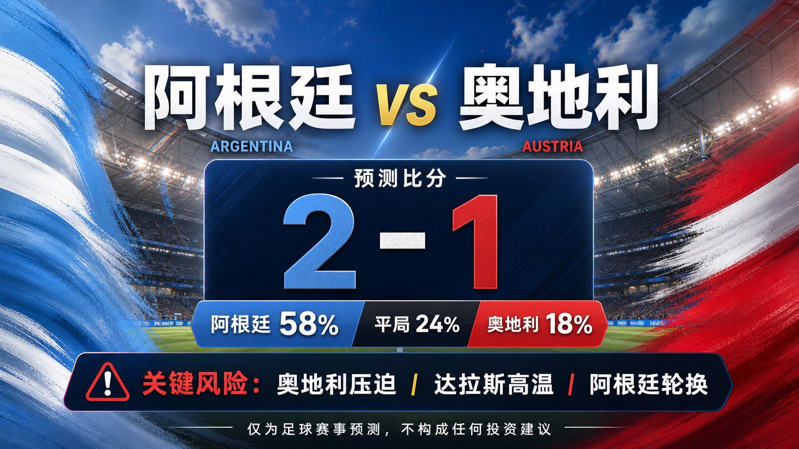

# 第 043 场：阿根廷 vs 奥地利

[仪表盘](../docs/README.zh-CN.md) | [English](match-043-arg-aut.md) | [日报](../reports/daily/2026-06-23.zh-CN.md)

## 分享图片




首图生成指令：

```text
$imagegen: 生成【社交平台赛事预测首图】，16:9 横版，真实位图图片，只展示赛事对阵、比赛阶段、城市/场馆氛围和球队色彩；中文文档配图的主要比赛信息必须使用简体中文，可在画面合适位置保留英文队名/赛事信息作为辅助文字；不输出比分，不输出预测胜负，不输出概率，不使用胜/平/负、晋级、爆冷等结果暗示词；不要生成 SVG，不要生成 HTML，不要生成代码图，不要生成线框图，不要使用官方 FIFA 标志或水印。
```

结果图生成指令：

```text
$imagegen: 生成【社交平台赛事预测配图】，16:9 横版，真实位图图片，用于抖音、小红书、微博和微信分享；中文文档配图的主要比赛信息必须使用简体中文，可在画面合适位置保留英文队名/赛事信息作为辅助文字；不要生成 SVG，不要生成 HTML，不要生成代码图，不要生成线框图，不要使用官方 FIFA 标志或水印。
```

## 预测

| 结果 | 概率 |
| --- | ---: |
| 阿根廷胜 | 58% |
| 平局 | 24% |
| 奥地利胜 | 18% |

- 预测方向：阿根廷
- 预测比分：阿根廷 vs 奥地利 2-1
- 置信度：medium
- 模型：ChatGPT 5.5 ultra-high reasoning

## 比分情景

| 情景 | 比分 | 概率 | 解读 |
| --- | --- | ---: | --- |
| 主情景 | 2-1 | 13% | 阿根廷的控场和 Messi 带动的机会质量压过奥地利，但奥地利压迫仍有进球路线。 |
| 保守 / 平局路径 | 1-1 | 10% | 奥地利压迫拖慢阿根廷中路节奏，并通过一次高位夺回制造扳平。 |
| 上限 / 替代路径 | 2-0 | 11% | 阿根廷先入球后处理好奥地利反抢，后半场保持控制并完成零封。 |

## 事实依据

- FIFA / FOX 赛程核验显示阿根廷 vs 奥地利在 Dallas Stadium 进行，中国时间为 2026-06-23 01:00。
- FIFA 排名显示阿根廷第 1、奥地利第 24；两队首轮均取胜，阿根廷 3-0 胜阿尔及利亚，奥地利 3-1 胜约旦。
- SportsMole 赛前资料把阿根廷列为热门，同时把奥地利高强度结构列为主要爆冷路线。

## 预测覆盖检查

| 维度 | 快照状态 | 倾向 |
| --- | --- | --- |
| 战术 | 阿根廷能通过控球降速；奥地利压迫和纵向反击可以干扰出球。 | 支持阿根廷但有爆冷风险 |
| 球员 | 阿根廷个人上限更高，但奥地利整体压迫让其不是被动弱队。 | 支持阿根廷 |
| 伤停 / 停赛 | 已核验预览未提示会推翻基础判断的确认缺阵；最终首发仍是缺口。 | 基本核验 |
| 赛程 / 休整 / 旅行 | 达拉斯中午条件带来热管理问题，但两队都带着首胜进入本场。 | 混合 |
| 交锋 / 历史 | 大赛底蕴明显偏向阿根廷，旧交锋样本权重较低。 | 支持阿根廷 |
| 舆论 / 媒体叙事 | 阿根廷首战和 Messi 叙事抬高预期；奥地利被视为有竞争力的弱势方。 | 支持阿根廷 |
| 天气 / 场地 | Climate Central 达拉斯页面提示高温仍是比赛管理变量。 | 支持低节奏 |
| 心理 / 动机 | 两队都带着首胜进入比赛，心理状态相对稳定。 | 中性 |
| 赔率变化 | 市场快照显示阿根廷热门，但完整变化历史未落库。 | 支持阿根廷但有缺口 |
| 专家观点 | SportsMole 倾向阿根廷，同时把奥地利压迫列为主要波动来源。 | 支持阿根廷 |

## 预测逻辑

1. 阿根廷仍是基础面更强的一方，但奥地利首胜和压迫画像阻止本场升到高置信热门。
2. 2-1 主情景体现阿根廷质量优势，同时保留奥地利实际进球路径。
3. 高温和小组形势意味着如果阿根廷领先，后半场可能更偏控制。

## 风险因素

- 奥地利高位压迫、达拉斯高温，以及阿根廷轮换 / 节奏管理。
- 奥地利先进球会迫使阿根廷进入更开放的比赛。
- 最终首发和完整赔率变化尚未全部归档。

## 平台分享文案

### 抖音

世界杯 Group J 预测：阿根廷 vs 奥地利。倾向：阿根廷胜，2-1。关键风险：奥地利高位压迫、达拉斯高温，以及阿根廷轮换 / 节奏管理。
仅为足球赛事预测，不构成任何投资建议。

### 小红书

阿根廷 vs 奥地利 预测：阿根廷胜，2-1。置信度：medium。最终首发和市场变化仍是主要数据缺口。
仅为足球赛事预测，不构成任何投资建议。

### 微博

Group J 预测：阿根廷 vs 奥地利 2-1。概率：ARG 58%，平局 24%，AUT 18%。
仅为足球赛事预测，不构成任何投资建议。#WorldCup2026#

### 微信

阿根廷 vs 奥地利 预测：阿根廷胜，2-1。本预测使用官方赛程核验、FIFA 排名、可靠赛前资料、场地 / 天气信息、可用市场快照，并结合截至第 040 场的复盘校准。仅为足球赛事预测，不构成任何投资建议。

## 免责声明

仅为足球赛事预测，不构成任何投资建议、财务建议或结果承诺。

This is a football match prediction only and does not constitute investment advice.

## 来源快照

- https://www.fifa.com/en/tournaments/mens/worldcup/canadamexicousa2026/scores-fixtures
- https://www.foxsports.com/soccer/fifa-world-cup-men-argentina-vs-austria-jun-22-2026-game-boxscore-647658
- https://www.sportsmole.co.uk/football/argentina/world-cup-2026/preview/argentina-vs-austria-prediction-team-news-lineups_599672.html
- https://www.climatecentral.org/world-cup-2026/matches/43
- https://inside.fifa.com/fifa-world-ranking/ARG?gender=men
- https://inside.fifa.com/fifa-world-ranking/AUT?gender=men
- 核验时间：2026-06-22T15:01:00+08:00
