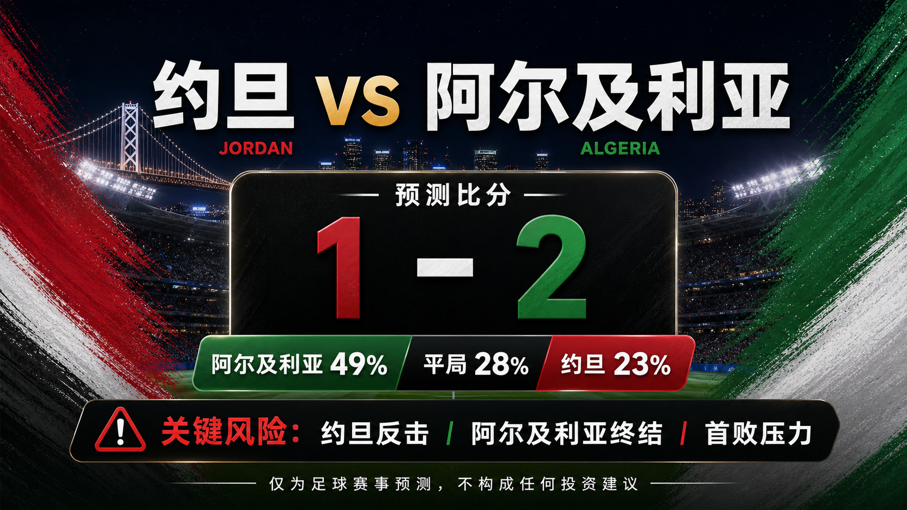

# Match 044: Jordan vs Algeria

[Dashboard](../README.md) | [简体中文](match-044-jor-alg.zh-CN.md) | [Daily report](../reports/daily/2026-06-23.md)

## Share Image




Lead image generation instruction:

```text
$imagegen: 生成【社交平台赛事预测首图】，16:9 横版，真实位图图片，只展示赛事对阵、比赛阶段、城市/场馆氛围和球队色彩；中文文档配图的主要比赛信息必须使用简体中文，可在画面合适位置保留英文队名/赛事信息作为辅助文字；不输出比分，不输出预测胜负，不输出概率，不使用胜/平/负、晋级、爆冷等结果暗示词；不要生成 SVG，不要生成 HTML，不要生成代码图，不要生成线框图，不要使用官方 FIFA 标志或水印。
```

Result image generation instruction:

```text
$imagegen: 生成【社交平台赛事预测配图】，16:9 横版，真实位图图片，用于抖音、小红书、微博和微信分享；中文文档配图的主要比赛信息必须使用简体中文，可在画面合适位置保留英文队名/赛事信息作为辅助文字；不要生成 SVG，不要生成 HTML，不要生成代码图，不要生成线框图，不要使用官方 FIFA 标志或水印。
```

## Prediction

| Outcome | Probability |
| --- | ---: |
| Jordan win | 23% |
| Draw | 28% |
| Algeria win | 49% |

- Predicted winner: Algeria
- Predicted scoreline: Jordan vs Algeria 1-2
- Confidence: medium-low
- Model: ChatGPT 5.5 ultra-high reasoning

## Scoreline Scenarios

| Scenario | Scoreline | Probability | Read |
| --- | --- | ---: | --- |
| primary | 1-2 | 12% | Algeria's ranking and attacking quality edge Jordan, but Jordan's transition route keeps the match close. |
| conservative_draw_path | 1-1 | 11% | Both teams protect against a second defeat, lowering tempo after the first goal and keeping the draw live. |
| upside_alternate | 0-2 | 9% | Algeria score first, force Jordan forward, and add a second through transition space. |

## Factual Basis

- FIFA/FOX fixture checks place Jordan vs Algeria at San Francisco Bay Area Stadium, China time 2026-06-23 11:00.
- FIFA ranking pages show Algeria 35th and Jordan 63rd; both lost openers, with Algeria falling to Argentina and Jordan to Austria.
- SportsMole's preview leans Algeria but keeps Jordan's scoring route visible, which keeps confidence at medium-low.

## Prediction Coverage Checklist

| Dimension | Snapshot status | Lean |
| --- | --- | --- |
| Tactics | Algeria have more individual quality in transition and wide areas; Jordan need compact defending and quick counters. | supports Algeria |
| Players | Algeria's attacking ceiling is higher, while Jordan's route depends on efficiency rather than sustained control. | supports Algeria |
| Injuries / suspensions | Checked previews do not confirm major late absences; final lineups remain unresolved. | mostly verified |
| Schedule / rest / travel | San Francisco evening conditions should be more forgiving than Dallas, with both teams coming from defeats. | neutral |
| History | Direct history is lower weight than current ranking and first-match evidence. | low weight |
| Public sentiment | Algeria are expected to respond after the Argentina loss; Jordan are still credited with a counter route. | supports Algeria |
| Weather / venue conditions | Climate Central match page suggests a lower heat burden than several other venues. | neutral |
| Psychology | Both teams need points, so a late draw-protection phase is plausible if level. | supports draw risk |
| Odds movement | Available market snapshots favor Algeria, but complete movement history is not stored. | supports Algeria with data gap |
| Expert views | SportsMole's preview gives Algeria the stronger win path while not dismissing Jordan's goal threat. | supports Algeria |

## Prediction Logic

1. Algeria's baseline ranking and individual attacking routes remain stronger even after the Argentina defeat.
2. Jordan's opener showed they can score, so the forecast keeps the underdog goal path rather than a clean favorite result.
3. The draw probability stays elevated because both teams may prioritize avoiding elimination damage if the game is level late.

## Risk Factors

- Jordan early counter, Algeria finishing variance, and the pressure of a second group match after defeats.
- If Algeria chase too aggressively, Jordan can turn the match into a transition exchange.
- Final lineups, match-hour weather, and complete odds movement are not fully archived.

## Platform Share Copy

### Douyin / 抖音

World Cup Group J prediction: Jordan vs Algeria. Lean: Algeria win, 1-2. Key risk: Jordan early counter, Algeria finishing variance, and the pressure of a second group match after defeats.
仅为足球赛事预测，不构成任何投资建议。

### Xiaohongshu / 小红书

Jordan vs Algeria prediction: Algeria win, 1-2. Confidence: medium-low. Late lineups and market movement remain the main data gaps.
仅为足球赛事预测，不构成任何投资建议。

### Weibo / 微博

Group J prediction: Jordan vs Algeria 1-2. Probability: JOR 23%, draw 28%, ALG 49%.
仅为足球赛事预测，不构成任何投资建议。#WorldCup2026#

### WeChat / 微信

Jordan vs Algeria forecast: Algeria win, 1-2. The forecast uses official fixture checks, FIFA ranking pages, reputable preview context, venue/weather notes, available market snapshots, and review calibration through Match 040. This is a football match prediction only and does not constitute investment advice. 仅为足球赛事预测，不构成任何投资建议。

## Disclaimer

This is a football match prediction only. It does not constitute investment advice, financial advice, or any guarantee of outcome.

仅为足球赛事预测，不构成任何投资建议、财务建议或结果承诺。

## Source Snapshot

- https://www.fifa.com/en/tournaments/mens/worldcup/canadamexicousa2026/scores-fixtures
- https://www.foxsports.com/soccer/fifa-world-cup-men-jordan-vs-algeria-jun-22-2026-game-boxscore-647659
- https://www.sportsmole.co.uk/football/jordan/world-cup-2026/preview/jordan-vs-algeria-prediction-team-news-lineups_599675.html
- https://www.climatecentral.org/world-cup-2026/matches/44
- https://inside.fifa.com/fifa-world-ranking/JOR?gender=men
- https://inside.fifa.com/fifa-world-ranking/ALG?gender=men
- Verified at: 2026-06-22T15:01:00+08:00
