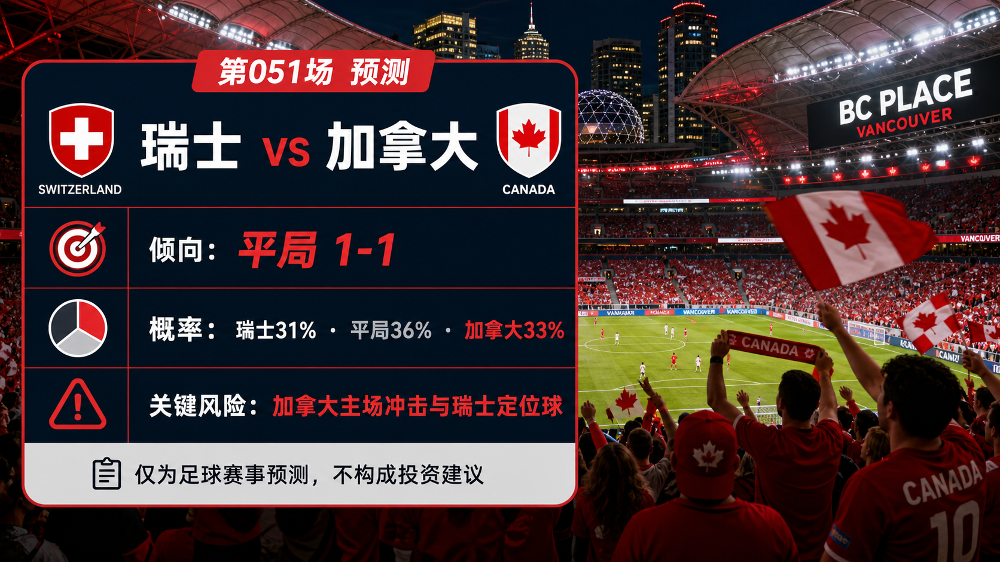

# Match 051: Switzerland vs Canada

[Dashboard](../README.md) | [简体中文](match-051-sui-can.zh-CN.md) | [Daily report](../reports/daily/2026-06-25.md)

## Share Image




Lead image generation instruction:

```text
$imagegen: 生成【社交平台赛事预测首图】，16:9 横版，真实位图图片，只展示赛事对阵、比赛阶段、城市/场馆氛围和球队色彩；中文文档配图的主要比赛信息必须使用简体中文，可在画面合适位置保留英文队名/赛事信息作为辅助文字；不输出比分，不输出预测胜负，不输出概率，不使用胜/平/负、晋级、爆冷等结果暗示词；不要生成 SVG，不要生成 HTML，不要生成代码图，不要生成线框图，不要使用官方 FIFA 标志或水印。
```

Result image generation instruction:

```text
$imagegen: 生成【社交平台赛事预测配图】，16:9 横版，真实位图图片，用于抖音、小红书、微博和微信分享；中文文档配图的主要比赛信息必须使用简体中文，可在画面合适位置保留英文队名/赛事信息作为辅助文字；不要生成 SVG，不要生成 HTML，不要生成代码图，不要生成线框图，不要使用官方 FIFA 标志或水印。
```

## Prediction

| Outcome | Probability |
| --- | ---: |
| Switzerland win | 31% |
| Draw | 36% |
| Canada win | 33% |

- Predicted winner: Draw
- Predicted scoreline: Switzerland vs Canada 1-1
- Confidence: medium-low
- Model: ChatGPT 5.5 ultra-high reasoning

## Scoreline Scenarios

| Scenario | Scoreline | Probability | Read |
| --- | --- | ---: | --- |
| primary | 1-1 | 12% | Both top Group B teams protect the point while still creating one scoring phase each. |
| conservative_draw_path | 0-0 | 8% | If the other Group B match stays close, neither side needs to overcommit. |
| upside_alternate | 1-2 | 9% | Canada's home intensity and transition speed turn one late phase into a narrow win. |

## Factual Basis

- FIFA match-centre and Matchday 14 preview checks place Switzerland vs Canada at BC Place Vancouver, China time 2026-06-25 03:00.
- Local data has Switzerland ranked 19th and Canada 30th; both teams enter this final Group B match on four points after Switzerland beat Bosnia and Canada beat Qatar.
- Climate Central Match 051 and Vancouver venue context were checked because travel, host atmosphere, and roofed-stadium conditions affect tempo.

## Prediction Coverage Checklist

| Dimension | Snapshot status | Lean |
| --- | --- | --- |
| Tactics | Switzerland's structured block and set pieces balance Canada's direct running and home pressure. | mixed |
| Players | Switzerland hold the higher ranking, but Canada's pace and host rhythm narrow the gap. | mixed |
| Injuries / suspensions | FIFA and RotoWire team-news previews were checked; final medical status and lineups remain late gaps. | data gap lowers confidence |
| Schedule / rest / travel | Canada stay in a host-country setting; Switzerland manage travel but can play for control. | supports Canada slightly |
| History | Current Group B results outweigh older head-to-head context. | low weight |
| Public sentiment | Canada's 6-0 Qatar result raises home optimism; Switzerland's 4-1 Bosnia win keeps the market balanced. | mixed |
| Weather / venue conditions | BC Place reduces some weather volatility, but venue tempo and crowd pressure remain relevant. | mixed |
| Psychology | Both sides can value risk control because the group table is favorable. | supports draw |
| Odds movement | Complete odds movement was not archived for all six matches. | data gap |
| Expert views | FIFA and RotoWire previews frame this as a balanced group-control match. | mixed |

## Prediction Logic

1. The table context makes a draw more plausible than a pure strength ranking would suggest.
2. Switzerland have the higher baseline, while Canada's host edge and recent goal surge keep the away-win path live.
3. Confidence stays medium-low because late lineups and complete odds movement are not fully archived.

## Risk Factors

- Canada's host pressure, Switzerland set pieces, and a possible low-tempo qualification-management script.
- Final lineups, late medical updates, match-hour weather, and complete odds movement are not fully stored.
- An early goal can shift the match from planned control into a chase-heavy script.

## Platform Share Copy

### Douyin / 抖音

World Cup Group B prediction: Switzerland vs Canada. Lean: Draw, 1-1. Key risk: Canada's host pressure, Switzerland set pieces, and a possible low-tempo qualification-management script.
仅为足球赛事预测，不构成任何投资建议。

### Xiaohongshu / 小红书

Switzerland vs Canada prediction: Draw, 1-1. Confidence: medium-low. Late lineups and market movement remain the main data gaps.
仅为足球赛事预测，不构成任何投资建议。

### Weibo / 微博

Group B prediction: Switzerland vs Canada 1-1. Probability: SUI 31%, draw 36%, CAN 33%.
仅为足球赛事预测，不构成任何投资建议。#WorldCup2026#

### WeChat / 微信

Switzerland vs Canada forecast: Draw, 1-1. The forecast uses official FIFA fixture and preview checks, FIFA ranking pages, venue/weather notes, prior result context, and review calibration through Match 048. This is a football match prediction only and does not constitute investment advice. 仅为足球赛事预测，不构成任何投资建议。

## Disclaimer

This is a football match prediction only. It does not constitute investment advice, financial advice, or any guarantee of outcome.

仅为足球赛事预测，不构成任何投资建议、财务建议或结果承诺。

## Source Snapshot

- https://www.fifa.com/en/tournaments/mens/worldcup/canadamexicousa2026/scores-fixtures
- https://www.fifa.com/en/match-centre/match/17/285023/289273/400021451
- https://www.fifa.com/en/tournaments/mens/worldcup/canadamexicousa2026/articles/matches-preview-matchday-fourteen-24-june-2026
- https://www.climatecentral.org/world-cup-2026/matches/51
- https://inside.fifa.com/fifa-world-ranking/SUI?gender=men
- https://inside.fifa.com/fifa-world-ranking/CAN?gender=men
- https://www.rotowire.com/soccer/article/switzerland-vs-canada-preview-predicted-lineups-team-news-tactical-analysis-2026-world-cup-group-b-119146
- Verified at: 2026-06-24T22:20:00+08:00
