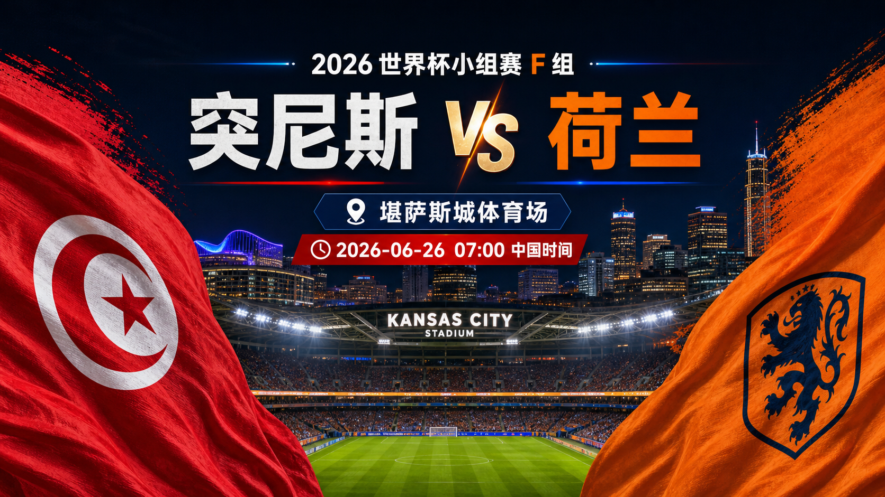
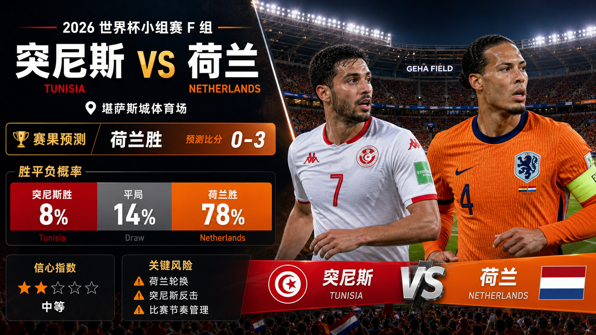

# Match 058: Tunisia vs Netherlands

[Dashboard](../README.md) | [简体中文](match-058-tun-ned.zh-CN.md) | [Daily report](../reports/daily/2026-06-26.md)

## Share Image





Lead image generation instruction:

```text
$imagegen: 生成【社交平台赛事预测首图】，16:9 横版，真实位图图片，只展示赛事对阵、比赛阶段、城市/场馆氛围和球队色彩；中文文档配图的主要比赛信息必须使用简体中文，可在画面合适位置保留英文队名/赛事信息作为辅助文字；不输出比分，不输出预测胜负，不输出概率，不使用胜/平/负、晋级、爆冷等结果暗示词；不要生成 SVG，不要生成 HTML，不要生成代码图，不要生成线框图，不要使用官方 FIFA 标志或水印。
```

Result image generation instruction:

```text
$imagegen: 生成【社交平台赛事预测配图】，16:9 横版，真实位图图片，用于抖音、小红书、微博和微信分享；中文文档配图的主要比赛信息必须使用简体中文，可在画面合适位置保留英文队名/赛事信息作为辅助文字；不要生成 SVG，不要生成 HTML，不要生成代码图，不要生成线框图，不要使用官方 FIFA 标志或水印。
```

## Prediction

| Outcome | Probability |
| --- | ---: |
| Tunisia win | 8% |
| Draw | 14% |
| Netherlands win | 78% |

- Predicted winner: Netherlands
- Predicted scoreline: Tunisia vs Netherlands 0-3
- Confidence: medium
- Model: ChatGPT 5.5 ultra-high reasoning

## Scoreline Scenarios

| Scenario | Scoreline | Probability | Read |
| --- | --- | ---: | --- |
| primary | 0-3 | 15% | The Netherlands' attacking form meets a Tunisia side whose defensive confidence has already been stressed. |
| conservative_draw_path | 1-1 | 5% | The draw path needs heavy Dutch rotation and one Tunisia transition finish. |
| upside_alternate | 0-2 | 14% | The Netherlands control the match at a lower tempo and stop short of a rout. |

## Factual Basis

- FIFA Matchday 15 and match-centre checks place Tunisia vs Netherlands at Kansas City Stadium, China time 2026-06-26 07:00.
- Local rankings list the Netherlands 8th and Tunisia 45th; the Netherlands have four points and a strong goal-difference position.
- Tunisia have conceded heavily in both tracked Group F matches, while the Netherlands' 5-1 win over Sweden raised their multi-goal tail.

## Prediction Coverage Checklist

| Dimension | Snapshot status | Lean |
| --- | --- | --- |
| Tactics | Tunisia's likely route is built around compactness and transition moments; Netherlands hold the stronger control or chance-quality route. | mixed, lean follows probability table |
| Players | FIFA ranking snapshot and prior group results support the published squad-depth read for Tunisia vs Netherlands. | supports the lean with caveats |
| Injuries / suspensions | FIFA preview and match-centre context were checked; final lineups and late medical bulletins remain unverified at publication time. | data gap lowers confidence |
| Schedule / rest / travel | Both teams are on the same group-stage recovery cadence, but simultaneous final-match incentives can change risk appetite. | mixed |
| Head-to-head / tournament history | Current Group stage form and table incentives are weighted above older head-to-head history. | current form weighted higher |
| Public sentiment / media narrative | FIFA Matchday 15 framing and group-table pressure were used; full public sentiment sampling is incomplete. | data gap |
| Weather / venue conditions | Climate Central Match 058 and venue notes were checked; match-hour conditions remain a late variable. | tempo risk |
| Psychology / pressure / motivation | Final group-match incentives are central to the scenario split, especially for teams needing a result. | material |
| Odds movement | Complete odds movement was not archived for all six matches. | data gap |
| Expert views | FIFA preview context was checked; a full multi-outlet expert consensus was unavailable in the stored snapshot. | data gap lowers confidence |

## Prediction Logic

1. The Netherlands hold the strongest probability edge of this China-time window.
2. Tunisia's defensive trend makes a clean-sheet favorite result more live than a narrow escape.
3. Rotation and a low-tempo script stop the confidence from moving higher.

## Risk Factors

- Netherlands rotation, Tunisia transition pride, and match-tempo management.
- Final lineups, late medical updates, match-hour weather, and complete odds movement are not fully stored.
- An early goal can shift the final group-match script away from the baseline probability table.

## Platform Share Copy

### Douyin / 抖音

World Cup Group F prediction: Tunisia vs Netherlands. Lean: Netherlands win, 0-3. Key risk: Netherlands rotation, Tunisia transition pride, and match-tempo management.
仅为足球赛事预测，不构成任何投资建议。

### Xiaohongshu / 小红书

Tunisia vs Netherlands prediction: Netherlands win, 0-3. Confidence: medium. Late lineups and market movement remain the main data gaps.
仅为足球赛事预测，不构成任何投资建议。

### Weibo / 微博

Group F prediction: Tunisia vs Netherlands 0-3. Probability: TUN 8%, draw 14%, NED 78%.
仅为足球赛事预测，不构成任何投资建议。#WorldCup2026#

### WeChat / 微信

Tunisia vs Netherlands forecast: Netherlands win, 0-3. The forecast uses official FIFA fixture and Matchday 15 preview checks, FIFA ranking pages, venue/weather notes, prior group results, and review calibration through Match 054. This is a football match prediction only and does not constitute investment advice. 仅为足球赛事预测，不构成任何投资建议。

## Disclaimer

This is a football match prediction only. It does not constitute investment advice, financial advice, or any guarantee of outcome.

仅为足球赛事预测，不构成任何投资建议、财务建议或结果承诺。

## Source Snapshot

- https://www.fifa.com/en/tournaments/mens/worldcup/canadamexicousa2026/scores-fixtures
- https://www.fifa.com/en/match-centre/match/17/285023/289273/400021473
- https://www.fifa.com/en/tournaments/mens/worldcup/canadamexicousa2026/articles/matches-preview-matchday-fifteen-25-june-2026
- https://www.climatecentral.org/world-cup-2026/matches/58
- https://inside.fifa.com/fifa-world-ranking/TUN?gender=men
- https://inside.fifa.com/fifa-world-ranking/NED?gender=men
- Verified at: 2026-06-25T13:51:27+08:00
