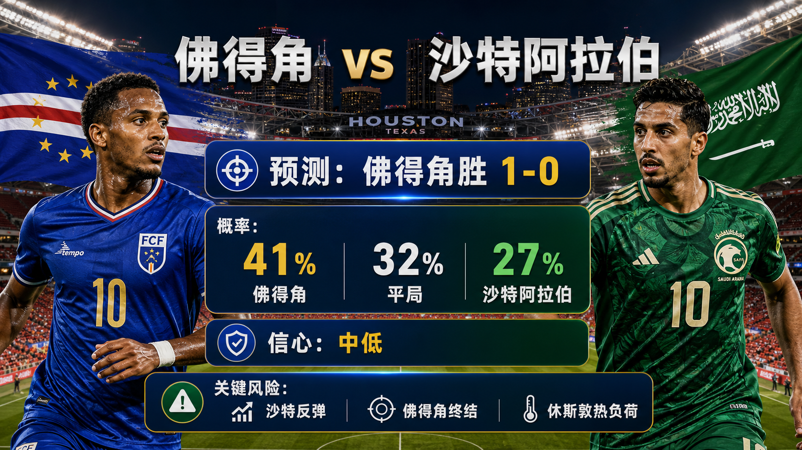

# 第 065 场：佛得角 vs 沙特阿拉伯

[仪表盘](../docs/README.zh-CN.md) | [English](match-065-cpv-ksa.md) | [日报](../reports/daily/2026-06-27.zh-CN.md)

## 预测配图




首图生成指令：

```text
$imagegen: 生成【社交平台赛事预测首图】，16:9 横版，真实位图图片，只展示赛事对阵、比赛阶段、城市/场馆氛围和球队色彩；中文文档配图的主要比赛信息必须使用简体中文，可在画面合适位置保留英文队名/赛事信息作为辅助文字；不输出比分，不输出预测胜负，不输出概率，不使用胜/平/负、晋级、爆冷等结果暗示词；不要生成 SVG，不要生成 HTML，不要生成代码图，不要生成线框图，不要使用官方 FIFA 标志或水印。
```

结果图生成指令：

```text
$imagegen: 生成【社交平台赛事预测配图】，16:9 横版，真实位图图片，用于抖音、小红书、微博和微信分享；中文文档配图的主要比赛信息必须使用简体中文，可在画面合适位置保留英文队名/赛事信息作为辅助文字；不要生成 SVG，不要生成 HTML，不要生成代码图，不要生成线框图，不要使用官方 FIFA 标志或水印。
```

## 预测

| 结果 | 概率 |
| --- | ---: |
| 佛得角胜 | 41% |
| 平局 | 32% |
| 沙特阿拉伯胜 | 27% |

- 预测胜者：佛得角
- 预测比分：佛得角 vs 沙特阿拉伯 1-0
- 信心等级：中低
- 模型：ChatGPT 5.5 ultra-high reasoning

## 比分情景

| 情景 | 比分 | 概率 | 判断 |
| --- | --- | ---: | --- |
| 主情景 | 1-0 | 11% | 佛得角紧凑性把一次机会转化为小胜。 |
| 保守 / 平局路径 | 1-1 | 10% | 如果佛得角守不住领先，沙特有回应路径。 |
| 上限 / 替代路径 | 2-1 | 8% | 后段追分拉开后，佛得角再获一次转换机会。 |

## 事实依据

- 已按 FIFA / 可信赛程来源核验比赛、场地、小组和开球；中国时间：2026-06-27 08:00。
- 使用 FIFA 排名快照和前序小组赛结果判断球队强度与积分动机。
- 最终首发、完整赔率变化和比赛小时级条件仍是临场数据缺口。

## 预测覆盖检查

| 维度 | 快照状态 | 倾向 |
| --- | --- | --- |
| 战术 | Final group-match incentives shape the tactical risk: compact defending, transition chances, and set pieces are all material. | mixed |
| 球员 | FIFA ranking snapshot and prior group results support the baseline quality read for 佛得角 vs 沙特阿拉伯. | supports lean with caveats |
| 伤病 / 停赛 | Final lineups and late medical bulletins were not fully archived at publication time. | data gap lowers confidence |
| 赛程 / 休息 / 旅行 | Both teams share the group-stage recovery cadence, but simultaneous kickoffs change risk appetite. | mixed |
| 交锋 / 赛事历史 | Current group form and table incentives are weighted above older history. | current form weighted higher |
| 舆情 / 媒体叙事 | Official/reputable preview framing was checked; full public sentiment sampling remains incomplete. | data gap |
| 天气 / 场馆条件 | Venue and Climate Central Match 065 notes were checked; match-hour weather remains a late variable. | tempo risk |
| 心理 / 压力 / 动机 | Qualification pressure is central to the scenario split. | material |
| 赔率变化 | Complete odds movement was not archived for all matches. | data gap |
| 专家观点 | Official/reputable previews were used where available; full analyst consensus is not stored. | data gap lowers confidence |

## 预测逻辑

1. 概率表综合排名基线、小组积分动机和近期赛事状态。
2. 头条比分对应最可能比赛脚本，同时保留平局或低分差路径。
3. 最终首发、天气和赔率变化不完整，因此限制信心上限。

## 风险因素

- 沙特反弹、佛得角终结，以及休斯敦热负荷。
- 最终首发、临场医疗更新、比赛小时级天气和完整赔率变化未完全存储。
- 早段进球会把小组末轮脚本从基准概率表中拉开。

## 平台分享文案

### 抖音

世界杯H 组预测：佛得角 vs 沙特阿拉伯。倾向：佛得角胜，1-0。关键风险：沙特反弹、佛得角终结，以及休斯敦热负荷。
仅为足球赛事预测，不构成任何投资建议。

### 小红书

佛得角 vs 沙特阿拉伯预测：佛得角胜，1-0。信心：中低。临场首发和市场变化仍是主要数据缺口。
仅为足球赛事预测，不构成任何投资建议。

### 微博

H 组预测：佛得角 vs 沙特阿拉伯 1-0。概率：CPV 41%，平局 32%，KSA 27%。
仅为足球赛事预测，不构成任何投资建议。#世界杯# #WorldCup2026#

### 微信

佛得角 vs 沙特阿拉伯预测：佛得角胜，1-0。判断基于赛程核验、FIFA 排名页、场地 / 天气资料、前序小组赛结果和截至第 066 场的复盘校准。This is a football match prediction only and does not constitute investment advice. 仅为足球赛事预测，不构成任何投资建议。

## 免责声明

This is a football match prediction only. It does not constitute investment advice, financial advice, or any guarantee of outcome.

仅为足球赛事预测，不构成任何投资建议、财务建议或结果承诺。

## 来源快照

- https://www.fifa.com/en/tournaments/mens/worldcup/canadamexicousa2026/scores-fixtures
- https://www.fifa.com/en/match-centre/match/17/285023/289273/400021485
- https://www.fifa.com/en/tournaments/mens/worldcup/canadamexicousa2026/articles/matchday-16-preview-group-g-h-i
- https://www.climatecentral.org/world-cup-2026/matches/65
- https://inside.fifa.com/fifa-world-ranking/CPV?gender=men
- https://inside.fifa.com/fifa-world-ranking/KSA?gender=men
- 核验时间：2026-06-26T22:16:00+08:00
