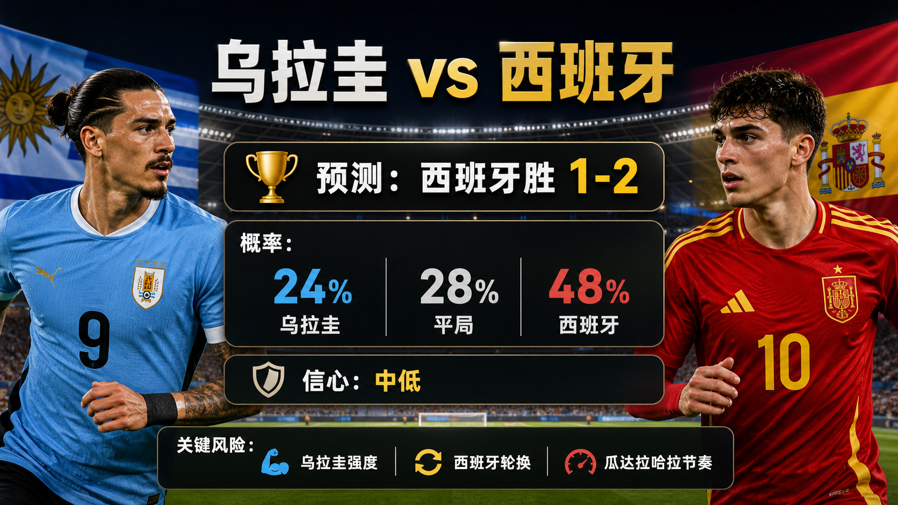

# Match 066: Uruguay vs Spain

[Dashboard](../README.md) | [简体中文](match-066-uru-esp.zh-CN.md) | [Daily report](../reports/daily/2026-06-27.md)

## Share Image




Lead image generation instruction:

```text
$imagegen: 生成【社交平台赛事预测首图】，16:9 横版，真实位图图片，只展示赛事对阵、比赛阶段、城市/场馆氛围和球队色彩；中文文档配图的主要比赛信息必须使用简体中文，可在画面合适位置保留英文队名/赛事信息作为辅助文字；不输出比分，不输出预测胜负，不输出概率，不使用胜/平/负、晋级、爆冷等结果暗示词；不要生成 SVG，不要生成 HTML，不要生成代码图，不要生成线框图，不要使用官方 FIFA 标志或水印。
```

Result image generation instruction:

```text
$imagegen: 生成【社交平台赛事预测配图】，16:9 横版，真实位图图片，用于抖音、小红书、微博和微信分享；中文文档配图的主要比赛信息必须使用简体中文，可在画面合适位置保留英文队名/赛事信息作为辅助文字；不要生成 SVG，不要生成 HTML，不要生成代码图，不要生成线框图，不要使用官方 FIFA 标志或水印。
```

## Prediction

| Outcome | Probability |
| --- | ---: |
| Uruguay win | 24% |
| Draw | 28% |
| Spain win | 48% |

- Predicted winner: Spain
- Predicted scoreline: Uruguay vs Spain 1-2
- Confidence: medium-low
- Model: ChatGPT 5.5 ultra-high reasoning

## Scoreline Scenarios

| Scenario | Scoreline | Probability | Read |
| --- | --- | ---: | --- |
| primary | 1-2 | 12% | Spain's control wins despite Uruguay's pressure response. |
| conservative_draw_path | 1-1 | 10% | Uruguay's duel intensity holds Spain to one goal. |
| upside_alternate | 0-2 | 9% | Spain score first and manage Uruguay's chase cleanly. |

## Factual Basis

- Fixture, venue, group, and kickoff were checked against FIFA/reputable schedule sources; China time: 2026-06-27 08:00.
- FIFA ranking snapshot and prior group results were used for team-strength and incentive context.
- Final lineups, complete odds movement, and match-hour conditions remain late data gaps.

## Prediction Coverage Checklist

| Dimension | Snapshot status | Lean |
| --- | --- | --- |
| Tactics | Final group-match incentives shape the tactical risk: compact defending, transition chances, and set pieces are all material. | mixed |
| Players | FIFA ranking snapshot and prior group results support the baseline quality read for Uruguay vs Spain. | supports lean with caveats |
| Injuries / suspensions | Final lineups and late medical bulletins were not fully archived at publication time. | data gap lowers confidence |
| Schedule / rest / travel | Both teams share the group-stage recovery cadence, but simultaneous kickoffs change risk appetite. | mixed |
| Head-to-head / tournament history | Current group form and table incentives are weighted above older history. | current form weighted higher |
| Public sentiment / media narrative | Official/reputable preview framing was checked; full public sentiment sampling remains incomplete. | data gap |
| Weather / venue conditions | Venue and Climate Central Match 066 notes were checked; match-hour weather remains a late variable. | tempo risk |
| Psychology / pressure / motivation | Qualification pressure is central to the scenario split. | material |
| Odds movement | Complete odds movement was not archived for all matches. | data gap |
| Expert views | Official/reputable previews were used where available; full analyst consensus is not stored. | data gap lowers confidence |

## Prediction Logic

1. The published probability table weights ranking baseline, group-table incentive, and recent tournament form.
2. The headline scoreline follows the most likely match script while keeping a draw or lower-margin route visible.
3. Confidence is capped where final lineups, weather, and odds movement are incomplete.

## Risk Factors

- Uruguay intensity, Spain rotation, and Guadalajara tempo.
- Final lineups, late medical updates, match-hour weather, and complete odds movement are not fully stored.
- An early goal can shift the final group-match script away from the baseline probability table.

## Platform Share Copy

### Douyin / 抖音

World Cup Group H prediction: Uruguay vs Spain. Lean: Spain win, 1-2. Key risk: Uruguay intensity, Spain rotation, and Guadalajara tempo.
仅为足球赛事预测，不构成任何投资建议。

### Xiaohongshu / 小红书

Uruguay vs Spain prediction: Spain win, 1-2. Confidence: medium-low. Late lineups and market movement remain the main data gaps.
仅为足球赛事预测，不构成任何投资建议。

### Weibo / 微博

Group H prediction: Uruguay vs Spain 1-2. Probability: URU 24%, draw 28%, ESP 48%.
仅为足球赛事预测，不构成任何投资建议。#WorldCup2026#

### WeChat / 微信

Uruguay vs Spain forecast: Spain win, 1-2. This forecast uses fixture checks, FIFA ranking pages, venue/weather notes, prior group results, and review calibration through Match 066. This is a football match prediction only and does not constitute investment advice. 仅为足球赛事预测，不构成任何投资建议。

## Disclaimer

This is a football match prediction only. It does not constitute investment advice, financial advice, or any guarantee of outcome.

仅为足球赛事预测，不构成任何投资建议、财务建议或结果承诺。

## Source Snapshot

- https://www.fifa.com/en/tournaments/mens/worldcup/canadamexicousa2026/scores-fixtures
- https://www.fifa.com/en/match-centre/match/17/285023/289273/400021484
- https://www.fifa.com/en/tournaments/mens/worldcup/canadamexicousa2026/articles/matchday-16-preview-group-g-h-i
- https://www.climatecentral.org/world-cup-2026/matches/66
- https://inside.fifa.com/fifa-world-ranking/URU?gender=men
- https://inside.fifa.com/fifa-world-ranking/ESP?gender=men
- Verified at: 2026-06-26T22:16:00+08:00
