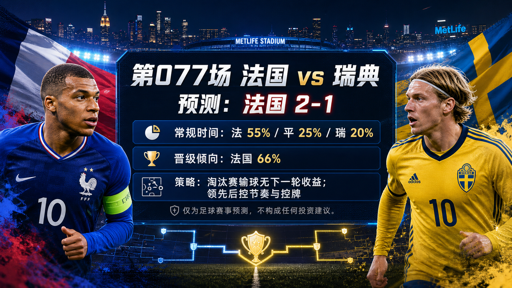

# Match 077: France vs Sweden

[Dashboard](../README.md) | [简体中文](match-077-fra-swe.zh-CN.md) | [Daily report](../reports/daily/2026-07-01.md)

## Share Image




Lead image generation instruction:

```text
$imagegen: 生成【社交平台赛事预测首图】，16:9 横版，真实位图图片，只展示赛事对阵、比赛阶段、城市/场馆氛围和球队色彩；中文文档配图的主要比赛信息必须使用简体中文，可在画面合适位置保留英文队名/赛事信息作为辅助文字；不输出比分，不输出预测胜负，不输出概率，不使用胜/平/负、晋级、爆冷等结果暗示词；不要生成 SVG，不要生成 HTML，不要生成代码图，不要生成线框图，不要使用官方 FIFA 标志或水印。
```

Result image generation instruction:

```text
$imagegen: 生成【社交平台赛事预测配图】，16:9 横版，真实位图图片，用于抖音、小红书、微博和微信分享；中文文档配图的主要比赛信息必须使用简体中文，可在画面合适位置保留英文队名/赛事信息作为辅助文字；不要生成 SVG，不要生成 HTML，不要生成代码图，不要生成线框图，不要使用官方 FIFA 标志或水印。
```

## Prediction

| Outcome | Regulation-time probability |
| --- | ---: |
| France win | 55% |
| Draw | 25% |
| Sweden win | 20% |

- Predicted regulation-time result: France
- Predicted scoreline: France vs Sweden 2-1
- Advancement lean: FRA 66%, SWE 34%
- Confidence: medium
- Model: ChatGPT 5.5 ultra-high reasoning

## Scoreline Scenarios

| Scenario | Scoreline | Probability | Read |
| --- | --- | ---: | --- |
| primary | 2-1 | 13% | France's attacking depth and wide acceleration create enough chances, but Sweden's set pieces keep the margin narrow. |
| conservative_draw_path | 1-1 | 11% | Sweden's compact block, aerial threat, and slower tempo drag the match into extra-time territory. |
| upside_alternate | 0-1 | 7% | A Swedish set piece or second-ball sequence lands first and France chase against a protected box. |

## Factual Basis

- FIFA/reputable fixture sources list Match 077 as France vs Sweden, Round of 32, at New York New Jersey Stadium; kickoff is 2026-06-30 21:00 UTC / 2026-07-01 05:00 China time.
- France rank 3rd and carry the stronger attacking-depth baseline; Sweden rank 38th but remain dangerous through set pieces and compact defensive phases.
- Paraguay eliminating Germany changes the visible next opponent: the France/Sweden winner is now projected toward Paraguay, not Germany, in the next round.
- Late official lineup, medical, suspension, match-hour weather, and complete odds-movement data remain data gaps, so the confidence stays at medium rather than higher.

## Prediction Coverage Checklist

| Dimension | Snapshot status | Lean |
| --- | --- | --- |
| Tactics | France can stress Sweden through wide speed and between-line movement; Sweden can lower the event count with compact spacing and set-piece delivery. | supports France with draw risk |
| Players | France have the deeper attacking and substitute profile; Sweden's best route is aerial pressure, second balls, and disciplined box defence. | supports France |
| Injuries / suspensions | Late official lineups, medical updates, and disciplinary sheets are not fully archived at publication time. | data gap lowers confidence |
| Schedule / rest / travel | New York/New Jersey travel and evening kickoff are manageable; extra time would matter because the next round arrives quickly. | mixed |
| Head-to-head / tournament history | Older history is weighted lightly; current tournament form and squad quality are more relevant. | mixed |
| Public sentiment / media narrative | Public previews and odds snippets lean France while warning that Sweden's dead-ball route keeps the upset path alive. | supports France with caution |
| Weather / venue conditions | Venue/weather checks are included, but match-hour wind, pitch speed, and exact conditions are not fully archived. | minor data gap |
| Psychology / pressure / motivation | France carry favourite pressure; Sweden can play a lower-pressure spoiler role. | mixed |
| Bracket path incentives | Knockout losing creates no next-round opportunity. Paraguay's penalty win over Germany makes the winner's next opponent look less powerful than the pre-match Germany path, but it does not support deliberate underperformance; it only affects risk appetite if leading, substitution timing, card management, and extra-time tolerance. | supports France with resource-management caveat |
| Odds movement | Public price snippets make France favourite, but complete opening-to-current line movement is not archived. | supports France, data gap |
| Expert views | Reputable previews favour France's quality while flagging Sweden's set-piece and low-block routes as the main disagreement case. | supports France with caution |

## Prediction Logic

1. France have the cleaner chance-creation floor and better bench options, so the regulation lean stays on a 2-1 France win.
2. Sweden's path is not a possession contest; it is a set-piece, second-ball, and extra-time pressure route, which keeps the draw scenario material.
3. The bracket-path check does not create a Tian Ji horse-racing incentive. Because a loss ends the tournament, the Paraguay next-round path only nudges France toward controlled risk management if they lead.

## Risk Factors

- Sweden scoring first from a dead ball and forcing France into a crowded box.
- France finishing below expected value and letting the match reach penalties.
- Late availability or weather news changing France's pressing and wide-speed advantage.

## Platform Share Copy

### Douyin / 抖音

World Cup Round of 32 prediction: France vs Sweden. Lean: France win, 2-1. Strategy read: knockout losses have no next-round upside; bracket path only affects substitutions, cards, travel/rest, extra-time risk, and confidence.
仅为足球赛事预测，不构成任何投资建议。

### Xiaohongshu / 小红书

France vs Sweden: FRA 55%, draw 25%, SWE 20%; advancement FRA 66%. The Tian Ji-style path-selection hypothesis is unsupported here because losing ends the tournament; the live bracket only changes risk management.
仅为足球赛事预测，不构成任何投资建议。

### Weibo / 微博

Round of 32 forecast: France vs Sweden 2-1. Probability summary: FRA 55%, draw 25%, SWE 20%; advancement FRA 66%.
仅为足球赛事预测，不构成任何投资建议。#WorldCup2026#

### WeChat / 微信

France vs Sweden forecast: France win, 2-1. The prediction explicitly checks bracket-path incentives: a knockout loss brings no future route benefit, so the strategy read focuses on managing the win path, opponent quality, travel/rest, cards, substitutions, and extra-time exposure. This is a football match prediction only and does not constitute investment advice. 仅为足球赛事预测，不构成任何投资建议。

## Disclaimer

This is a football match prediction only. It does not constitute investment advice, financial advice, or any guarantee of outcome.

仅为足球赛事预测，不构成任何投资建议、财务建议或结果承诺。

## Source Snapshot

- https://www.fifa.com/en/tournaments/mens/worldcup/canadamexicousa2026/scores-fixtures
- https://www.fifa.com/en/match-centre/match/17/285023/289287/400021523
- https://www.espn.com/soccer/story/_/id/48939282/2026-fifa-world-cup-fixtures-results-match-schedule-group-stage-knockout-rounds-bracket
- https://www.foxsports.com/stories/soccer/world-cup-round-32-predictions-one-thing-watch-every-team
- https://www.si.com/soccer/france-vs-sweden-world-cup-preview-predictions-lineups-6-30-26
- https://www.cbssports.com/soccer/news/france-vs-sweden-world-cup-2026-preview-predictions-watch/amp/
- https://www.climatecentral.org/world-cup-2026/matches/77
- https://inside.fifa.com/fifa-world-ranking/FRA?gender=men
- https://inside.fifa.com/fifa-world-ranking/SWE?gender=men
- Verified at: 2026-06-30T23:55:00+08:00
