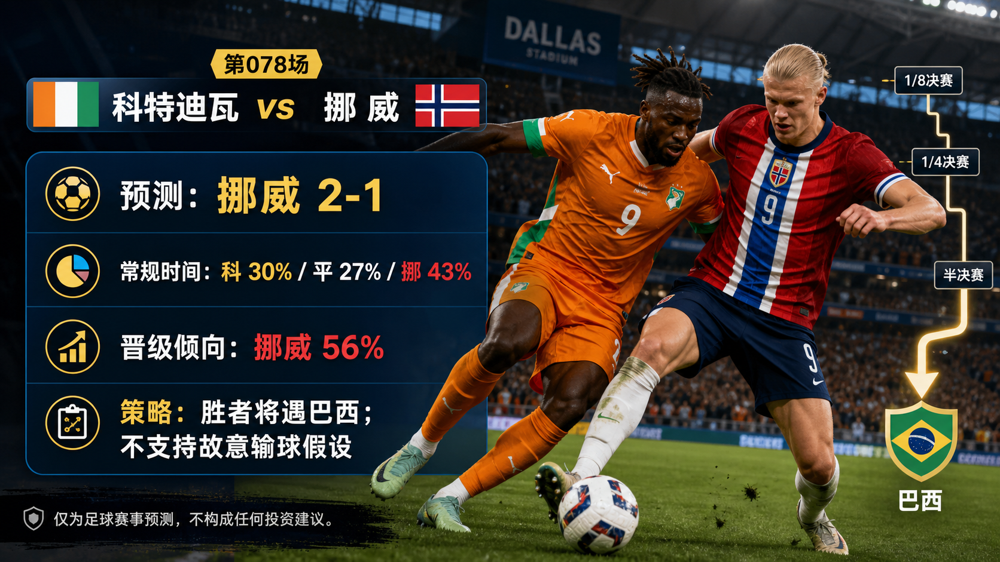

# Match 078: Cote d'Ivoire vs Norway

[Dashboard](../README.md) | [简体中文](match-078-civ-nor.zh-CN.md) | [Daily report](../reports/daily/2026-07-01.md)

## Share Image




Lead image generation instruction:

```text
$imagegen: 生成【社交平台赛事预测首图】，16:9 横版，真实位图图片，只展示赛事对阵、比赛阶段、城市/场馆氛围和球队色彩；中文文档配图的主要比赛信息必须使用简体中文，可在画面合适位置保留英文队名/赛事信息作为辅助文字；不输出比分，不输出预测胜负，不输出概率，不使用胜/平/负、晋级、爆冷等结果暗示词；不要生成 SVG，不要生成 HTML，不要生成代码图，不要生成线框图，不要使用官方 FIFA 标志或水印。
```

Result image generation instruction:

```text
$imagegen: 生成【社交平台赛事预测配图】，16:9 横版，真实位图图片，用于抖音、小红书、微博和微信分享；中文文档配图的主要比赛信息必须使用简体中文，可在画面合适位置保留英文队名/赛事信息作为辅助文字；不要生成 SVG，不要生成 HTML，不要生成代码图，不要生成线框图，不要使用官方 FIFA 标志或水印。
```

## Prediction

| Outcome | Regulation-time probability |
| --- | ---: |
| Cote d'Ivoire win | 30% |
| Draw | 27% |
| Norway win | 43% |

- Predicted regulation-time result: Norway
- Predicted scoreline: Cote d'Ivoire vs Norway 1-2
- Advancement lean: CIV 44%, NOR 56%
- Confidence: medium-low
- Model: ChatGPT 5.5 ultra-high reasoning

## Scoreline Scenarios

| Scenario | Scoreline | Probability | Read |
| --- | --- | ---: | --- |
| primary | 1-2 | 12% | Norway's elite penalty-box reference and direct service edge a physical match, while Cote d'Ivoire still find transition pressure. |
| conservative_draw_path | 1-1 | 12% | Cote d'Ivoire's duel strength and set-piece value slow Norway enough to force extra time. |
| upside_alternate | 2-1 | 8% | Cote d'Ivoire win second balls, turn the match into transition phases, and punish Norway before the final pass settles. |

## Factual Basis

- FIFA/reputable fixture sources list Match 078 as Cote d'Ivoire vs Norway, Round of 32, at Dallas Stadium; kickoff is 2026-06-30 17:00 UTC / 2026-07-01 01:00 China time.
- Norway rank 11th and bring the stronger central-finishing reference; Cote d'Ivoire rank 33rd and can make the match physical, direct, and set-piece heavy.
- Brazil beating Japan means the winner is now expected to face Brazil, which raises the cost of extra time, cards, and late fatigue.
- Late lineups, injuries, suspensions, and complete odds movement remain incomplete, so the confidence is medium-low.

## Prediction Coverage Checklist

| Dimension | Snapshot status | Lean |
| --- | --- | --- |
| Tactics | Norway can play early into the box and attack cutbacks; Cote d'Ivoire can disrupt rhythm through duels, rest defence, and transition carries. | slight Norway |
| Players | Norway's elite finishing reference is the clearest individual edge; Cote d'Ivoire have athletic balance and duel volume. | supports Norway |
| Injuries / suspensions | Late official availability, suspensions, and lineups are not fully archived at publication time. | data gap lowers confidence |
| Schedule / rest / travel | Dallas midday conditions and possible roof/heat variables make tempo, hydration, and extra time important. | mixed |
| Head-to-head / tournament history | Older head-to-head data has low weight; the matchup is driven by current tournament form and stylistic contrast. | mixed |
| Public sentiment / media narrative | Public previews lean Norway because of top-end finishing while still treating Cote d'Ivoire as a live physical underdog. | supports Norway with caution |
| Weather / venue conditions | Climate/venue pages are checked, but exact roof and match-hour conditions are unresolved. | tempo risk |
| Psychology / pressure / motivation | Norway carry the expectation attached to their star forwards; Cote d'Ivoire can play a lower-pressure spoiler script. | mixed |
| Bracket path incentives | Brazil are now the likely next opponent after Match 076. Losing has no next-round benefit, so a Tian Ji horse-racing strategy is unsupported. The real incentive is to win without creating avoidable extra-time, booking, and muscle-load costs before a Brazil path. | supports Norway with Brazil-path caveat |
| Odds movement | Public odds snippets lean Norway, but opening-to-current movement is not fully archived. | supports Norway, data gap |
| Expert views | RotoWire/VSiN-style previews frame Norway as favourite but flag Cote d'Ivoire's physical transition route. | supports Norway with caution |

## Prediction Logic

1. Norway have the clearer single-action scoring edge, which matters in a knockout match that may not offer many clean chances.
2. Cote d'Ivoire keep the upset path alive by raising duel volume and turning Norway's buildup into second-ball contests.
3. The bracket-path analysis pushes confidence down: the winner likely gets Brazil, but because a loss ends the tournament, that only increases the importance of efficient winning rather than strategic underperformance.

## Risk Factors

- Cote d'Ivoire winning midfield second balls and turning the match into transitions.
- Norway becoming too direct and losing control of defensive spacing.
- Dallas heat/roof uncertainty and extra time changing physical sustainability.

## Platform Share Copy

### Douyin / 抖音

World Cup Round of 32 prediction: Cote d'Ivoire vs Norway. Lean: Norway win, 1-2. Strategy read: knockout losses have no next-round upside; bracket path only affects substitutions, cards, travel/rest, extra-time risk, and confidence.
仅为足球赛事预测，不构成任何投资建议。

### Xiaohongshu / 小红书

Cote d'Ivoire vs Norway: CIV 30%, draw 27%, NOR 43%; advancement NOR 56%. The Tian Ji-style path-selection hypothesis is unsupported here because losing ends the tournament; the live bracket only changes risk management.
仅为足球赛事预测，不构成任何投资建议。

### Weibo / 微博

Round of 32 forecast: Cote d'Ivoire vs Norway 1-2. Probability summary: CIV 30%, draw 27%, NOR 43%; advancement NOR 56%.
仅为足球赛事预测，不构成任何投资建议。#WorldCup2026#

### WeChat / 微信

Cote d'Ivoire vs Norway forecast: Norway win, 1-2. The prediction explicitly checks bracket-path incentives: a knockout loss brings no future route benefit, so the strategy read focuses on managing the win path, opponent quality, travel/rest, cards, substitutions, and extra-time exposure. This is a football match prediction only and does not constitute investment advice. 仅为足球赛事预测，不构成任何投资建议。

## Disclaimer

This is a football match prediction only. It does not constitute investment advice, financial advice, or any guarantee of outcome.

仅为足球赛事预测，不构成任何投资建议、财务建议或结果承诺。

## Source Snapshot

- https://www.fifa.com/en/tournaments/mens/worldcup/canadamexicousa2026/scores-fixtures
- https://www.fifa.com/en/match-centre/match/17/285023/289287/400021522
- https://www.espn.com/soccer/story/_/id/48939282/2026-fifa-world-cup-fixtures-results-match-schedule-group-stage-knockout-rounds-bracket
- https://www.foxsports.com/stories/soccer/world-cup-round-32-predictions-one-thing-watch-every-team
- https://www.rotowire.com/soccer/article/ivory-coast-vs-norway-preview-predicted-lineups-team-news-tactical-analysis-2026-world-cup-round-of-32-120216
- https://www.vsin.com/soccer/ivory-coast-vs-norway-picks-best-bets-and-prediction-june-30
- https://www.climatecentral.org/world-cup-2026/matches/78
- https://inside.fifa.com/fifa-world-ranking/CIV?gender=men
- https://inside.fifa.com/fifa-world-ranking/NOR?gender=men
- Verified at: 2026-06-30T23:55:00+08:00
