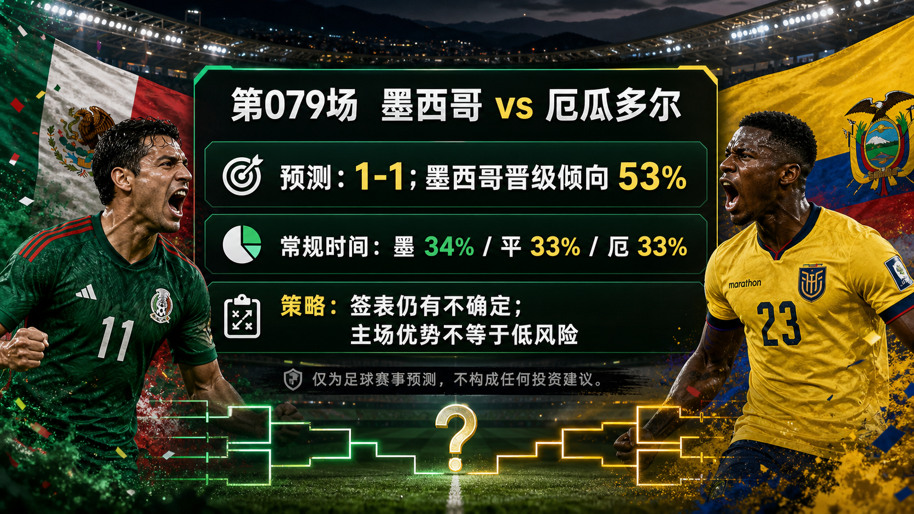

# Match 079: Mexico vs Ecuador

[Dashboard](../README.md) | [简体中文](match-079-mex-ecu.zh-CN.md) | [Daily report](../reports/daily/2026-07-01.md)

## Share Image




Lead image generation instruction:

```text
$imagegen: 生成【社交平台赛事预测首图】，16:9 横版，真实位图图片，只展示赛事对阵、比赛阶段、城市/场馆氛围和球队色彩；中文文档配图的主要比赛信息必须使用简体中文，可在画面合适位置保留英文队名/赛事信息作为辅助文字；不输出比分，不输出预测胜负，不输出概率，不使用胜/平/负、晋级、爆冷等结果暗示词；不要生成 SVG，不要生成 HTML，不要生成代码图，不要生成线框图，不要使用官方 FIFA 标志或水印。
```

Result image generation instruction:

```text
$imagegen: 生成【社交平台赛事预测配图】，16:9 横版，真实位图图片，用于抖音、小红书、微博和微信分享；中文文档配图的主要比赛信息必须使用简体中文，可在画面合适位置保留英文队名/赛事信息作为辅助文字；不要生成 SVG，不要生成 HTML，不要生成代码图，不要生成线框图，不要使用官方 FIFA 标志或水印。
```

## Prediction

| Outcome | Regulation-time probability |
| --- | ---: |
| Mexico win | 33% |
| Draw | 34% |
| Ecuador win | 33% |

- Predicted regulation-time result: Draw
- Predicted scoreline: Mexico vs Ecuador 1-1
- Advancement lean: MEX 53%, ECU 47%
- Confidence: low
- Model: ChatGPT 5.5 ultra-high reasoning

## Scoreline Scenarios

| Scenario | Scoreline | Probability | Read |
| --- | --- | ---: | --- |
| primary | 1-1 | 12% | Mexico's host context and Ecuador's midfield ball-winning cancel each other out through a tense regulation match. |
| conservative_draw_path | 0-0 | 8% | Both sides protect central zones, altitude and pressure slow tempo, and the tie shifts toward extra time. |
| upside_alternate | 1-2 | 9% | Ecuador turn a Mexico buildup loss into a transition goal and defend the final phase under pressure. |

## Factual Basis

- FIFA/reputable fixture sources list Match 079 as Mexico vs Ecuador, Round of 32, at Mexico City Stadium; kickoff is 2026-07-01 01:00 UTC / 2026-07-01 09:00 China time.
- Mexico rank 14th and receive host-city/altitude context; Ecuador rank 23rd and have the midfield ball-winning profile to make the match uncomfortable.
- The next bracket branch is not fully fixed at publication time, so path uncertainty lowers confidence and keeps the regulation draw as the main scoreline.
- Late lineups, medical news, suspensions, weather, pitch speed, and full odds movement are data gaps.

## Prediction Coverage Checklist

| Dimension | Snapshot status | Lean |
| --- | --- | --- |
| Tactics | Mexico can use home tempo and wide combinations; Ecuador can attack Mexico's buildup through ball-winning midfield pressure and transition carries. | mixed |
| Players | Mexico have host-supported confidence and attacking rhythm; Ecuador's midfield duels and transition runners make the talent gap narrow. | mixed |
| Injuries / suspensions | Official late availability, suspensions, and lineup sheets are not fully archived. | data gap lowers confidence |
| Schedule / rest / travel | Mexico City altitude and host environment support Mexico but can also magnify pressure and pacing mistakes. | slight Mexico |
| Head-to-head / tournament history | Recent style and venue context carry more weight than older meetings. | mixed |
| Public sentiment / media narrative | Public sentiment leans into Mexico's host advantage, while expert previews treat Ecuador as one of the more credible non-host challengers. | mixed |
| Weather / venue conditions | Weather and venue checks are included, but exact match-hour temperature, rain, and pitch speed remain unresolved. | data gap |
| Psychology / pressure / motivation | Mexico receive crowd energy but also host pressure; Ecuador can play the disruption role with less public burden. | mixed |
| Bracket path incentives | The next branch is still uncertain at publication time, and a knockout loss creates no future route. A Tian Ji horse-racing strategy is unsupported; the uncertainty instead lowers confidence, raises extra-time/penalty weighting, and keeps Mexico's advancement lean narrow rather than decisive. | supports draw / low confidence |
| Odds movement | Public odds snippets are close enough to support a low-confidence forecast; complete movement is not archived. | mixed, data gap |
| Expert views | SI/Lineups-style previews emphasize Mexico's venue edge and Ecuador's midfield/transition danger, matching a narrow draw-plus-host-advancement lean. | mixed |

## Prediction Logic

1. The model separates regulation and advancement: regulation is almost even, while Mexico get a narrow advancement lean from venue, crowd, and penalty-context comfort.
2. Ecuador are strong enough in midfield to stop this from becoming a simple host script; their best route is transition pressure after Mexico commit numbers forward.
3. The bracket-path rule matters most as uncertainty. No losing path has value, and the unclear next branch reduces confidence instead of pushing either team toward a deliberate path-selection strategy.

## Risk Factors

- Mexico overcommitting under host pressure and exposing transition space.
- Ecuador winning the midfield duel and forcing Mexico into low-quality crosses.
- Altitude, pitch speed, or officiating/card pattern changing the match tempo.

## Platform Share Copy

### Douyin / 抖音

World Cup Round of 32 prediction: Mexico vs Ecuador. Lean: Draw, 1-1; Mexico advancement lean. Strategy read: knockout losses have no next-round upside; bracket path only affects substitutions, cards, travel/rest, extra-time risk, and confidence.
仅为足球赛事预测，不构成任何投资建议。

### Xiaohongshu / 小红书

Mexico vs Ecuador: MEX 33%, draw 34%, ECU 33%; advancement MEX 53%. The Tian Ji-style path-selection hypothesis is unsupported here because losing ends the tournament; the live bracket only changes risk management.
仅为足球赛事预测，不构成任何投资建议。

### Weibo / 微博

Round of 32 forecast: Mexico vs Ecuador 1-1. Probability summary: MEX 33%, draw 34%, ECU 33%; advancement MEX 53%.
仅为足球赛事预测，不构成任何投资建议。#WorldCup2026#

### WeChat / 微信

Mexico vs Ecuador forecast: Draw, 1-1; Mexico advancement lean. The prediction explicitly checks bracket-path incentives: a knockout loss brings no future route benefit, so the strategy read focuses on managing the win path, opponent quality, travel/rest, cards, substitutions, and extra-time exposure. This is a football match prediction only and does not constitute investment advice. 仅为足球赛事预测，不构成任何投资建议。

## Disclaimer

This is a football match prediction only. It does not constitute investment advice, financial advice, or any guarantee of outcome.

仅为足球赛事预测，不构成任何投资建议、财务建议或结果承诺。

## Source Snapshot

- https://www.fifa.com/en/tournaments/mens/worldcup/canadamexicousa2026/scores-fixtures
- https://www.fifa.com/en/match-centre/match/17/285023/289287/400021524
- https://www.espn.com/soccer/story/_/id/48939282/2026-fifa-world-cup-fixtures-results-match-schedule-group-stage-knockout-rounds-bracket
- https://www.foxsports.com/soccer/fifa-world-cup/scores
- https://www.si.com/soccer/mexico-vs-ecuador-world-cup-preview-predictions-lineups-6-30-26
- https://www.lineups.com/articles/mexico-vs-ecuador-prediction-odds-lineups-preview-world-cup-2026-06-30
- https://www.climatecentral.org/world-cup-2026/matches/79
- https://inside.fifa.com/fifa-world-ranking/MEX?gender=men
- https://inside.fifa.com/fifa-world-ranking/ECU?gender=men
- Verified at: 2026-06-30T23:55:00+08:00
