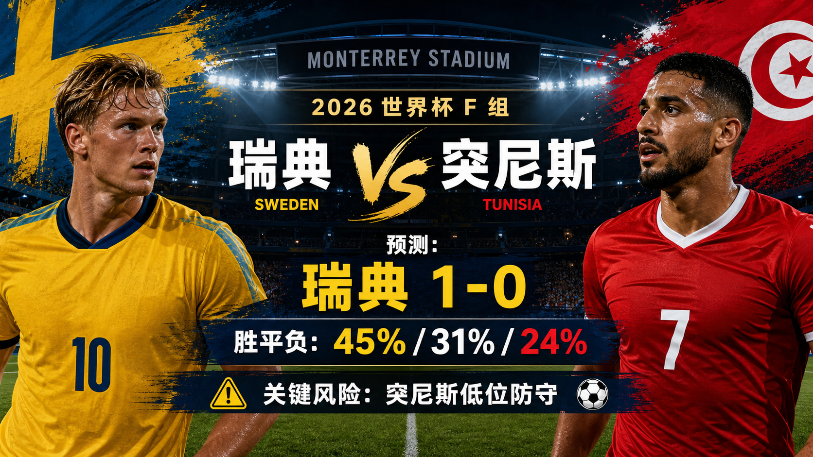
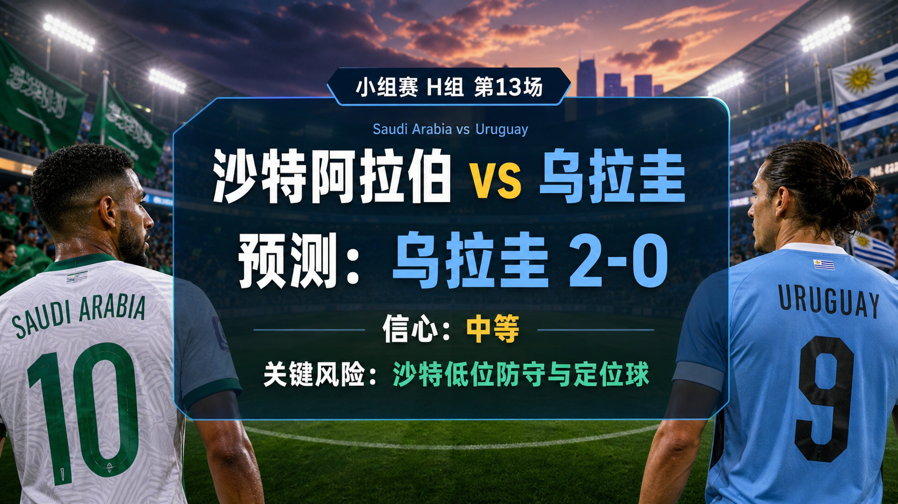

# Daily Report: 2026-06-13

[Dashboard](../../README.md) | [简体中文](2026-06-13.zh-CN.md) | [Sources](../../docs/sources.md)

## Snapshot

- Verification time: 2026-06-13T10:39:10+08:00.
- Tournament status: Match 003 completed as Canada 1-1 Bosnia and Herzegovina; USA vs Paraguay was live at verification time and not yet reviewed.
- Official tournament window: 2026-06-11 to 2026-07-19.
- Official match count: 104.
- Official team count: 48.
- Official player count: 1,248.
- Repository-tracked matches: 16.
- Published predictions: 16.
- Final results tracked: 3.
- Published post-match reviews: 3.
- Exact prediction window from this run includes Match 015 at 2026-06-16T01:00:00Z.

## Share Images

## Next Matches

| Match | Stage | Kickoff | Venue | Prediction |
| --- | --- | --- | --- | --- |
| USA vs Paraguay | Group D | 2026-06-13 01:00 UTC | Los Angeles Stadium | [Live at verification time; pre-match prediction USA win, 2-1](../../predictions/match-004-usa-par.md) / [简体中文](../../predictions/match-004-usa-par.zh-CN.md) |
| Qatar vs Switzerland | Group B | 2026-06-13 19:00 UTC | San Francisco Bay Area Stadium | [Switzerland win, 2-0](../../predictions/match-008-qat-sui.md) / [简体中文](../../predictions/match-008-qat-sui.zh-CN.md) |
| Brazil vs Morocco | Group C | 2026-06-13 22:00 UTC | New York New Jersey Stadium | [Brazil win, 2-1](../../predictions/match-007-bra-mar.md) / [简体中文](../../predictions/match-007-bra-mar.zh-CN.md) |
| Haiti vs Scotland | Group C | 2026-06-14 01:00 UTC | Boston Stadium | [Scotland win, 2-1](../../predictions/match-005-hai-sco.md) / [简体中文](../../predictions/match-005-hai-sco.zh-CN.md) |
| Australia vs Türkiye | Group D | 2026-06-14 04:00 UTC | BC Place Vancouver | [Türkiye win, 2-1](../../predictions/match-006-aus-tur.md) / [简体中文](../../predictions/match-006-aus-tur.zh-CN.md) |
| Germany vs Curaçao | Group E | 2026-06-14 17:00 UTC | Houston Stadium | [Germany win, 3-0](../../predictions/match-010-ger-cuw.md) / [简体中文](../../predictions/match-010-ger-cuw.zh-CN.md) |
| Netherlands vs Japan | Group F | 2026-06-14 20:00 UTC | Dallas Stadium | [Netherlands win, 2-1](../../predictions/match-011-ned-jpn.md) / [简体中文](../../predictions/match-011-ned-jpn.zh-CN.md) |
| Côte d'Ivoire vs Ecuador | Group E | 2026-06-14 23:00 UTC | Philadelphia Stadium | [Ecuador win, 1-0](../../predictions/match-009-civ-ecu.md) / [简体中文](../../predictions/match-009-civ-ecu.zh-CN.md) |
| Sweden vs Tunisia | Group F | 2026-06-15 02:00 UTC | Monterrey Stadium | [Sweden win, 1-0](../../predictions/match-012-swe-tun.md) / [简体中文](../../predictions/match-012-swe-tun.zh-CN.md) |
| Spain vs Cabo Verde | Group H | 2026-06-15 16:00 UTC | Atlanta Stadium | [Spain win, 3-0](../../predictions/match-014-esp-cpv.md) / [简体中文](../../predictions/match-014-esp-cpv.zh-CN.md) |
| Belgium vs Egypt | Group G | 2026-06-15 19:00 UTC | Seattle Stadium | [Belgium win, 2-1](../../predictions/match-016-bel-egy.md) / [简体中文](../../predictions/match-016-bel-egy.zh-CN.md) |
| Saudi Arabia vs Uruguay | Group H | 2026-06-15 22:00 UTC | Miami Stadium | [Uruguay win, 2-0](../../predictions/match-013-ksa-uru.md) / [简体中文](../../predictions/match-013-ksa-uru.zh-CN.md) |
| IR Iran vs New Zealand | Group G | 2026-06-16 01:00 UTC | Los Angeles Stadium | [IR Iran win, 2-0](../../predictions/match-015-irn-nzl.md) / [简体中文](../../predictions/match-015-irn-nzl.zh-CN.md) |

## Updates

- Marked Match 003 as reviewed after Canada drew Bosnia and Herzegovina 1-1.
- Added the Match 003 post-match review and rated the prediction `partial`.
- Marked Match 004 as `live` at verification time because a reliable final result was not yet available.
- Expanded tracked matches, teams, venues, rankings, squad-status snapshots, and prediction records through Match 016.
- Created new bilingual predictions for Matches 012-016.
- Generated ten `$imagegen` raster images for the five new predictions and embedded fixture-only lead images before result cards.
- Refreshed README dashboard counters and daily report index references.

## Predictions

| Match | Lean | Probability Summary | Key Risk |
| --- | --- | --- | --- |
| Sweden vs Tunisia | Sweden win, 1-0 | SWE 43%, draw 31%, TUN 26% | Tunisia defensive discipline |
| Saudi Arabia vs Uruguay | Uruguay win, 2-0 | KSA 15%, draw 25%, URU 60% | Saudi low block and set pieces |
| Spain vs Cabo Verde | Spain win, 3-0 | ESP 76%, draw 16%, CPV 8% | Spain rotation and finishing efficiency |
| IR Iran vs New Zealand | IR Iran win, 2-0 | IRN 62%, draw 24%, NZL 14% | external pressure and New Zealand set pieces |
| Belgium vs Egypt | Belgium win, 2-1 | BEL 52%, draw 27%, EGY 21% | Salah transition threat |

## Reviews

| Match | Prediction | Actual | Rating | Review |
| --- | --- | --- | --- | --- |
| Mexico vs South Africa | Mexico 2-0 | Mexico 2-0 | correct | [Review](../../reviews/match-001-mex-rsa.md) / [简体中文](../../reviews/match-001-mex-rsa.zh-CN.md) |
| Korea Republic vs Czechia | 1-1 draw | Korea Republic 2-1 | partial | [Review](../../reviews/match-002-kor-cze.md) / [简体中文](../../reviews/match-002-kor-cze.zh-CN.md) |
| Canada vs Bosnia and Herzegovina | Canada 2-1 | Canada 1-1 Bosnia and Herzegovina | partial | [Review](../../reviews/match-003-can-bih.md) / [简体中文](../../reviews/match-003-can-bih.zh-CN.md) |

## Platform Share Package

Use the prediction pages for full Douyin, Xiaohongshu, Weibo, and WeChat copy:

- [Match 012 platform copy](../../predictions/match-012-swe-tun.md#platform-share-copy)
- [Match 013 platform copy](../../predictions/match-013-ksa-uru.md#platform-share-copy)
- [Match 014 platform copy](../../predictions/match-014-esp-cpv.md#platform-share-copy)
- [Match 015 platform copy](../../predictions/match-015-irn-nzl.md#platform-share-copy)
- [Match 016 platform copy](../../predictions/match-016-bel-egy.md#platform-share-copy)

Disclaimer for all shares: This is a match prediction only and does not constitute investment advice. 仅为足球赛事预测，不构成任何投资建议。

## Source Checks

- FIFA schedule and match-centre pages reviewed for match dates, venues, and current status.
- MLSsoccer and Guardian reviewed as reputable cross-checks for Canada 1-1 Bosnia and Herzegovina.
- FIFA 2026-06-11 ranking pages reviewed for all newly tracked teams.
- NY Post Group F, Group G, and Group H previews reviewed for public forecast context and expert framing.
- FIFA squad confirmation and FourFourTwo squad pages reviewed where available for new-window team context.
