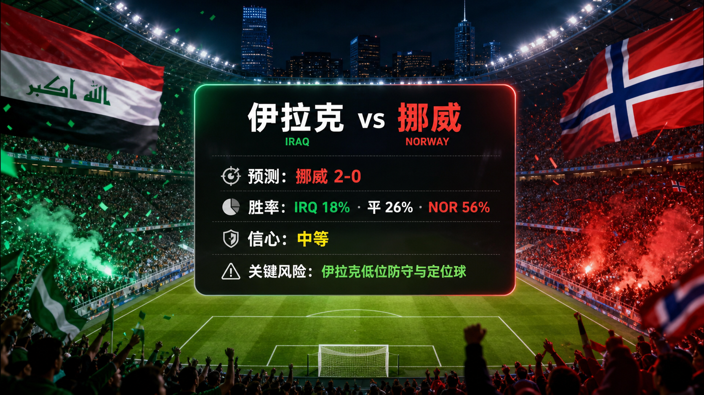

# Daily Report: 2026-06-14

[Dashboard](../../README.md) | [简体中文](2026-06-14.zh-CN.md) | [Sources](../../docs/sources.md)

## Snapshot

- Verification time: 2026-06-14T11:12:46+08:00.
- Tournament status: Matches 004, 005, 007, and 008 have final results and reviews; Australia vs Türkiye is the next unreviewed tracked match.
- Official tournament window: 2026-06-11 to 2026-07-19.
- Official match count: 104.
- Official team count: 48.
- Official player count: 1,248.
- Repository-tracked matches: 19.
- Published predictions: 19.
- Final results tracked: 7.
- Published post-match reviews: 7.
- Exact prediction window from this run includes Match 019 at 2026-06-17T01:00:00Z.

## Share Images

## Next Matches

| Match | Stage | Kickoff | Venue | Prediction |
| --- | --- | --- | --- | --- |
| Australia vs Türkiye | Group D | 2026-06-14 04:00 UTC | BC Place Vancouver | [Türkiye win, 2-1](../../predictions/match-006-aus-tur.md) / [简体中文](../../predictions/match-006-aus-tur.zh-CN.md) |
| Germany vs Curaçao | Group E | 2026-06-14 17:00 UTC | Houston Stadium | [Germany win, 3-0](../../predictions/match-010-ger-cuw.md) / [简体中文](../../predictions/match-010-ger-cuw.zh-CN.md) |
| Netherlands vs Japan | Group F | 2026-06-14 20:00 UTC | Dallas Stadium | [Netherlands win, 2-1](../../predictions/match-011-ned-jpn.md) / [简体中文](../../predictions/match-011-ned-jpn.zh-CN.md) |
| Côte d'Ivoire vs Ecuador | Group E | 2026-06-14 23:00 UTC | Philadelphia Stadium | [Draw, 1-1](../../predictions/match-009-civ-ecu.md) / [简体中文](../../predictions/match-009-civ-ecu.zh-CN.md) |
| Sweden vs Tunisia | Group F | 2026-06-15 02:00 UTC | Monterrey Stadium | [Sweden win, 1-0](../../predictions/match-012-swe-tun.md) / [简体中文](../../predictions/match-012-swe-tun.zh-CN.md) |
| Spain vs Cabo Verde | Group H | 2026-06-15 16:00 UTC | Atlanta Stadium | [Spain win, 3-0](../../predictions/match-014-esp-cpv.md) / [简体中文](../../predictions/match-014-esp-cpv.zh-CN.md) |
| Belgium vs Egypt | Group G | 2026-06-15 19:00 UTC | Seattle Stadium | [Belgium win, 2-1](../../predictions/match-016-bel-egy.md) / [简体中文](../../predictions/match-016-bel-egy.zh-CN.md) |
| Saudi Arabia vs Uruguay | Group H | 2026-06-15 22:00 UTC | Miami Stadium | [Uruguay win, 2-0](../../predictions/match-013-ksa-uru.md) / [简体中文](../../predictions/match-013-ksa-uru.zh-CN.md) |
| IR Iran vs New Zealand | Group G | 2026-06-16 01:00 UTC | Los Angeles Stadium | [IR Iran win, 2-0](../../predictions/match-015-irn-nzl.md) / [简体中文](../../predictions/match-015-irn-nzl.zh-CN.md) |
| France vs Senegal | Group I | 2026-06-16 16:00 UTC | New York New Jersey Stadium | [France win, 2-1](../../predictions/match-017-fra-sen.md) / [简体中文](../../predictions/match-017-fra-sen.zh-CN.md) |
| Iraq vs Norway | Group I | 2026-06-16 19:00 UTC | Boston Stadium | [Norway win, 2-0](../../predictions/match-018-irq-nor.md) / [简体中文](../../predictions/match-018-irq-nor.zh-CN.md) |
| Argentina vs Algeria | Group J | 2026-06-17 01:00 UTC | Kansas City Stadium | [Argentina win, 2-0](../../predictions/match-019-arg-alg.md) / [简体中文](../../predictions/match-019-arg-alg.zh-CN.md) |

## Updates

- Added final results and post-match reviews for USA 4-1 Paraguay, Haiti 0-1 Scotland, Brazil 1-1 Morocco, and Qatar 1-1 Switzerland.
- Marked Matches 004, 005, 007, and 008 as `reviewed` in structured data.
- Expanded tracked matches, teams, venues, rankings, squad-status snapshots, and prediction records through Match 019.
- Created new bilingual predictions for Matches 017-019.
- Generated six `$imagegen` raster images for the three new predictions and embedded fixture-only lead images before result cards.
- Refreshed README dashboard counters and daily report index references.

## Predictions

| Match | Lean | Probability Summary | Key Risk |
| --- | --- | --- | --- |
| France vs Senegal | France win, 2-1 | FRA 50%, draw 27%, SEN 23% | Senegal transition speed and set pieces |
| Iraq vs Norway | Norway win, 2-0 | IRQ 18%, draw 26%, NOR 56% | Iraq low block and set pieces |
| Argentina vs Algeria | Argentina win, 2-0 | ARG 65%, draw 22%, ALG 13% | Messi minutes and Algeria transition speed |

## Reviews

| Match | Prediction | Actual | Rating | Review |
| --- | --- | --- | --- | --- |
| USA vs Paraguay | USA 2-1 | USA 4-1 Paraguay | correct | [Review](../../reviews/match-004-usa-par.md) / [简体中文](../../reviews/match-004-usa-par.zh-CN.md) |
| Haiti vs Scotland | Scotland 2-1 | Haiti 0-1 Scotland | correct | [Review](../../reviews/match-005-hai-sco.md) / [简体中文](../../reviews/match-005-hai-sco.zh-CN.md) |
| Brazil vs Morocco | Brazil 2-1 | Brazil 1-1 Morocco | partial | [Review](../../reviews/match-007-bra-mar.md) / [简体中文](../../reviews/match-007-bra-mar.zh-CN.md) |
| Qatar vs Switzerland | Switzerland 2-0 | Qatar 1-1 Switzerland | partial | [Review](../../reviews/match-008-qat-sui.md) / [简体中文](../../reviews/match-008-qat-sui.zh-CN.md) |

## Platform Share Package

Use the prediction pages for full Douyin, Xiaohongshu, Weibo, and WeChat copy:

- [Match 017 platform copy](../../predictions/match-017-fra-sen.md#platform-share-copy)
- [Match 018 platform copy](../../predictions/match-018-irq-nor.md#platform-share-copy)
- [Match 019 platform copy](../../predictions/match-019-arg-alg.md#platform-share-copy)

Disclaimer for all shares: This is a match prediction only and does not constitute investment advice. 仅为足球赛事预测，不构成任何投资建议。

## Source Checks

- FIFA schedule and match-centre/result pages reviewed for match dates, venues, and current status.
- U.S. Soccer reviewed as the official federation source for USA 4-1 Paraguay.
- Guardian live reports reviewed as reputable cross-checks for Haiti 0-1 Scotland, Brazil 1-1 Morocco, and Qatar 1-1 Switzerland.
- FIFA 2026-06-11 ranking pages reviewed for France, Senegal, Iraq, Norway, Argentina, and Algeria.
- FIFA squad confirmation, ESPN schedule, and FourFourTwo schedule pages reviewed for the new 72-hour prediction window.
