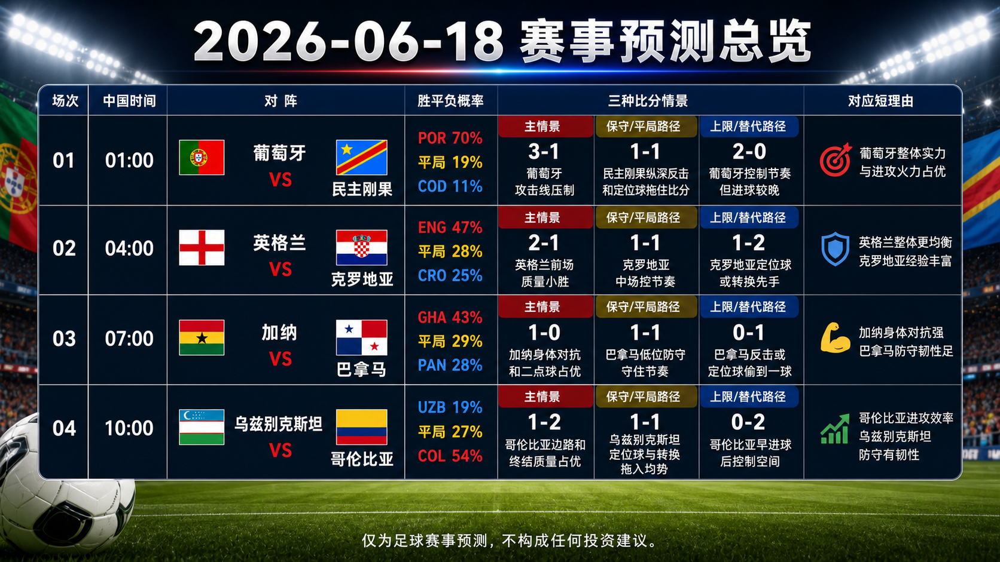
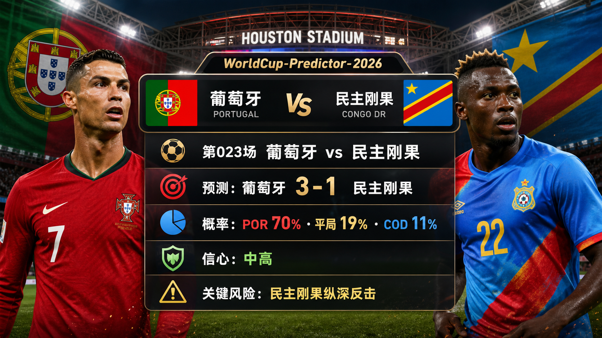
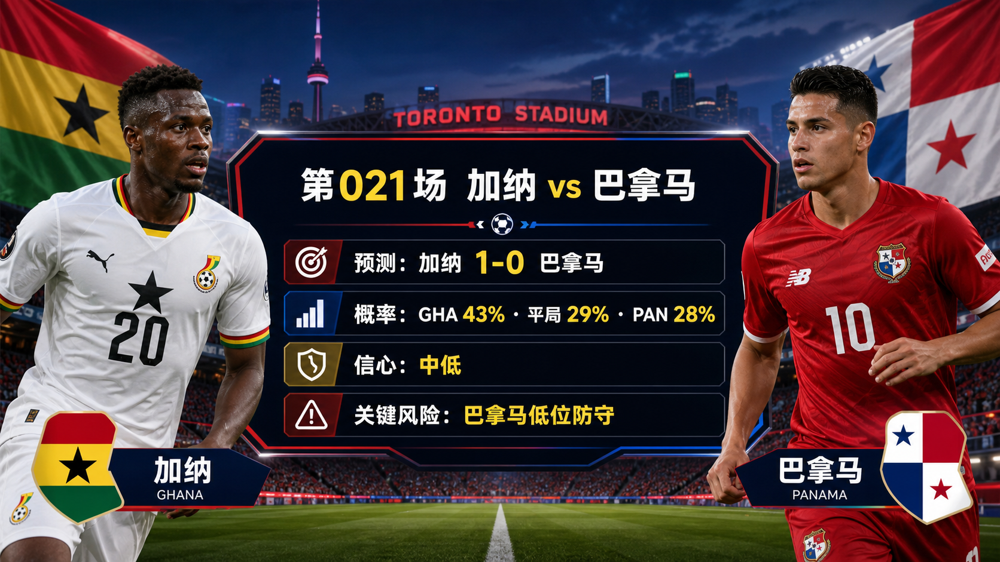
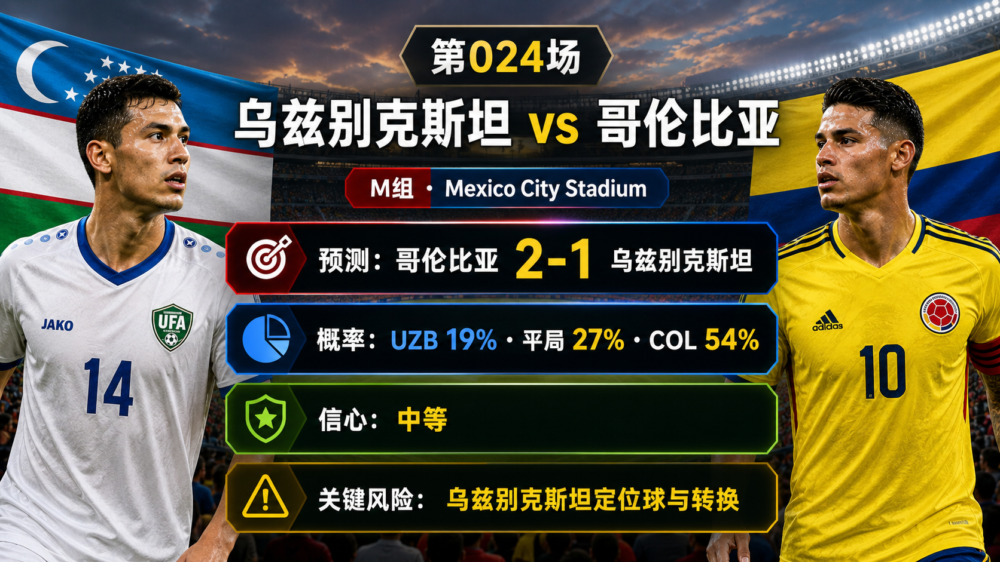

# 日报：2026-06-18

[首页](../../docs/README.zh-CN.md) | [English](2026-06-18.md) | [来源](../../docs/sources.zh-CN.md)

## 快照

- 核验时间：2026-06-17T14:38:30+08:00。
- 中国时间目标日期：2026-06-18。
- 赛事状态：下一个中国时间比赛日包含 4 场已追踪小组赛预测。
- 仓库已追踪比赛：24。
- 已发布预测：24。
- 已追踪赛果：20。
- 已发布复盘：20。

## 分享图片

## 总览图说明

总览图汇总 2026-06-18 中国时间的 4 场预测。每场展示中国时间开球、胜平负概率，以及 `主情景`、`保守 / 平局路径`、`上限 / 替代路径` 三条比分路径。预测使用官方赛程核验、FIFA 排名页、当前赛前背景、场地/旅行信息，以及截至第 020 场的复盘校准。最终首发、临场医疗新闻、天气、市场变化和早段进球仍可能改变比赛脚本。仅为足球赛事预测，不构成任何投资建议。

逐场分享图：

## 近期比赛

| 比赛 | 阶段 | 开球时间 | 场地 | 预测 |
| --- | --- | --- | --- | --- |
| 葡萄牙 vs 民主刚果 | K 组 | 2026-06-17 17:00 UTC / 2026-06-18 01:00 中国时间 | Houston Stadium | [葡萄牙胜，3-1](../../predictions/match-023-por-cod.zh-CN.md) / [English](../../predictions/match-023-por-cod.md) |
| 英格兰 vs 克罗地亚 | L 组 | 2026-06-17 20:00 UTC / 2026-06-18 04:00 中国时间 | Dallas Stadium | [英格兰胜，2-1](../../predictions/match-022-eng-cro.zh-CN.md) / [English](../../predictions/match-022-eng-cro.md) |
| 加纳 vs 巴拿马 | L 组 | 2026-06-17 23:00 UTC / 2026-06-18 07:00 中国时间 | Toronto Stadium | [加纳胜，1-0](../../predictions/match-021-gha-pan.zh-CN.md) / [English](../../predictions/match-021-gha-pan.md) |
| 乌兹别克斯坦 vs 哥伦比亚 | M 组 | 2026-06-18 02:00 UTC / 2026-06-18 10:00 中国时间 | Mexico City Stadium | [哥伦比亚胜，2-1](../../predictions/match-024-uzb-col.zh-CN.md) / [English](../../predictions/match-024-uzb-col.md) |

## 更新

- 完成中国时间 2026-06-17 已结束比赛 017-020 的复盘。
- 新增中国时间 2026-06-18 比赛 021-024 的预测。
- 为 4 场预测补充每日总览图和逐场分享图。
- 更新结构化赛果、复盘索引、排名覆盖、球队覆盖和来源快照。

## 预测

| 比赛 | 倾向 | 概率概览 | 关键风险 |
| --- | --- | --- | --- |
| 葡萄牙 vs 民主刚果 | 葡萄牙胜，3-1 | POR 70%，平局 19%，COD 11% | 民主刚果纵深反击和定位球可能打破零封路径。 |
| 英格兰 vs 克罗地亚 | 英格兰胜，2-1 | ENG 47%，平局 28%，CRO 25% | 克罗地亚可以通过中场控节奏拖慢比赛。 |
| 加纳 vs 巴拿马 | 加纳胜，1-0 | GHA 43%，平局 29%，PAN 28% | 巴拿马低位防守可能把比赛拖向 1-1 或 0-1。 |
| 乌兹别克斯坦 vs 哥伦比亚 | 哥伦比亚胜，2-1 | UZB 19%，平局 27%，COL 54% | 乌兹别克斯坦定位球和转换让平局路径存在。 |

## 比分情景总览

| 比赛 | 情景 | 比分 | 理由 |
| --- | --- | --- | --- |
| 葡萄牙 vs 民主刚果 | 主情景 | 3-1 | 葡萄牙把排名和攻击质量差转化为持续禁区进入，民主刚果仍保有转换威胁。 |
| 葡萄牙 vs 民主刚果 | 保守 / 平局路径 | 1-1 | 民主刚果深度防守、赢下足够高空球，并通过一次直接进攻扳平。 |
| 葡萄牙 vs 民主刚果 | 上限 / 替代路径 | 2-0 | 葡萄牙控制节奏和机会质量，但第二球来得较晚。 |
| 英格兰 vs 克罗地亚 | 主情景 | 2-1 | 英格兰兑现更强的前场质量，但克罗地亚仍能通过控场阶段进球。 |
| 英格兰 vs 克罗地亚 | 保守 / 平局路径 | 1-1 | 克罗地亚控制中场节奏，让英格兰难以把场面优势转成分差。 |
| 英格兰 vs 克罗地亚 | 上限 / 替代路径 | 1-2 | 克罗地亚通过定位球或转换先手，迫使英格兰拉开阵型追分。 |
| 加纳 vs 巴拿马 | 主情景 | 1-0 | 加纳依靠身体对抗和二点球优势小胜。 |
| 加纳 vs 巴拿马 | 保守 / 平局路径 | 1-1 | 巴拿马保持紧凑、压慢节奏，并通过定位球或反击回应。 |
| 加纳 vs 巴拿马 | 上限 / 替代路径 | 0-1 | 如果首球来自转换，巴拿马可以惩罚加纳压上后的空间。 |
| 乌兹别克斯坦 vs 哥伦比亚 | 主情景 | 1-2 | 哥伦比亚依靠边路创造和终结质量小胜，乌兹别克斯坦仍能通过重启球威胁。 |
| 乌兹别克斯坦 vs 哥伦比亚 | 保守 / 平局路径 | 1-1 | 乌兹别克斯坦保持紧凑，并通过定位球或转换把哥伦比亚拖住。 |
| 乌兹别克斯坦 vs 哥伦比亚 | 上限 / 替代路径 | 0-2 | 哥伦比亚早进球后打开空间，并在下半场管理比赛。 |

## 复盘

| 比赛 | 最终赛果 | 评级 | 复盘 |
| --- | --- | --- | --- |
| 法国 vs 塞内加尔 | 法国 3-1 塞内加尔 | correct | [复盘](../../reviews/match-017-fra-sen.zh-CN.md) / [English](../../reviews/match-017-fra-sen.md) |
| 伊拉克 vs 挪威 | 伊拉克 1-4 挪威 | correct | [复盘](../../reviews/match-018-irq-nor.zh-CN.md) / [English](../../reviews/match-018-irq-nor.md) |
| 阿根廷 vs 阿尔及利亚 | 阿根廷 3-0 阿尔及利亚 | correct | [复盘](../../reviews/match-019-arg-alg.zh-CN.md) / [English](../../reviews/match-019-arg-alg.md) |
| 奥地利 vs 约旦 | 奥地利 3-1 约旦 | correct | [复盘](../../reviews/match-020-aut-jor.zh-CN.md) / [English](../../reviews/match-020-aut-jor.md) |

## 平台发布包

完整抖音、小红书、微博和微信文案见各预测页：

- [第 021 场平台文案](../../predictions/match-021-gha-pan.zh-CN.md#平台发布文案)
- [第 022 场平台文案](../../predictions/match-022-eng-cro.zh-CN.md#平台发布文案)
- [第 023 场平台文案](../../predictions/match-023-por-cod.zh-CN.md#平台发布文案)
- [第 024 场平台文案](../../predictions/match-024-uzb-col.zh-CN.md#平台发布文案)

所有发布均需包含免责声明：仅为足球赛事预测，不构成任何投资建议。

## 来源检查

- FIFA 比赛中心用于核验日期、阶段、场地和比赛状态。
- FIFA 2026-06-11 排名页用于核验 8 支球队排名。
- ESPN 赛前预览用于核验比赛时间和临场球队新闻框架。
- 第 017-020 场使用战报和数据页交叉核验最终赛果。
