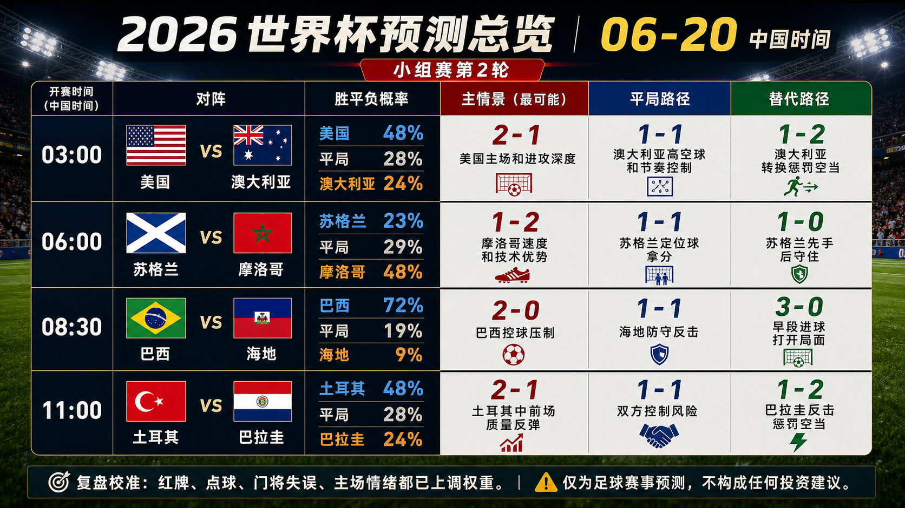
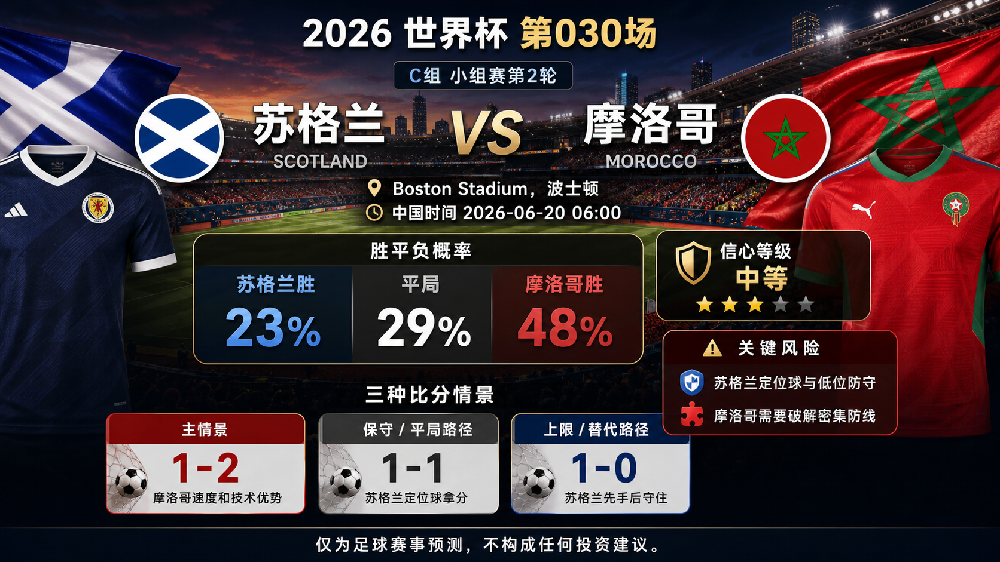
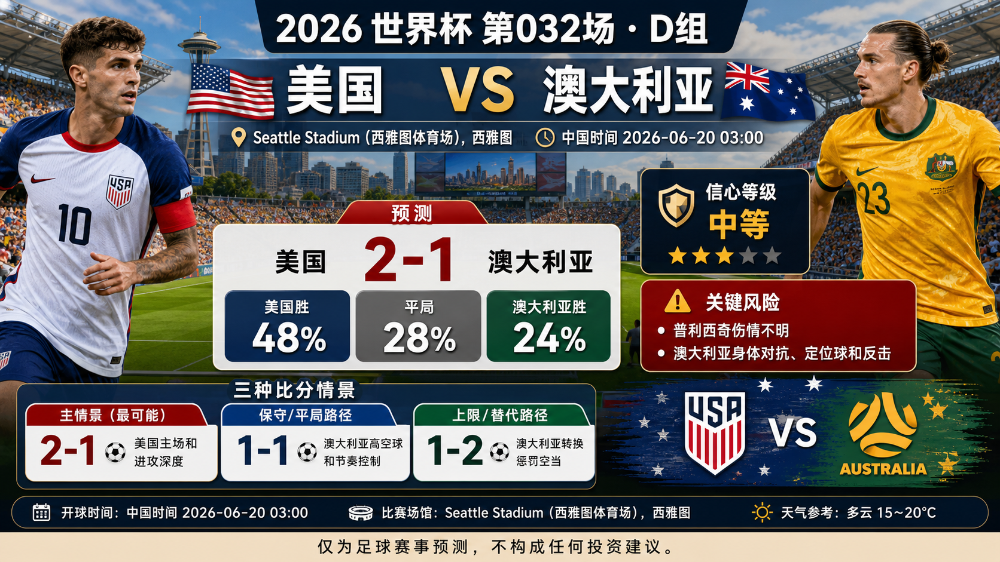

# Daily Report: 2026-06-20

[Dashboard](../../README.md) | [简体中文](2026-06-20.zh-CN.md) | [Sources](../../docs/sources.md)

## Snapshot

- Verification time: 2026-06-20T14:45:00+08:00.
- China-time target date: 2026-06-20.
- Tournament status: Catch-up review is complete for verified finals through Match 032; the next China-time prediction window is published in the 2026-06-21 report.
- Repository-tracked matches: 32.
- Published predictions: 32.
- Final results tracked: 32.
- Published post-match reviews: 32.

## Share Images

## Summary Card Notes

The overview card summarizes the four China-time 2026-06-20 predictions. Each match shows kickoff time in China time, win/draw/loss probabilities, and three scoreline paths: `primary`, `conservative_draw_path`, and `upside_alternate`. The forecast uses official fixture checks, FIFA ranking pages, current preview context, venue/travel notes, and review calibration through Match 028. Final lineups, late medical news, weather, market movement, and early goals can still change the match script. This is a match prediction only and does not constitute investment advice. 仅为足球赛事预测，不构成任何投资建议。

Per-match share images:

## Next Matches

| Match | Stage | Kickoff | Venue | Prediction |
| --- | --- | --- | --- | --- |
| Brazil vs Haiti | Group C | 2026-06-20 00:30 UTC / 2026-06-20 08:30 China time | Philadelphia Stadium | [Brazil win, 2-0](../../predictions/match-029-bra-hai.md) / [简体中文](../../predictions/match-029-bra-hai.zh-CN.md) |
| Scotland vs Morocco | Group C | 2026-06-19 22:00 UTC / 2026-06-20 06:00 China time | Boston Stadium | [Morocco win, 1-2](../../predictions/match-030-sco-mar.md) / [简体中文](../../predictions/match-030-sco-mar.zh-CN.md) |
| Turkiye vs Paraguay | Group D | 2026-06-20 03:00 UTC / 2026-06-20 11:00 China time | San Francisco Bay Area Stadium | [Turkiye win, 2-1](../../predictions/match-031-tur-par.md) / [简体中文](../../predictions/match-031-tur-par.zh-CN.md) |
| USA vs Australia | Group D | 2026-06-19 19:00 UTC / 2026-06-20 03:00 China time | Seattle Stadium | [USA win, 2-1](../../predictions/match-032-usa-aus.md) / [简体中文](../../predictions/match-032-usa-aus.zh-CN.md) |

## Predictions

| Match | Lean | Probability Summary | Key Risk |
| --- | --- | --- | --- |
| Brazil vs Haiti | Brazil win, 2-0 | BRA 72%, draw 19%, HAI 9% | Neymar absence and Haiti low-block set pieces. |
| Scotland vs Morocco | Morocco win, 1-2 | SCO 23%, draw 29%, MAR 48% | Scotland set pieces and low-block defending. |
| Turkiye vs Paraguay | Turkiye win, 2-1 | TUR 48%, draw 28%, PAR 24% | Both teams are conservative after opening losses; Paraguay set pieces and counters remain live. |
| USA vs Australia | USA win, 2-1 | USA 48%, draw 28%, AUS 24% | Pulisic injury uncertainty and Australia's aerial/set-piece route. |

## Scoreline Scenario Overview

| Match | Scenario | Scoreline | Rationale |
| --- | --- | --- | --- |
| Brazil vs Haiti | primary | 2-0 | Brazil turn control into a clean two-goal win. |
| Brazil vs Haiti | conservative_draw_path | 1-1 | Haiti slow the tempo and answer through a set piece. |
| Brazil vs Haiti | upside_alternate | 3-0 | An early Brazil breakthrough turns the game into a wider-margin result. |
| Scotland vs Morocco | primary | 1-2 | Morocco's speed and technical edge break through Scotland's block. |
| Scotland vs Morocco | conservative_draw_path | 1-1 | Scotland set pieces and defensive shape keep the match level. |
| Scotland vs Morocco | upside_alternate | 1-0 | Scotland score first and defend the lead. |
| Turkiye vs Paraguay | primary | 2-1 | Turkiye's midfield quality creates enough pressure after the opener setback. |
| Turkiye vs Paraguay | conservative_draw_path | 1-1 | Both sides manage risk and avoid a second damaging defeat. |
| Turkiye vs Paraguay | upside_alternate | 1-2 | Paraguay punish open space through counters and set pieces. |
| USA vs Australia | primary | 2-1 | USA use home energy and attacking depth while Australia still threaten from restarts. |
| USA vs Australia | conservative_draw_path | 1-1 | Australia's aerial route and tempo control keep the match level. |
| USA vs Australia | upside_alternate | 1-2 | Australia punish a stretched USA chase through transition. |

## Reviews

| Match | Final Result | Rating | Review |
| --- | --- | --- | --- |
| Czechia vs South Africa | Czechia 1-1 South Africa | partial | [Review](../../reviews/match-025-cze-rsa.md) / [简体中文](../../reviews/match-025-cze-rsa.zh-CN.md) |
| Switzerland vs Bosnia and Herzegovina | Switzerland 4-1 Bosnia and Herzegovina | partial | [Review](../../reviews/match-026-sui-bih.md) / [简体中文](../../reviews/match-026-sui-bih.zh-CN.md) |
| Canada vs Qatar | Canada 6-0 Qatar | partial | [Review](../../reviews/match-027-can-qat.md) / [简体中文](../../reviews/match-027-can-qat.zh-CN.md) |
| Mexico vs Korea Republic | Mexico 1-0 Korea Republic | correct | [Review](../../reviews/match-028-mex-kor.md) / [简体中文](../../reviews/match-028-mex-kor.zh-CN.md) |
| Brazil vs Haiti | Brazil 3-0 Haiti | correct | [Review](../../reviews/match-029-bra-hai.md) / [简体中文](../../reviews/match-029-bra-hai.zh-CN.md) |
| Scotland vs Morocco | Scotland 0-1 Morocco | correct | [Review](../../reviews/match-030-sco-mar.md) / [简体中文](../../reviews/match-030-sco-mar.zh-CN.md) |
| Turkiye vs Paraguay | Turkiye 0-1 Paraguay | wrong | [Review](../../reviews/match-031-tur-par.md) / [简体中文](../../reviews/match-031-tur-par.zh-CN.md) |
| USA vs Australia | USA 2-0 Australia | correct | [Review](../../reviews/match-032-usa-aus.md) / [简体中文](../../reviews/match-032-usa-aus.zh-CN.md) |

## Lessons From Today

- Canada 6-0 Qatar and Switzerland 4-1 Bosnia and Herzegovina showed that red cards, discipline loss, and late substitutions can turn medium-confidence favorite calls into large margins.
- Czechia 1-1 South Africa and Turkiye 0-1 Paraguay showed that compact underdogs with restart/counter routes still need more probability mass.
- Brazil 3-0 Haiti confirmed that a heavy favorite can cover the upside scoreline even without perfect fluency.
- USA 2-0 Australia showed that a host side with depth can absorb a star absence better than a single-player risk frame implies.

## Platform Share Package

Use the prediction pages for full Douyin, Xiaohongshu, Weibo, and WeChat copy:

- [Match 029 platform copy](../../predictions/match-029-bra-hai.md#platform-share-copy)
- [Match 030 platform copy](../../predictions/match-030-sco-mar.md#platform-share-copy)
- [Match 031 platform copy](../../predictions/match-031-tur-par.md#platform-share-copy)
- [Match 032 platform copy](../../predictions/match-032-usa-aus.md#platform-share-copy)

Disclaimer for all shares: This is a match prediction only and does not constitute investment advice. 仅为足球赛事预测，不构成任何投资建议。

## Source Checks

- FIFA match-centre pages and official/reputable match reports were checked for Matches 025-032.
- FIFA ranking pages and the existing generated prediction cards were checked for Matches 029-032 prediction records.
- Match 033-036 prediction publication is handled in the 2026-06-21 report with new raster image assets.
