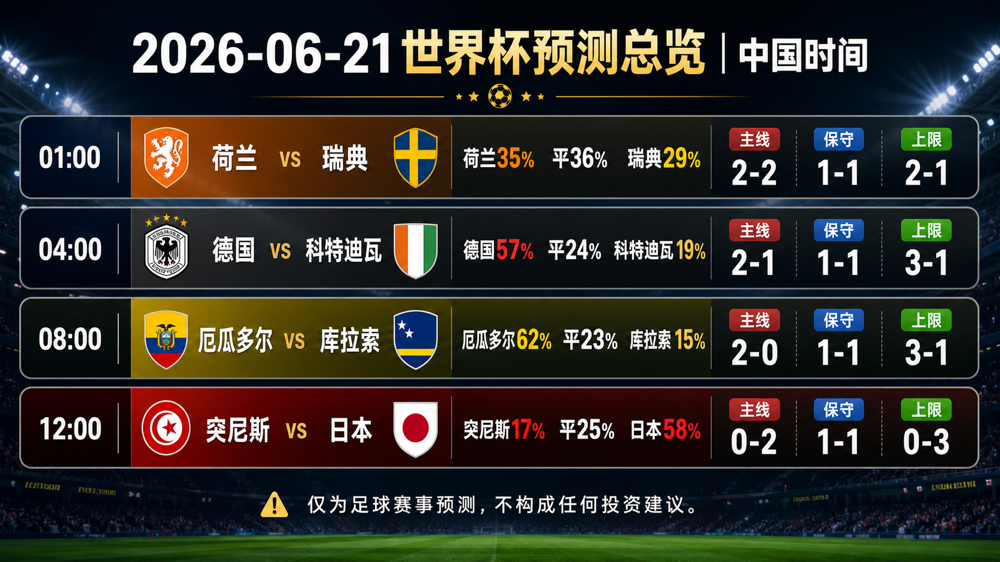
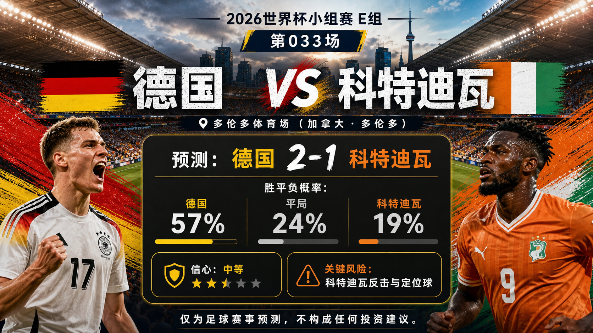
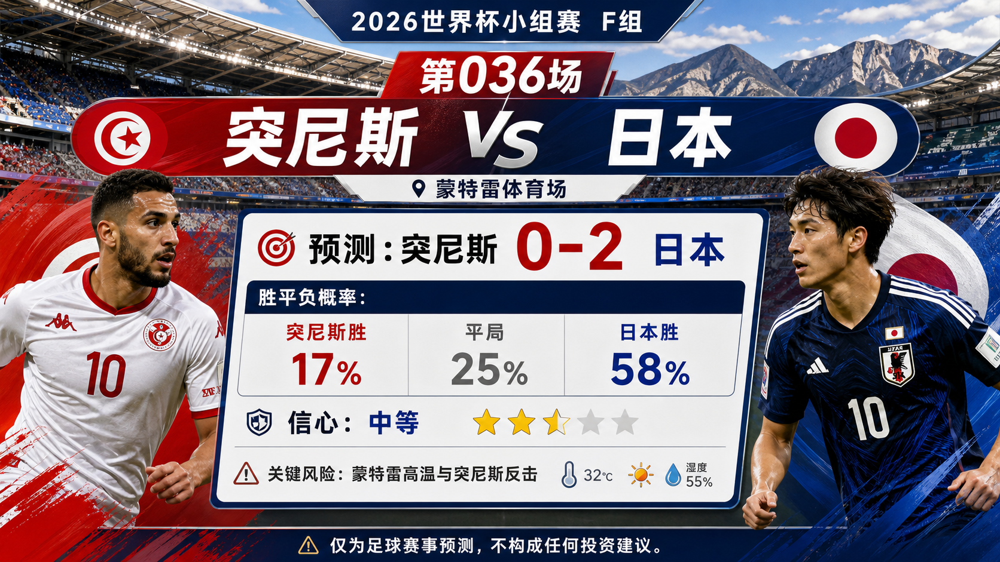

# Daily Report: 2026-06-21

[Dashboard](../../README.md) | [简体中文](2026-06-21.zh-CN.md) | [Sources](../../docs/sources.md)

## Snapshot

- Verification time: 2026-06-20T16:45:00+08:00.
- China-time target date: 2026-06-21.
- Tournament status: China-time 2026-06-20 completed matches 029-032 have been reviewed; the next China-time schedule contains four tracked predictions.
- Repository-tracked matches: 36.
- Published predictions: 36.
- Final results tracked: 32.
- Published post-match reviews: 32.

## Share Images

## Summary Card Notes

The overview card summarizes the four China-time 2026-06-21 predictions. Each match shows kickoff time in China time, win/draw/loss probabilities, and three scoreline paths: `primary`, `conservative_draw_path`, and `upside_alternate`. The forecast uses official fixture checks, FIFA ranking pages, current preview context, venue/travel notes, and review calibration through Match 032. Final lineups, late medical news, weather, market movement, and early goals can still change the match script. This is a match prediction only and does not constitute investment advice. 仅为足球赛事预测，不构成任何投资建议。

Per-match share images:

## Next Matches

| Match | Stage | Kickoff | Venue | Prediction |
| --- | --- | --- | --- | --- |
| Netherlands vs Sweden | Group F | 2026-06-20 17:00 UTC / 2026-06-21 01:00 China time | Houston Stadium | [Draw, 2-2](../../predictions/match-035-ned-swe.md) / [简体中文](../../predictions/match-035-ned-swe.zh-CN.md) |
| Germany vs Cote d'Ivoire | Group E | 2026-06-20 20:00 UTC / 2026-06-21 04:00 China time | Toronto Stadium | [Germany win, 2-1](../../predictions/match-033-ger-civ.md) / [简体中文](../../predictions/match-033-ger-civ.zh-CN.md) |
| Ecuador vs Curacao | Group E | 2026-06-21 00:00 UTC / 2026-06-21 08:00 China time | Kansas City Stadium | [Ecuador win, 2-0](../../predictions/match-034-ecu-cuw.md) / [简体中文](../../predictions/match-034-ecu-cuw.zh-CN.md) |
| Tunisia vs Japan | Group F | 2026-06-21 04:00 UTC / 2026-06-21 12:00 China time | Monterrey Stadium | [Japan win, 0-2](../../predictions/match-036-tun-jpn.md) / [简体中文](../../predictions/match-036-tun-jpn.zh-CN.md) |

## Updates

- Reviewed completed China-time 2026-06-20 matches: 029-032.
- Added predictions for China-time 2026-06-21 matches: 033-036.
- Added a daily overview card and eight per-match share images generated through the built-in $imagegen preview flow.
- Calibration adjustment: keep transition/set-piece underdog routes visible even when the favorite or draw is the headline lean.

## Predictions

| Match | Lean | Probability Summary | Key Risk |
| --- | --- | --- | --- |
| Netherlands vs Sweden | Draw, 2-2 | NED 35%, draw 36%, SWE 29% | Wide duels, set pieces, and both teams' transition quality. |
| Germany vs Cote d'Ivoire | Germany win, 2-1 | GER 57%, draw 24%, CIV 19% | Cote d'Ivoire transition speed and set pieces. |
| Ecuador vs Curacao | Ecuador win, 2-0 | ECU 62%, draw 23%, CUW 15% | Curacao low block and counterattacks. |
| Tunisia vs Japan | Japan win, 0-2 | TUN 17%, draw 25%, JPN 58% | Monterrey heat and Tunisia counterattacks. |

## Scoreline Scenario Overview

| Match | Scenario | Scoreline | Rationale |
| --- | --- | --- | --- |
| Germany vs Cote d'Ivoire | primary | 2-1 | Germany's midfield control creates enough territory, but Cote d'Ivoire score through one transition or restart. |
| Germany vs Cote d'Ivoire | conservative_draw_path | 1-1 | Cote d'Ivoire defend compactly and keep the match level through direct attacks. |
| Germany vs Cote d'Ivoire | upside_alternate | 3-1 | If Germany score first, Cote d'Ivoire must open space and the favorite margin can widen late. |
| Ecuador vs Curacao | primary | 2-0 | Ecuador's midfield pressure and defensive structure suppress Curacao's counter route. |
| Ecuador vs Curacao | conservative_draw_path | 1-1 | Curacao slow the game, defend the box, and answer through one transition. |
| Ecuador vs Curacao | upside_alternate | 3-1 | If Ecuador score early, Curacao's low block opens enough for a wider favorite result. |
| Netherlands vs Sweden | primary | 2-2 | Both sides create from wide areas and set pieces, producing a volatile scoring draw. |
| Netherlands vs Sweden | conservative_draw_path | 1-1 | The game slows after the first goal and both managers protect the point. |
| Netherlands vs Sweden | upside_alternate | 2-1 | Netherlands' possession pressure turns one late box entry into the winner. |
| Tunisia vs Japan | primary | 0-2 | Japan's structure creates two controlled chances while limiting Tunisia's transition volume. |
| Tunisia vs Japan | conservative_draw_path | 1-1 | Heat slows Japan's rhythm and Tunisia convert one counterattack or restart. |
| Tunisia vs Japan | upside_alternate | 0-3 | If Japan score early, Tunisia must chase and the technical gap widens late. |

## Reviews

| Match | Final Result | Rating | Review |
| --- | --- | --- | --- |
| Brazil vs Haiti | Brazil 3-0 Haiti | correct | [Review](../../reviews/match-029-bra-hai.md) / [简体中文](../../reviews/match-029-bra-hai.zh-CN.md) |
| Scotland vs Morocco | Scotland 0-1 Morocco | correct | [Review](../../reviews/match-030-sco-mar.md) / [简体中文](../../reviews/match-030-sco-mar.zh-CN.md) |
| Turkiye vs Paraguay | Turkiye 0-1 Paraguay | wrong | [Review](../../reviews/match-031-tur-par.md) / [简体中文](../../reviews/match-031-tur-par.zh-CN.md) |
| USA vs Australia | USA 2-0 Australia | correct | [Review](../../reviews/match-032-usa-aus.md) / [简体中文](../../reviews/match-032-usa-aus.zh-CN.md) |

## Lessons From Today

- Brazil 3-0 Haiti and USA 2-0 Australia were useful favorite calls, but both still warn against overclaiming process dominance.
- Scotland 0-1 Morocco and Turkiye 0-1 Paraguay showed that an early goal can overturn a possession-based read.
- Paraguay's upset reinforces the need to keep low-probability transition and set-piece outcomes visible in every scenario set.

## Platform Share Package

Use the prediction pages for full Douyin, Xiaohongshu, Weibo, and WeChat copy:

- [Match 033 platform copy](../../predictions/match-033-ger-civ.md#platform-share-copy)
- [Match 034 platform copy](../../predictions/match-034-ecu-cuw.md#platform-share-copy)
- [Match 035 platform copy](../../predictions/match-035-ned-swe.md#platform-share-copy)
- [Match 036 platform copy](../../predictions/match-036-tun-jpn.md#platform-share-copy)

Disclaimer for all shares: This is a match prediction only and does not constitute investment advice. 仅为足球赛事预测，不构成任何投资建议。

## Source Checks

- FIFA match-centre pages and schedule aggregators were checked for Match 033-036 date, stage, venue, and kickoff.
- FIFA ranking pages and reputable previews were checked for all eight teams in the prediction slate.
- Completed-match reports and official/reputable score sources were checked for Matches 029-032.
