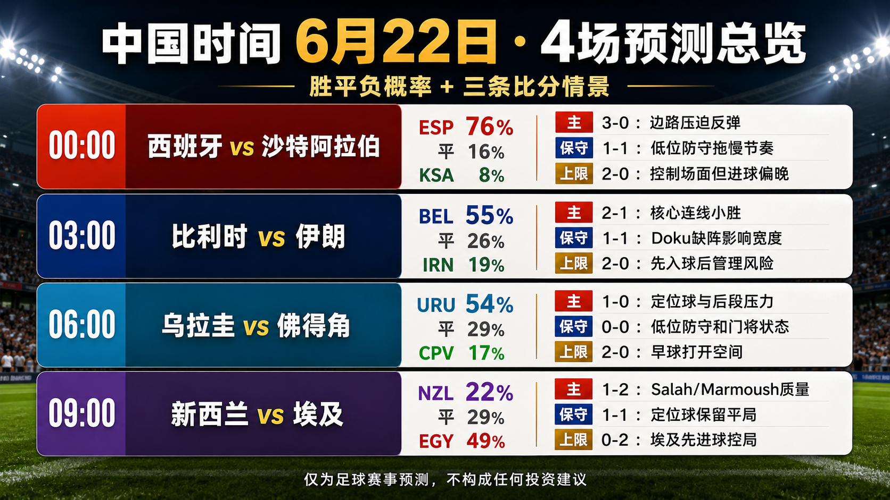
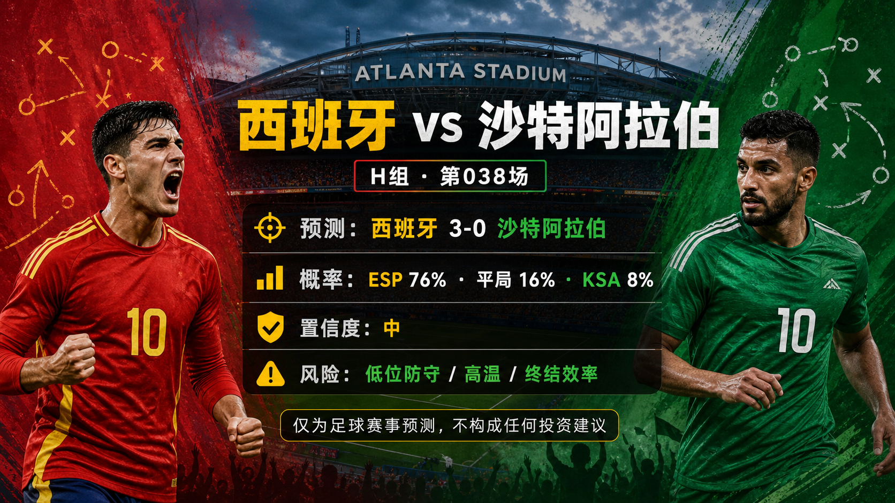
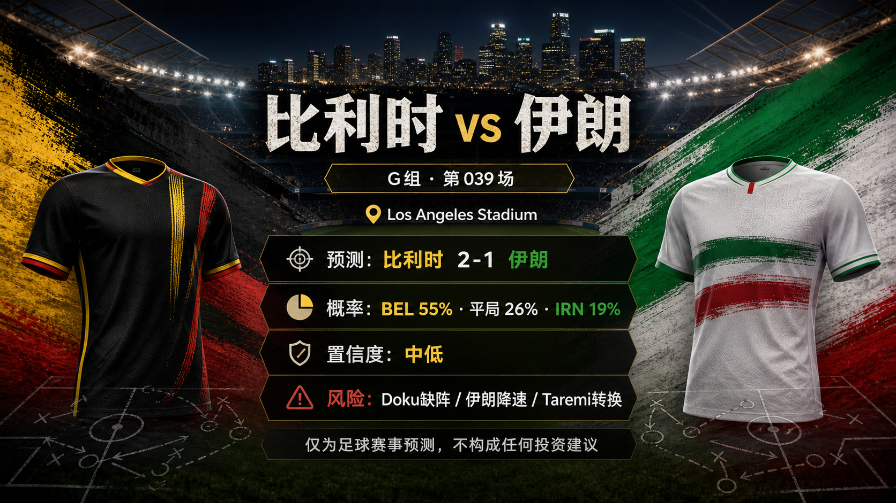
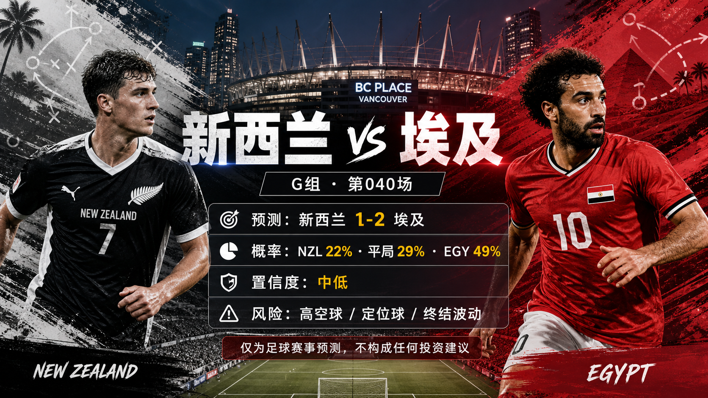

# 日报：2026-06-22

[仪表盘](../../docs/README.zh-CN.md) | [English](2026-06-22.md) | [来源](../../docs/sources.zh-CN.md)

## 快照

- 核验时间：2026-06-21T16:30:00+08:00。
- 中国时间目标日期：2026-06-22。
- 赛事状态：中国时间 2026-06-21 已完赛的第 033-036 场已完成复盘；下一组中国时间赛程包含 4 场已跟踪预测。
- 仓库已跟踪比赛：40。
- 已发布预测：40。
- 已跟踪完赛结果：36。
- 已发布赛后复盘：36。

## 分享图片

单场分享图片：

## 总览图说明

总览图汇总中国时间 2026-06-22 的 4 场预测。每场列出中国时间开球、胜 / 平 / 负概率，以及 3 条比分路径：主情景、保守 / 平局路径、上限 / 替代路径。预测依据包括 FIFA 赛程核验、FIFA 排名页、可靠赛前资料、场地 / 天气信息、赔率快照，以及截至第 036 场的复盘校准。最终首发、临场伤停、比赛时段天气、市场变化和早段进球仍会改变比赛脚本。仅为足球赛事预测，不构成任何投资建议。

## 近期比赛

| 比赛 | 阶段 | 开球 | 场地 | 预测 |
| --- | --- | --- | --- | --- |
| 西班牙 vs 沙特阿拉伯 | Group H | 2026-06-21 16:00 UTC / 2026-06-22 00:00 China time | Atlanta Stadium | [西班牙胜，3-0](../../predictions/match-038-esp-ksa.zh-CN.md) / [English](../../predictions/match-038-esp-ksa.md) |
| 比利时 vs 伊朗 | Group G | 2026-06-21 19:00 UTC / 2026-06-22 03:00 China time | Los Angeles Stadium | [比利时胜，2-1](../../predictions/match-039-bel-irn.zh-CN.md) / [English](../../predictions/match-039-bel-irn.md) |
| 乌拉圭 vs 佛得角 | Group H | 2026-06-21 22:00 UTC / 2026-06-22 06:00 China time | Miami Stadium | [乌拉圭胜，1-0](../../predictions/match-037-uru-cpv.zh-CN.md) / [English](../../predictions/match-037-uru-cpv.md) |
| 新西兰 vs 埃及 | Group G | 2026-06-22 01:00 UTC / 2026-06-22 09:00 China time | BC Place Vancouver | [埃及胜，1-2](../../predictions/match-040-nzl-egy.zh-CN.md) / [English](../../predictions/match-040-nzl-egy.md) |

## 更新

- 已复盘中国时间 2026-06-21 完赛的第 033-036 场。
- 已新增中国时间 2026-06-22 的第 037-040 场预测。
- 已准备 1 张每日总览图和 8 张单场分享图，均使用内置 $imagegen 预览流程生成。
- 校准调整：门将超常表现、热门大比分尾部和确认缺阵变量，需要在比分情景中更可见。

## 预测

| 比赛 | 倾向 | 概率摘要 | 关键风险 |
| --- | --- | --- | --- |
| 西班牙 vs 沙特阿拉伯 | 西班牙胜，3-0 | ESP 76%，平局 16%，KSA 8% | 沙特阿拉伯低位防守、高温，以及西班牙在佛得角战后的终结效率。 |
| 比利时 vs 伊朗 | 比利时胜，2-1 | BEL 55%，平局 26%，IRN 19% | Jeremy Doku 因病缺阵、伊朗低节奏防守，以及 Taremi 带来的转换威胁。 |
| 乌拉圭 vs 佛得角 | 乌拉圭胜，1-0 | URU 54%，平局 29%，CPV 17% | 佛得角低位防守、Vozinha 的扑救状态与迈阿密高温。 |
| 新西兰 vs 埃及 | 埃及胜，1-2 | NZL 22%，平局 29%，EGY 49% | 新西兰通过 Wood 的高空球路线、定位球，以及埃及终结波动。 |

## 比分情景总览

| 比赛 | 情景 | 比分 | 理由 |
| --- | --- | --- | --- |
| 西班牙 vs 沙特阿拉伯 | 主情景 | 3-0 | 西班牙把控球压力、边路宽度和 Yamal 的创造力转化为多球反弹。 |
| 西班牙 vs 沙特阿拉伯 | 保守 / 平局路径 | 1-1 | 沙特阿拉伯低位防守叠加高温拖慢西班牙，一次转换或定位球足以扳平。 |
| 西班牙 vs 沙特阿拉伯 | 上限 / 替代路径 | 2-0 | 西班牙控制场面，但终结效率中等，第二球偏晚出现。 |
| 比利时 vs 伊朗 | 主情景 | 2-1 | 比利时依靠 De Bruyne 与 Lukaku 的主通道小胜，但伊朗的 Taremi 路线仍有进球可能。 |
| 比利时 vs 伊朗 | 保守 / 平局路径 | 1-1 | Doku 缺阵叠加伊朗低节奏防守，让比利时难以拉开差距。 |
| 比利时 vs 伊朗 | 上限 / 替代路径 | 2-0 | 比利时先入球后，伊朗恢复与后勤变量限制反扑质量。 |
| 乌拉圭 vs 佛得角 | 主情景 | 1-0 | 乌拉圭通过定位球和后段禁区压力，最终撬开佛得角低位防守。 |
| 乌拉圭 vs 佛得角 | 保守 / 平局路径 | 0-0 | 佛得角复制对西班牙的低位防守，Vozinha 的扑救把机会质量压低。 |
| 乌拉圭 vs 佛得角 | 上限 / 替代路径 | 2-0 | 乌拉圭早段进球迫使佛得角前压，打开第二球路径。 |
| 新西兰 vs 埃及 | 主情景 | 1-2 | Salah 与 Marmoush 的质量撬开新西兰防线，但 Wood 仍保留新西兰进球路径。 |
| 新西兰 vs 埃及 | 保守 / 平局路径 | 1-1 | 新西兰定位球和紧凑阵型拖住埃及终结效率。 |
| 新西兰 vs 埃及 | 上限 / 替代路径 | 0-2 | 埃及先入球后管控新西兰高空球路线，保持零封。 |

## 复盘

| 比赛 | 最终赛果 | 评级 | 复盘 |
| --- | --- | --- | --- |
| 荷兰 vs 瑞典 | 荷兰 5-1 瑞典 | wrong | [复盘](../../reviews/match-035-ned-swe.zh-CN.md) / [English](../../reviews/match-035-ned-swe.md) |
| 德国 vs 科特迪瓦 | 德国 2-1 科特迪瓦 | correct | [复盘](../../reviews/match-033-ger-civ.zh-CN.md) / [English](../../reviews/match-033-ger-civ.md) |
| 厄瓜多尔 vs 库拉索 | 厄瓜多尔 0-0 库拉索 | wrong | [复盘](../../reviews/match-034-ecu-cuw.zh-CN.md) / [English](../../reviews/match-034-ecu-cuw.md) |
| 突尼斯 vs 日本 | 突尼斯 0-4 日本 | partial | [复盘](../../reviews/match-036-tun-jpn.zh-CN.md) / [English](../../reviews/match-036-tun-jpn.md) |

## 今日校准

- 德国 2-1 科特迪瓦是精确命中，但路径依赖替补后手，而非早早掌控。
- 厄瓜多尔 0-0 库拉索和荷兰 5-1 瑞典代表两类相反误差：弱队门将韧性与热门大胜尾部都需要更高情景权重。
- 日本 4-0 突尼斯确认胜负与零封方向，但也说明教练动荡会更快放大比分差距。

## 平台分享包

完整抖音、小红书、微博、微信文案见各场预测页：

- [第 037 场平台文案](../../predictions/match-037-uru-cpv.zh-CN.md#平台分享文案)
- [第 038 场平台文案](../../predictions/match-038-esp-ksa.zh-CN.md#平台分享文案)
- [第 039 场平台文案](../../predictions/match-039-bel-irn.zh-CN.md#平台分享文案)
- [第 040 场平台文案](../../predictions/match-040-nzl-egy.zh-CN.md#平台分享文案)

所有分享统一免责声明：仅为足球赛事预测，不构成任何投资建议。This is a match prediction only and does not constitute investment advice.

## 来源核验

- 已核验第 037-040 场的 FIFA 赛事页和可靠赛程聚合源，确认日期、阶段、场地和开球时间。
- 已核验本轮 8 支球队的 FIFA 排名页、可靠赛前资料、伤停 / 可用性报道、赔率快照和 Climate Central 场地页面。
- 已核验第 033-036 场的完赛报道和官方 / 可靠比分来源。
