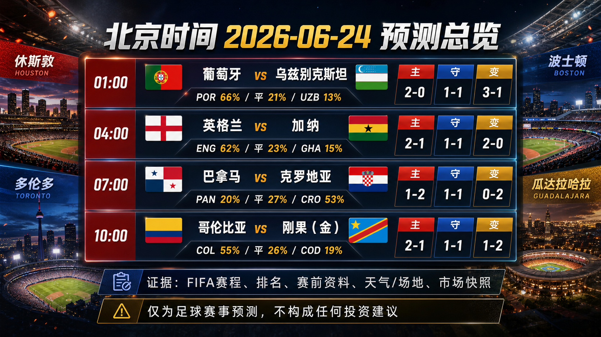
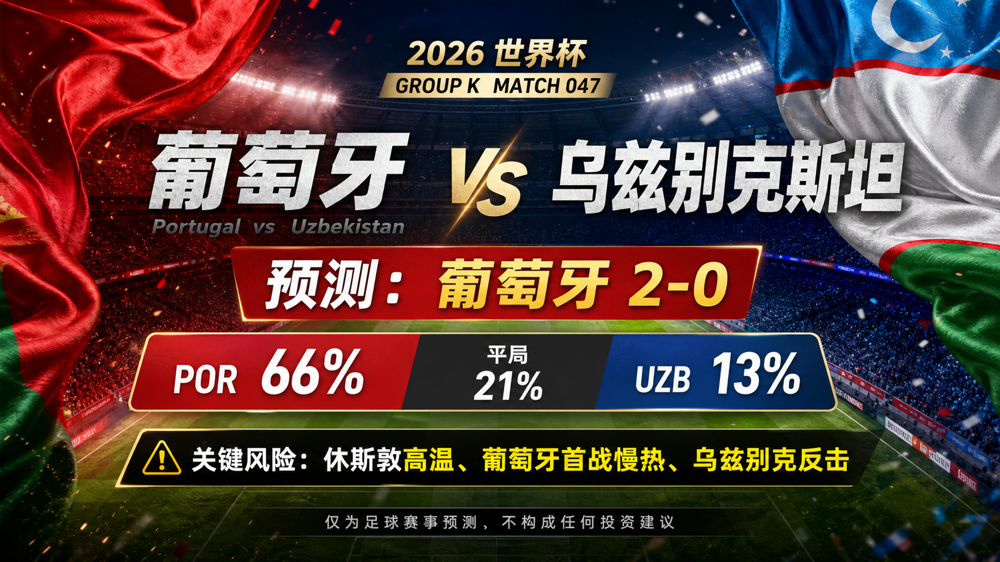
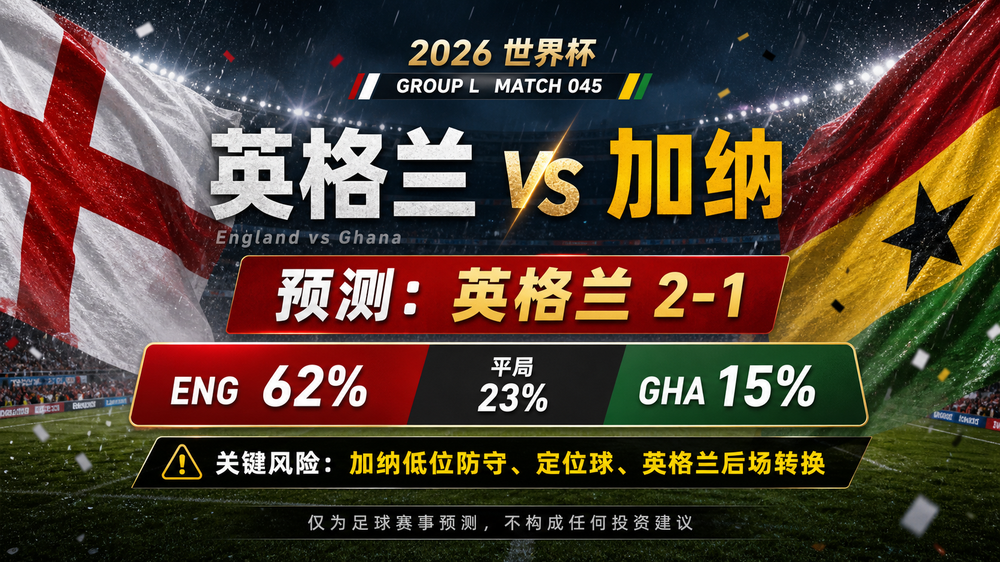
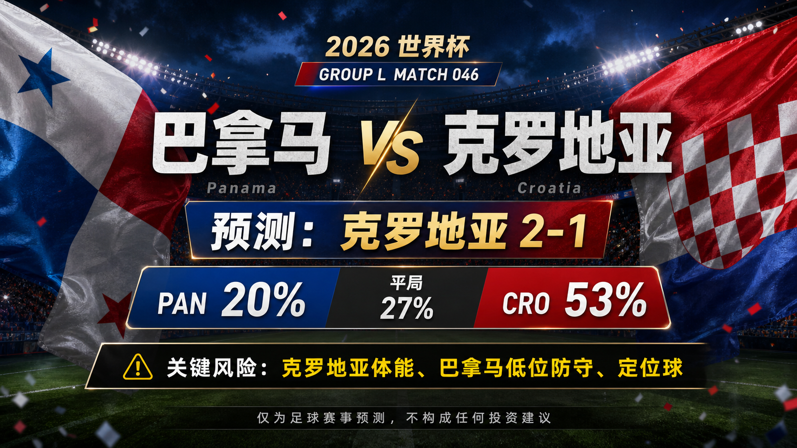
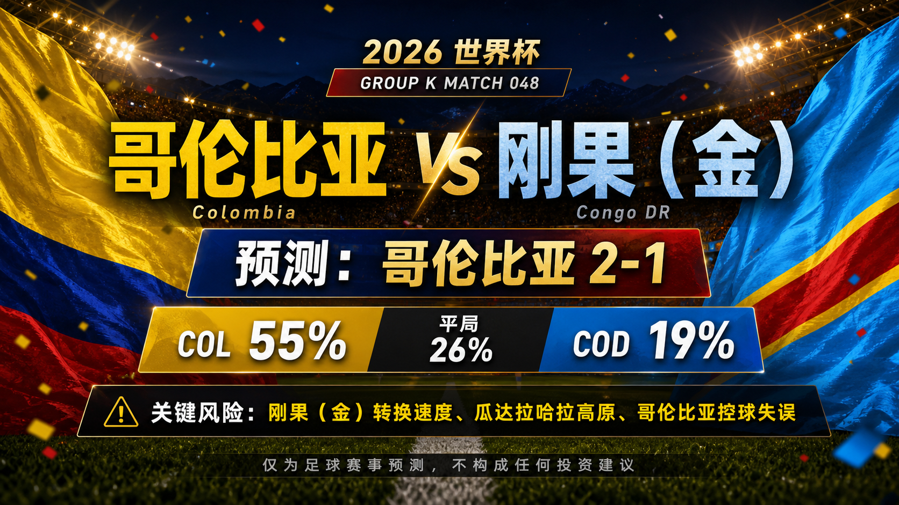

# Daily Report: 2026-06-24

[Dashboard](../../README.md) | [简体中文](2026-06-24.zh-CN.md) | [Sources](../../docs/sources.md)

## Snapshot

- Verification time: 2026-06-23T21:48:00+08:00.
- China-time target date: 2026-06-24.
- Tournament status: China-time 2026-06-23 completed matches 041-044 have been reviewed; the next China-time schedule contains four tracked predictions.
- Repository-tracked matches: 48.
- Published predictions: 48.
- Final results tracked: 44.
- Published post-match reviews: 44.

## Share Images

Per-match share images:

## Summary Card Notes

The overview card summarizes the four China-time 2026-06-24 predictions. Each match shows kickoff time in China time, win/draw/loss probabilities, and three scoreline paths: `primary`, `conservative_draw_path`, and `upside_alternate`. The forecast uses FIFA fixture and preview checks, FIFA ranking pages, prior result context, Climate Central venue/weather notes, and review calibration through Match 044. Final lineups, late medical news, match-hour weather, complete odds movement, and early goals can still change the match script. This is a match prediction only and does not constitute investment advice. 仅为足球赛事预测，不构成任何投资建议。

## Next Matches

| Match | Stage | Kickoff | Venue | Prediction |
| --- | --- | --- | --- | --- |
| Portugal vs Uzbekistan | Group K | 2026-06-23 17:00 UTC / 2026-06-24 01:00 China time | Houston Stadium | [Portugal win, 2-0](../../predictions/match-047-por-uzb.md) / [简体中文](../../predictions/match-047-por-uzb.zh-CN.md) |
| England vs Ghana | Group L | 2026-06-23 20:00 UTC / 2026-06-24 04:00 China time | Boston Stadium | [England win, 2-1](../../predictions/match-045-eng-gha.md) / [简体中文](../../predictions/match-045-eng-gha.zh-CN.md) |
| Panama vs Croatia | Group L | 2026-06-23 23:00 UTC / 2026-06-24 07:00 China time | Toronto Stadium | [Croatia win, 1-2](../../predictions/match-046-pan-cro.md) / [简体中文](../../predictions/match-046-pan-cro.zh-CN.md) |
| Colombia vs Congo DR | Group K | 2026-06-24 02:00 UTC / 2026-06-24 10:00 China time | Guadalajara Stadium | [Colombia win, 2-1](../../predictions/match-048-col-cod.md) / [简体中文](../../predictions/match-048-col-cod.zh-CN.md) |

## Updates

- Reviewed completed China-time 2026-06-23 matches: 041-044.
- Added predictions for China-time 2026-06-24 matches: 045-048.
- Prepared a daily overview card plus eight per-match share images through the built-in $imagegen preview flow.
- Corrected Uzbekistan and Colombia from the earlier Group M label to Group K in structured data and Match 024 pages.
- Calibration adjustment: exact favorite wins landed well in France/Iraq and Jordan/Algeria, while Norway/Senegal shows high-event favorite edges need more win-tail weight.

## Predictions

| Match | Lean | Probability Summary | Key Risk |
| --- | --- | --- | --- |
| Portugal vs Uzbekistan | Portugal win, 2-0 | POR 66%, draw 21%, UZB 13% | Houston midday heat, Portugal's slow opener, and Uzbekistan transition/set-piece response. |
| England vs Ghana | England win, 2-1 | ENG 62%, draw 23%, GHA 15% | Ghana's low block, set pieces, and England's transition defending after conceding twice in the opener. |
| Panama vs Croatia | Croatia win, 1-2 | PAN 20%, draw 27%, CRO 53% | Croatia's recovery load, Panama's compact defensive block, and set-piece variance. |
| Colombia vs Congo DR | Colombia win, 2-1 | COL 55%, draw 26%, COD 19% | Congo DR's transition speed, Guadalajara altitude/venue load, and Colombia turnovers while controlling possession. |

## Scoreline Scenario Overview

| Match | Scenario | Scoreline | Rationale |
| --- | --- | --- | --- |
| Portugal vs Uzbekistan | primary | 2-0 | Portugal's talent edge and response pressure produce a controlled win if heat does not crush tempo. |
| Portugal vs Uzbekistan | conservative_draw_path | 1-1 | Houston heat and Portugal finishing variance let Uzbekistan hold shape and convert one restart or counter. |
| Portugal vs Uzbekistan | upside_alternate | 3-1 | An early Portugal goal forces Uzbekistan forward and opens late transition space. |
| England vs Ghana | primary | 2-1 | England's chance volume and attacking depth edge Ghana, but Ghana's set-piece/counter route keeps a goal live. |
| England vs Ghana | conservative_draw_path | 1-1 | Ghana compress central spaces and turn one restart or counter into a level game. |
| England vs Ghana | upside_alternate | 2-0 | England score first, reduce transition exposure, and manage the second half without conceding. |
| Panama vs Croatia | primary | 1-2 | Croatia's midfield quality creates the cleaner win path, but Panama's direct/set-piece route keeps the match close. |
| Panama vs Croatia | conservative_draw_path | 1-1 | Panama slow the match, defend the box well, and turn one restart into an equalizer. |
| Panama vs Croatia | upside_alternate | 0-2 | Croatia score first and force Panama to chase, creating a late second-goal route. |
| Colombia vs Congo DR | primary | 2-1 | Colombia's wide creation and first-match finishing edge out Congo DR, but the underdog transition route scores. |
| Colombia vs Congo DR | conservative_draw_path | 1-1 | Congo DR repeat the Portugal containment pattern and slow Colombia's possession rhythm. |
| Colombia vs Congo DR | upside_alternate | 1-2 | If Colombia lose the ball in bad zones, Congo DR can turn pace and physicality into an upset path. |

## Reviews

| Match | Final Result | Rating | Review |
| --- | --- | --- | --- |
| Norway vs Senegal | Norway 3-2 Senegal | wrong | [Review](../../reviews/match-041-nor-sen.md) / [简体中文](../../reviews/match-041-nor-sen.zh-CN.md) |
| France vs Iraq | France 3-0 Iraq | correct | [Review](../../reviews/match-042-fra-irq.md) / [简体中文](../../reviews/match-042-fra-irq.zh-CN.md) |
| Argentina vs Austria | Argentina 2-0 Austria | correct | [Review](../../reviews/match-043-arg-aut.md) / [简体中文](../../reviews/match-043-arg-aut.zh-CN.md) |
| Jordan vs Algeria | Jordan 1-2 Algeria | correct | [Review](../../reviews/match-044-jor-alg.md) / [简体中文](../../reviews/match-044-jor-alg.zh-CN.md) |

## Lessons From Today

- Norway 3-2 Senegal shows that a high-event draw read can underweight the favorite's final-margin route when the elite striker path keeps firing.
- France 3-0 Iraq and Jordan 1-2 Algeria confirm that clear favorite baselines can still be expressed with exact-score confidence when the underdog's route is properly scoped.
- Argentina 2-0 Austria shows the need to avoid overweighting the underdog goal path against elite control teams that can manage rest defense.

## Platform Share Package

Use the prediction pages for full Douyin, Xiaohongshu, Weibo, and WeChat copy:

- [Match 047 platform copy](../../predictions/match-047-por-uzb.md#platform-share-copy)
- [Match 045 platform copy](../../predictions/match-045-eng-gha.md#platform-share-copy)
- [Match 046 platform copy](../../predictions/match-046-pan-cro.md#platform-share-copy)
- [Match 048 platform copy](../../predictions/match-048-col-cod.md#platform-share-copy)

Disclaimer for all shares: This is a match prediction only and does not constitute investment advice. 仅为足球赛事预测，不构成任何投资建议。

## Source Checks

- FIFA match-centre and preview pages were checked for Match 045-048 date, stage, venue, kickoff, and team-news framing.
- FIFA ranking pages and Climate Central Match 045-048 pages were checked for all eight teams and venues.
- FOX score pages were checked for completed Matches 041-044.
