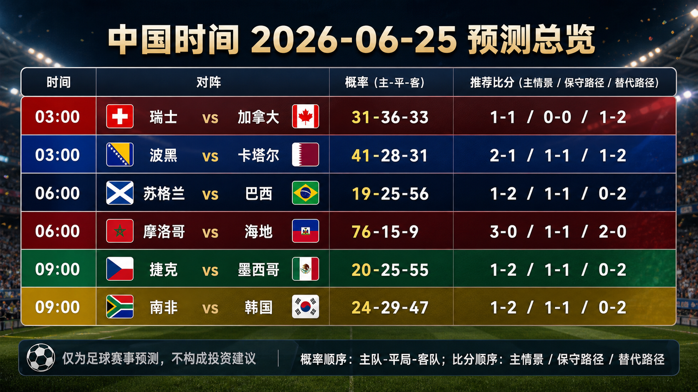
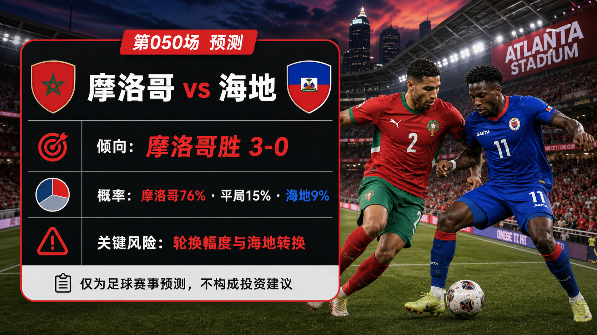
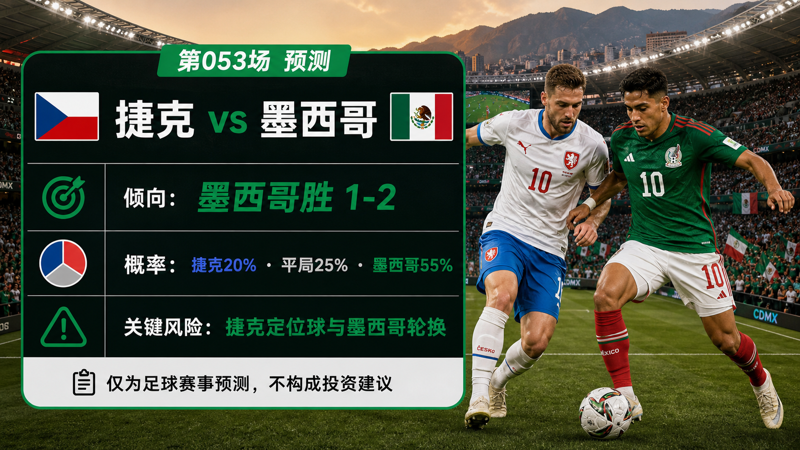
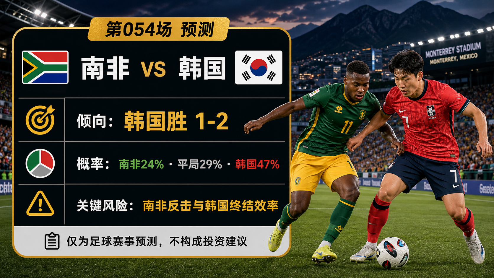

# 日报：2026-06-25

[仪表盘](../../docs/README.zh-CN.md) | [English](2026-06-25.md) | [来源](../../docs/sources.zh-CN.md)

## 快照

- 核验时间：2026-06-24T22:20:00+08:00。
- 中国时间目标日期：2026-06-25。
- 赛事状态：中国时间 2026-06-24 已完赛第 045-048 场均已复盘；下一组中国时间赛程包含 6 场预测。
- 仓库已跟踪比赛：54。
- 已发布预测：54。
- 已跟踪完赛结果：48。
- 已发布赛后复盘：48。

## 分享图片

逐场分享图：

## 总览图说明

总览图汇总中国时间 2026-06-25 的 6 场预测。每场包括中国时间开球、胜 / 平 / 负概率和三条比分路径：主情景、保守 / 平局路径、上限 / 替代路径。本轮预测使用 FIFA 比赛中心和第 14 比赛日预览、FIFA 排名页、前序小组赛果、Climate Central 场地 / 天气资料，以及可用的 RotoWire、SI、Sports Mole 战术和球队新闻背景，并结合截至第 048 场的复盘校准。最终首发、临场医疗新闻、比赛小时级天气、完整赔率变化和早段进球仍可能改变比赛脚本。仅为足球赛事预测，不构成任何投资建议。

## 近期比赛

| 比赛 | 阶段 | 开球 | 场地 | 预测 |
| --- | --- | --- | --- | --- |
| 瑞士 vs 加拿大 | B 组 | 2026-06-24 19:00 UTC / 2026-06-25 03:00 中国时间 | BC Place Vancouver | [平局，1-1](../../predictions/match-051-sui-can.zh-CN.md) / [English](../../predictions/match-051-sui-can.md) |
| 波黑 vs 卡塔尔 | B 组 | 2026-06-24 19:00 UTC / 2026-06-25 03:00 中国时间 | Seattle Stadium | [波黑胜，2-1](../../predictions/match-052-bih-qat.zh-CN.md) / [English](../../predictions/match-052-bih-qat.md) |
| 苏格兰 vs 巴西 | C 组 | 2026-06-24 22:00 UTC / 2026-06-25 06:00 中国时间 | Miami Stadium | [巴西胜，1-2](../../predictions/match-049-sco-bra.zh-CN.md) / [English](../../predictions/match-049-sco-bra.md) |
| 摩洛哥 vs 海地 | C 组 | 2026-06-24 22:00 UTC / 2026-06-25 06:00 中国时间 | Atlanta Stadium | [摩洛哥胜，3-0](../../predictions/match-050-mar-hai.zh-CN.md) / [English](../../predictions/match-050-mar-hai.md) |
| 捷克 vs 墨西哥 | A 组 | 2026-06-25 01:00 UTC / 2026-06-25 09:00 中国时间 | Mexico City Stadium | [墨西哥胜，1-2](../../predictions/match-053-cze-mex.zh-CN.md) / [English](../../predictions/match-053-cze-mex.md) |
| 南非 vs 韩国 | A 组 | 2026-06-25 01:00 UTC / 2026-06-25 09:00 中国时间 | Monterrey Stadium | [韩国胜，1-2](../../predictions/match-054-rsa-kor.zh-CN.md) / [English](../../predictions/match-054-rsa-kor.md) |

## 更新

- 已复盘中国时间 2026-06-24 完赛：第 045-048 场。
- 已新增中国时间 2026-06-25 预测：第 049-054 场。
- 通过内置 $imagegen 预览流程生成 1 张每日总览图和 12 张逐场分享图。
- 按 FIFA 比赛中心顺序将第 050 场记录为摩洛哥 vs 海地，并同步文件名和数据。
- 校准调整：面对紧凑弱势方时要提高 0-0 / 平局路径权重；顶级热门首战受阻后要提高多球胜尾部。

## 预测

| 比赛 | 倾向 | 概率摘要 | 关键风险 |
| --- | --- | --- | --- |
| 瑞士 vs 加拿大 | 平局，1-1 | SUI 31%，平局 36%，CAN 33% | 加拿大主场冲击、瑞士定位球，以及双方可能共同进入低节奏出线管理脚本。 |
| 波黑 vs 卡塔尔 | 波黑胜，2-1 | BIH 41%，平局 28%，QAT 31% | 卡塔尔反弹和波黑为争取出线而前压后的防守间距。 |
| 苏格兰 vs 巴西 | 巴西胜，1-2 | SCO 19%，平局 25%，BRA 56% | 苏格兰低位防守、定位球，以及迈阿密热负荷拖慢巴西控球节奏。 |
| 摩洛哥 vs 海地 | 摩洛哥胜，3-0 | MAR 76%，平局 15%，HAI 9% | 摩洛哥轮换、亚特兰大节奏，以及海地能否把一次转换变成进球。 |
| 捷克 vs 墨西哥 | 墨西哥胜，1-2 | CZE 20%，平局 25%，MEX 55% | 捷克定位球、墨西哥两连胜后的轮换，以及墨西哥城高原管理。 |
| 南非 vs 韩国 | 韩国胜，1-2 | RSA 24%，平局 29%，KOR 47% | 南非反击、韩国终结波动，以及蒙特雷热负荷。 |

## 比分情景总览

| 比赛 | 情景 | 比分 | 理由 |
| --- | --- | --- | --- |
| 瑞士 vs 加拿大 | 主情景 | 1-1 | 两支 B 组前列球队都保护积分，同时各自制造一次得分阶段。 |
| 瑞士 vs 加拿大 | 保守 / 平局路径 | 0-0 | 如果另一场 B 组比赛胶着，双方都没有必要过度前压。 |
| 瑞士 vs 加拿大 | 上限 / 替代路径 | 1-2 | 加拿大主场强度和转换速度把一个后段阶段转成小胜。 |
| 波黑 vs 卡塔尔 | 主情景 | 2-1 | 波黑必须争胜的直接打法制造两个时刻，卡塔尔仍能回应一次。 |
| 波黑 vs 卡塔尔 | 保守 / 平局路径 | 1-1 | 两队都想前压，但终结波动让比赛落成各取一分。 |
| 波黑 vs 卡塔尔 | 上限 / 替代路径 | 1-2 | 如果卡塔尔先得分，波黑追分会打开转换空间。 |
| 苏格兰 vs 巴西 | 主情景 | 1-2 | 巴西质量优势赢下比赛，但苏格兰低位和定位球保留进球路线。 |
| 苏格兰 vs 巴西 | 保守 / 平局路径 | 1-1 | 迈阿密条件和苏格兰紧凑阵型拖住巴西拉开比分。 |
| 苏格兰 vs 巴西 | 上限 / 替代路径 | 0-2 | 巴西先得分、控制防转换，并把下半场管理得更干净。 |
| 摩洛哥 vs 海地 | 主情景 | 3-0 | 摩洛哥结构和排名优势把控制转成多球胜。 |
| 摩洛哥 vs 海地 | 保守 / 平局路径 | 1-1 | 平局路径需要摩洛哥大幅轮换且海地打成一次转换。 |
| 摩洛哥 vs 海地 | 上限 / 替代路径 | 2-0 | 摩洛哥控制比赛，但轮换使分差停在较低区间。 |
| 捷克 vs 墨西哥 | 主情景 | 1-2 | 墨西哥主场优势和转换控制压过捷克一次定位球回应。 |
| 捷克 vs 墨西哥 | 保守 / 平局路径 | 1-1 | 墨西哥保护小组位置，捷克身体和定位球路线拿到一分。 |
| 捷克 vs 墨西哥 | 上限 / 替代路径 | 0-2 | 墨西哥先得分后，捷克追分打开反击空间。 |
| 南非 vs 韩国 | 主情景 | 1-2 | 韩国转换优势赢下比赛，但南非紧迫感带来一次得分回应。 |
| 南非 vs 韩国 | 保守 / 平局路径 | 1-1 | 南非保持紧凑，韩国在热负荷降速前未能拉开。 |
| 南非 vs 韩国 | 上限 / 替代路径 | 0-2 | 韩国先得分后管理南非追分，不失球收场。 |

## 复盘

| 比赛 | 最终赛果 | 评级 | 复盘 |
| --- | --- | --- | --- |
| 英格兰 vs 加纳 | 英格兰 0-0 加纳 | wrong | [复盘](../../reviews/match-045-eng-gha.zh-CN.md) / [English](../../reviews/match-045-eng-gha.md) |
| 巴拿马 vs 克罗地亚 | 巴拿马 0-1 克罗地亚 | correct | [复盘](../../reviews/match-046-pan-cro.zh-CN.md) / [English](../../reviews/match-046-pan-cro.md) |
| 葡萄牙 vs 乌兹别克斯坦 | 葡萄牙 5-0 乌兹别克斯坦 | partial | [复盘](../../reviews/match-047-por-uzb.zh-CN.md) / [English](../../reviews/match-047-por-uzb.md) |
| 哥伦比亚 vs 刚果（金） | 哥伦比亚 1-0 刚果（金） | correct | [复盘](../../reviews/match-048-col-cod.zh-CN.md) / [English](../../reviews/match-048-col-cod.md) |

## 今日校准

- 英格兰 0-0 加纳说明，紧凑弱势方即使面对排名优势明显的热门队，也会让 0-0 路径进入可见区间。
- 葡萄牙 5-0 乌兹别克斯坦说明，热门队首战受阻后的反弹压力可能比高温降速假设更强。
- 巴拿马 0-1 克罗地亚、哥伦比亚 1-0 刚果（金）确认，一球热门胜也可能是零封控制局，不一定是双方都有进球。

## 平台分享包

完整抖音、小红书、微博、微信文案见预测页面：

- [第 051 场平台文案](../../predictions/match-051-sui-can.zh-CN.md#平台分享文案)
- [第 052 场平台文案](../../predictions/match-052-bih-qat.zh-CN.md#平台分享文案)
- [第 049 场平台文案](../../predictions/match-049-sco-bra.zh-CN.md#平台分享文案)
- [第 050 场平台文案](../../predictions/match-050-mar-hai.zh-CN.md#平台分享文案)
- [第 053 场平台文案](../../predictions/match-053-cze-mex.zh-CN.md#平台分享文案)
- [第 054 场平台文案](../../predictions/match-054-rsa-kor.zh-CN.md#平台分享文案)

统一免责声明：This is a match prediction only and does not constitute investment advice. 仅为足球赛事预测，不构成任何投资建议。

## 来源核验

- 已检查 FIFA 比赛中心和第 14 比赛日预览，核验第 049-054 场日期、阶段、场地、开球和球队新闻框架。
- 已检查 12 支球队的 FIFA 排名页和 Climate Central 第 049-054 场页面。
- 已检查 FIFA 比赛中心和赛后战报页，核验第 045-048 场赛果。
