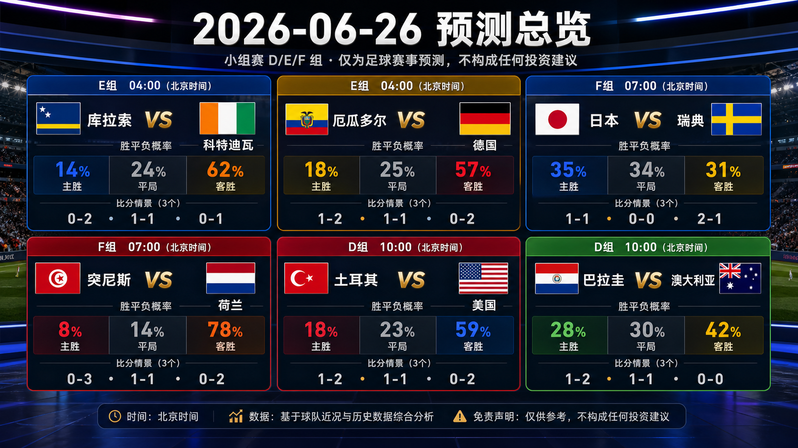
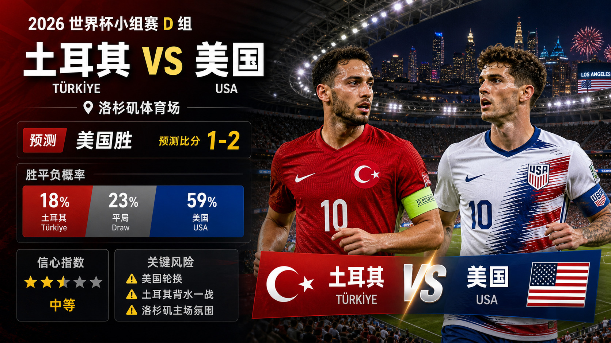

# 每日报告：2026-06-26

[仪表盘](../../docs/README.zh-CN.md) | [English](2026-06-26.md) | [来源](../../docs/sources.zh-CN.md)

## 快照

- 核验时间：2026-06-25T13:51:27+08:00。
- 中国时间目标日期：2026-06-26。
- 赛事状态：中国时间 2026-06-25 完赛的第 049-054 场已完成复盘；下一组中国时间赛程包含 6 场已跟踪预测。
- 仓库已跟踪比赛：60。
- 已发布预测：60。
- 已跟踪完赛结果：54。
- 已发布赛后复盘：54。

## 分享图片

逐场分享图：

## 总览图说明

总览图汇总中国时间 2026-06-26 的 6 场预测。每场包含中国时间开球、胜 / 平 / 负概率，以及三条比分路径：主情景、保守 / 平局路径、上限 / 替代路径。预测依据包括 FIFA 赛程和第 15 比赛日预览核验、FIFA 排名页、前序小组赛结果、Climate Central 场地 / 天气备注，以及截至第 054 场的复盘校准。最终首发、临场医疗消息、比赛小时级天气、完整赔率变化和早段进球仍可能改变比赛脚本。仅为足球赛事预测，不构成任何投资建议。

## 近期比赛

| 比赛 | 阶段 | 开球 | 场地 | 预测 |
| --- | --- | --- | --- | --- |
| 库拉索 vs 科特迪瓦 | E 组 | 2026-06-25 20:00 UTC / 2026-06-26 04:00 中国时间 | Philadelphia Stadium | [科特迪瓦胜，0-2](../../predictions/match-055-cuw-civ.zh-CN.md) / [English](../../predictions/match-055-cuw-civ.md) |
| 厄瓜多尔 vs 德国 | E 组 | 2026-06-25 20:00 UTC / 2026-06-26 04:00 中国时间 | New York New Jersey Stadium | [德国胜，1-2](../../predictions/match-056-ecu-ger.zh-CN.md) / [English](../../predictions/match-056-ecu-ger.md) |
| 日本 vs 瑞典 | F 组 | 2026-06-25 23:00 UTC / 2026-06-26 07:00 中国时间 | Dallas Stadium | [平局，1-1](../../predictions/match-057-jpn-swe.zh-CN.md) / [English](../../predictions/match-057-jpn-swe.md) |
| 突尼斯 vs 荷兰 | F 组 | 2026-06-25 23:00 UTC / 2026-06-26 07:00 中国时间 | Kansas City Stadium | [荷兰胜，0-3](../../predictions/match-058-tun-ned.zh-CN.md) / [English](../../predictions/match-058-tun-ned.md) |
| 土耳其 vs 美国 | D 组 | 2026-06-26 02:00 UTC / 2026-06-26 10:00 中国时间 | Los Angeles Stadium | [美国胜，1-2](../../predictions/match-059-tur-usa.zh-CN.md) / [English](../../predictions/match-059-tur-usa.md) |
| 巴拉圭 vs 澳大利亚 | D 组 | 2026-06-26 02:00 UTC / 2026-06-26 10:00 中国时间 | San Francisco Bay Area Stadium | [澳大利亚胜，1-2](../../predictions/match-060-par-aus.zh-CN.md) / [English](../../predictions/match-060-par-aus.md) |

## 更新

- 复盘中国时间 2026-06-25 已完赛比赛：第 049-054 场。
- 新增中国时间 2026-06-26 比赛预测：第 055-060 场。
- 通过内置 $imagegen 预览流程准备 1 张每日总览图和 12 张逐场分享图。
- 将公开仪表盘的活跃近期比赛窗口从 A/B/C 组推进到 D/E/F 组。
- 校准调整：第 049-054 场后，先得分热门的零封和多球胜尾部需要上调，但必须赢球弱势方仍要保留 1-0 低比分冷门分支。

## 预测

| 比赛 | 倾向 | 概率摘要 | 关键风险 |
| --- | --- | --- | --- |
| 库拉索 vs 科特迪瓦 | 科特迪瓦胜，0-2 | CUW 14%，平局 24%，CIV 62% | 库拉索低位防守、科特迪瓦终结效率，以及费城比赛节奏。 |
| 厄瓜多尔 vs 德国 | 德国胜，1-2 | ECU 18%，平局 25%，GER 57% | 德国轮换、厄瓜多尔抢分压力、定位球和反击。 |
| 日本 vs 瑞典 | 平局，1-1 | JPN 35%，平局 34%，SWE 31% | 瑞典定位球、日本控节奏，以及末轮同步出线压力。 |
| 突尼斯 vs 荷兰 | 荷兰胜，0-3 | TUN 8%，平局 14%，NED 78% | 荷兰轮换、突尼斯反击尊严战，以及比赛节奏管理。 |
| 土耳其 vs 美国 | 美国胜，1-2 | TUR 18%，平局 23%，USA 59% | 美国轮换、土耳其背水一战，以及洛杉矶主场氛围。 |
| 巴拉圭 vs 澳大利亚 | 澳大利亚胜，1-2 | PAR 28%，平局 30%，AUS 42% | 巴拉圭必须抢胜、澳大利亚能否守住节奏，以及湾区天气。 |

## 比分情景总览

| 比赛 | 情景 | 比分 | 理由 |
| --- | --- | --- | --- |
| 库拉索 vs 科特迪瓦 | 主情景 | 0-2 | 科特迪瓦基础实力和出线动力转化为两次得分，不需要对攻也能拉开。 |
| 库拉索 vs 科特迪瓦 | 保守 / 平局路径 | 1-1 | 库拉索延续对厄瓜多尔式的低位压缩，靠一次转换或定位球拿到平局。 |
| 库拉索 vs 科特迪瓦 | 上限 / 替代路径 | 0-1 | 如果费城节奏偏慢，科特迪瓦仍靠一次关键禁区进入小胜。 |
| 厄瓜多尔 vs 德国 | 主情景 | 1-2 | 德国阵容深度压过厄瓜多尔抢分压力和身体对抗回应。 |
| 厄瓜多尔 vs 德国 | 保守 / 平局路径 | 1-1 | 德国轮换叠加厄瓜多尔防守紧迫感，让比赛留在平局。 |
| 厄瓜多尔 vs 德国 | 上限 / 替代路径 | 0-2 | 德国先得分后迫使厄瓜多尔追分，后段转换再进一球。 |
| 日本 vs 瑞典 | 主情景 | 1-1 | 日本保护出线路径，瑞典靠定位球压力拿到回应。 |
| 日本 vs 瑞典 | 保守 / 平局路径 | 0-0 | 日本控制节奏，瑞典机会质量不足，比赛压成低比分平局。 |
| 日本 vs 瑞典 | 上限 / 替代路径 | 2-1 | 如果瑞典过度追胜，日本压迫和转换会惩罚身后空间。 |
| 突尼斯 vs 荷兰 | 主情景 | 0-3 | 荷兰进攻状态遇到防线信心受压的突尼斯，形成多球胜路径。 |
| 突尼斯 vs 荷兰 | 保守 / 平局路径 | 1-1 | 平局路径需要荷兰大幅轮换，同时突尼斯把一次转换打进。 |
| 突尼斯 vs 荷兰 | 上限 / 替代路径 | 0-2 | 荷兰用较低节奏控制比赛，赢球但不过度扩大。 |
| 土耳其 vs 美国 | 主情景 | 1-2 | 美国主场深度取胜，但土耳其背水一战制造一次得分回应。 |
| 土耳其 vs 美国 | 保守 / 平局路径 | 1-1 | 美国轮换和小组位置管理让土耳其留在比赛里。 |
| 土耳其 vs 美国 | 上限 / 替代路径 | 0-2 | 美国先得分后利用土耳其追分空间再进一球。 |
| 巴拉圭 vs 澳大利亚 | 主情景 | 1-2 | 澳大利亚积分位置和转换能力，在巴拉圭后段打开比赛时形成惩罚。 |
| 巴拉圭 vs 澳大利亚 | 保守 / 平局路径 | 1-1 | 澳大利亚保护出线路径，巴拉圭紧迫感带来一次回应。 |
| 巴拉圭 vs 澳大利亚 | 上限 / 替代路径 | 0-0 | 同步末轮压力让双方都趋于谨慎，有限机会未能转化。 |

## 复盘

| 比赛 | 最终赛果 | 评级 | 复盘 |
| --- | --- | --- | --- |
| 苏格兰 vs 巴西 | 苏格兰 0-3 巴西 | partial | [复盘](../../reviews/match-049-sco-bra.zh-CN.md) / [English](../../reviews/match-049-sco-bra.md) |
| 摩洛哥 vs 海地 | 摩洛哥 4-2 海地 | partial | [复盘](../../reviews/match-050-mar-hai.zh-CN.md) / [English](../../reviews/match-050-mar-hai.md) |
| 瑞士 vs 加拿大 | 瑞士 2-1 加拿大 | wrong | [复盘](../../reviews/match-051-sui-can.zh-CN.md) / [English](../../reviews/match-051-sui-can.md) |
| 波黑 vs 卡塔尔 | 波黑 3-1 卡塔尔 | correct | [复盘](../../reviews/match-052-bih-qat.zh-CN.md) / [English](../../reviews/match-052-bih-qat.md) |
| 捷克 vs 墨西哥 | 捷克 0-3 墨西哥 | partial | [复盘](../../reviews/match-053-cze-mex.zh-CN.md) / [English](../../reviews/match-053-cze-mex.md) |
| 南非 vs 韩国 | 南非 1-0 韩国 | wrong | [复盘](../../reviews/match-054-rsa-kor.zh-CN.md) / [English](../../reviews/match-054-rsa-kor.md) |

## 今日经验

- 巴西、摩洛哥、波黑和墨西哥说明：热门倾向判断正确时，若对手必须追分，仍要给足分差尾部。
- 瑞士 2-1 加拿大说明，较强一方的后段制胜路径可以压过谨慎平局脚本。
- 南非 1-0 韩国说明，必须赢球的弱势方在热门终结不稳时需要单列低比分冷门路径。

## 平台分享包

完整抖音、小红书、微博和微信文案见各预测页：

- [第 055 场平台文案](../../predictions/match-055-cuw-civ.zh-CN.md#平台分享文案)
- [第 056 场平台文案](../../predictions/match-056-ecu-ger.zh-CN.md#平台分享文案)
- [第 057 场平台文案](../../predictions/match-057-jpn-swe.zh-CN.md#平台分享文案)
- [第 058 场平台文案](../../predictions/match-058-tun-ned.zh-CN.md#平台分享文案)
- [第 059 场平台文案](../../predictions/match-059-tur-usa.zh-CN.md#平台分享文案)
- [第 060 场平台文案](../../predictions/match-060-par-aus.zh-CN.md#平台分享文案)

所有分享免责声明：This is a match prediction only and does not constitute investment advice. 仅为足球赛事预测，不构成任何投资建议。

## 来源核验

- 已检查 FIFA 比赛中心和第 14 比赛日复盘页，用于核验第 049-054 场完赛结果。
- 已检查 FIFA 比赛中心和第 15 比赛日预览页，用于核验第 055-060 场日期、阶段、场地、开球和球队新闻框架。
- 已检查 FIFA 排名页和 Climate Central 第 055-060 场页面，用于覆盖 12 支球队和场地 / 天气风险。
