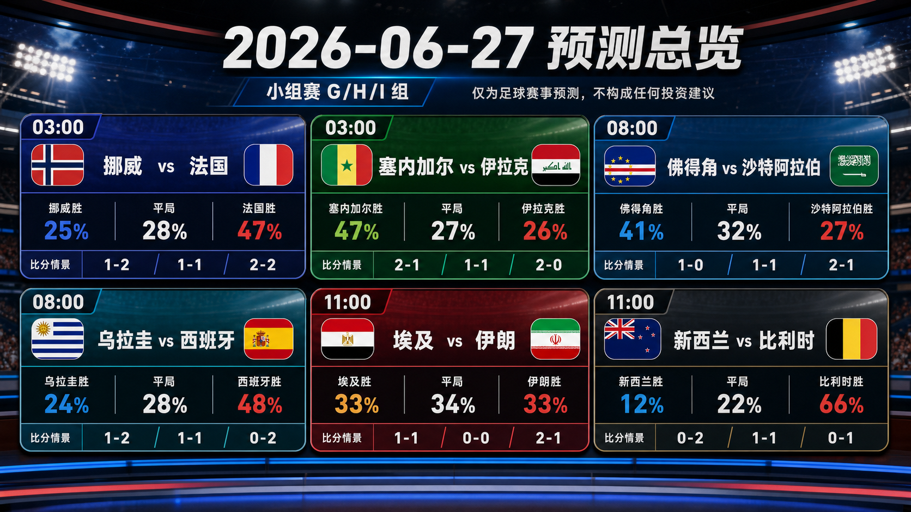
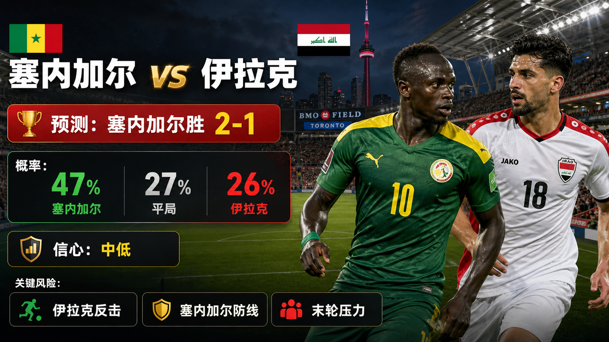
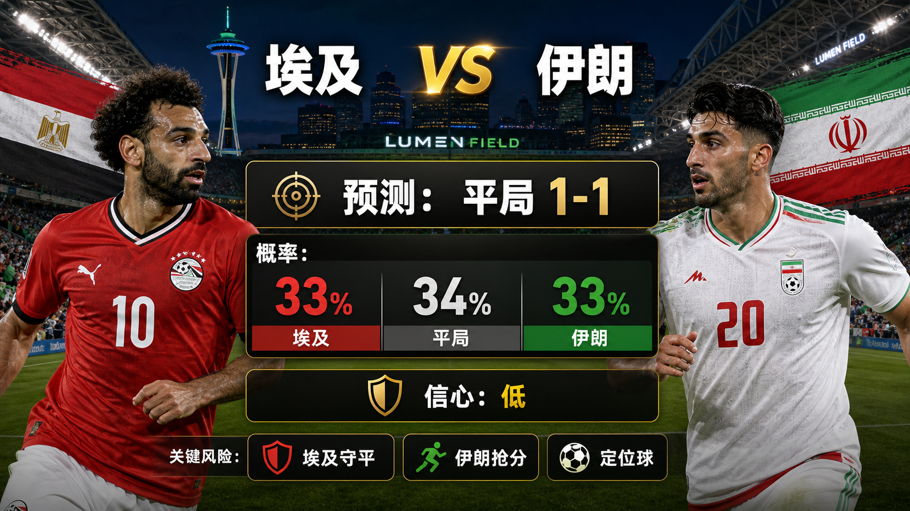

# 每日报告：2026-06-27

[仪表盘](../../docs/README.zh-CN.md) | [English](2026-06-27.md) | [来源](../../docs/sources.zh-CN.md)

## 快照

- 核验时间：2026-06-27T22:45:00+08:00。
- 中国时间目标日期：2026-06-27。
- 仓库已跟踪比赛：72。
- 已发布预测：72。
- 已跟踪完赛结果：66。
- 已发布赛后复盘：66。

## 分享图片

逐场分享图：

## 总览图说明

总览图汇总中国时间 2026-06-27 的预测，列出中国时间开球、胜 / 平 / 负概率和三条比分路径：主情景、保守 / 平局路径、上限 / 替代路径。预测依据包括赛程核验、FIFA 排名页、前序小组赛结果、场地 / 天气备注，以及截至第 066 场的复盘校准。最终首发、临场医疗消息、比赛小时级天气、完整赔率变化和早段进球仍可能改变比赛脚本。仅为足球赛事预测，不构成任何投资建议。

## 近期比赛

| 比赛 | 阶段 | 开球 | 场地 | 预测 |
| --- | --- | --- | --- | --- |
| 挪威 vs 法国 | I 组 | 2026-06-26 19:00 UTC / 2026-06-27 03:00 中国时间 | Boston Stadium | [法国胜，1-2](../../predictions/match-061-nor-fra.zh-CN.md) / [English](../../predictions/match-061-nor-fra.md) |
| 塞内加尔 vs 伊拉克 | I 组 | 2026-06-26 19:00 UTC / 2026-06-27 03:00 中国时间 | Toronto Stadium | [塞内加尔胜，2-1](../../predictions/match-062-sen-irq.zh-CN.md) / [English](../../predictions/match-062-sen-irq.md) |
| 埃及 vs 伊朗 | G 组 | 2026-06-27 03:00 UTC / 2026-06-27 11:00 中国时间 | Seattle Stadium | [平局，1-1](../../predictions/match-063-egy-irn.zh-CN.md) / [English](../../predictions/match-063-egy-irn.md) |
| 新西兰 vs 比利时 | G 组 | 2026-06-27 03:00 UTC / 2026-06-27 11:00 中国时间 | BC Place Vancouver | [比利时胜，0-2](../../predictions/match-064-nzl-bel.zh-CN.md) / [English](../../predictions/match-064-nzl-bel.md) |
| 佛得角 vs 沙特阿拉伯 | H 组 | 2026-06-27 00:00 UTC / 2026-06-27 08:00 中国时间 | Houston Stadium | [佛得角胜，1-0](../../predictions/match-065-cpv-ksa.zh-CN.md) / [English](../../predictions/match-065-cpv-ksa.md) |
| 乌拉圭 vs 西班牙 | H 组 | 2026-06-27 00:00 UTC / 2026-06-27 08:00 中国时间 | Guadalajara Stadium | [西班牙胜，1-2](../../predictions/match-066-uru-esp.zh-CN.md) / [English](../../predictions/match-066-uru-esp.md) |

## 预测

| 比赛 | 倾向 | 概率摘要 | 关键风险 |
| --- | --- | --- | --- |
| 挪威 vs 法国 | 法国胜，1-2 | NOR 25%, 平局 28%, FRA 47% | 挪威反击、法国轮换，以及 I 组头名压力。 |
| 塞内加尔 vs 伊拉克 | 塞内加尔胜，2-1 | SEN 47%, 平局 27%, IRQ 26% | 伊拉克反击、塞内加尔防线间距，以及末轮压力。 |
| 埃及 vs 伊朗 | 平局，1-1 | EGY 33%, 平局 34%, IRN 33% | 埃及守平动机、伊朗抢分压力和定位球。 |
| 新西兰 vs 比利时 | 比利时胜，0-2 | NZL 12%, 平局 22%, BEL 66% | 比利时终结、潜在轮换，以及新西兰定位球。 |
| 佛得角 vs 沙特阿拉伯 | 佛得角胜，1-0 | CPV 41%, 平局 32%, KSA 27% | 沙特反弹、佛得角终结，以及休斯敦热负荷。 |
| 乌拉圭 vs 西班牙 | 西班牙胜，1-2 | URU 24%, 平局 28%, ESP 48% | 乌拉圭强度、西班牙轮换，以及瓜达拉哈拉节奏。 |

## 比分情景总览

| 比赛 | 情景 | 比分 | 理由 |
| --- | --- | --- | --- |
| 挪威 vs 法国 | 主情景 | 1-2 | 法国阵容深度赢下一场胶着头名战。 |
| 挪威 vs 法国 | 保守 / 平局路径 | 1-1 | 挪威直接威胁和法国轮换让比赛留在平局。 |
| 挪威 vs 法国 | 上限 / 替代路径 | 2-2 | 如果早段打开，两队进攻都能交换机会。 |
| 塞内加尔 vs 伊拉克 | 主情景 | 2-1 | 塞内加尔身体和冲击优势创造足够机会，伊拉克仍有回应。 |
| 塞内加尔 vs 伊拉克 | 保守 / 平局路径 | 1-1 | 伊拉克压窄比赛，塞内加尔终结不稳。 |
| 塞内加尔 vs 伊拉克 | 上限 / 替代路径 | 2-0 | 塞内加尔先得分后让伊拉克追分但缺少清晰机会。 |
| 埃及 vs 伊朗 | 主情景 | 1-1 | 双方都有一次得分能力，但很难拉开。 |
| 埃及 vs 伊朗 | 保守 / 平局路径 | 0-0 | 埃及保护积分位置，伊朗最后一传停滞。 |
| 埃及 vs 伊朗 | 上限 / 替代路径 | 2-1 | 如果伊朗追分拉开，埃及可惩罚空间。 |
| 新西兰 vs 比利时 | 主情景 | 0-2 | 比利时质量和抢分需求带来可控分差。 |
| 新西兰 vs 比利时 | 保守 / 平局路径 | 1-1 | 新西兰定位球得分，比利时终结继续发冷。 |
| 新西兰 vs 比利时 | 上限 / 替代路径 | 0-1 | 比利时控制比赛但分差不大。 |
| 佛得角 vs 沙特阿拉伯 | 主情景 | 1-0 | 佛得角紧凑性把一次机会转化为小胜。 |
| 佛得角 vs 沙特阿拉伯 | 保守 / 平局路径 | 1-1 | 如果佛得角守不住领先，沙特有回应路径。 |
| 佛得角 vs 沙特阿拉伯 | 上限 / 替代路径 | 2-1 | 后段追分拉开后，佛得角再获一次转换机会。 |
| 乌拉圭 vs 西班牙 | 主情景 | 1-2 | 西班牙控制力压过乌拉圭的强度回应。 |
| 乌拉圭 vs 西班牙 | 保守 / 平局路径 | 1-1 | 乌拉圭对抗强度把西班牙限制在一球。 |
| 乌拉圭 vs 西班牙 | 上限 / 替代路径 | 0-2 | 西班牙先得分并干净管理乌拉圭追分。 |

## 复盘

| 比赛 | 最终赛果 | 评级 | 复盘 |
| --- | --- | --- | --- |
| 库拉索 vs 科特迪瓦 | 库拉索 0-2 科特迪瓦 | correct | [复盘](../../reviews/match-055-cuw-civ.zh-CN.md) / [English](../../reviews/match-055-cuw-civ.md) |
| 厄瓜多尔 vs 德国 | 厄瓜多尔 2-1 德国 | wrong | [复盘](../../reviews/match-056-ecu-ger.zh-CN.md) / [English](../../reviews/match-056-ecu-ger.md) |
| 日本 vs 瑞典 | 日本 1-1 瑞典 | correct | [复盘](../../reviews/match-057-jpn-swe.zh-CN.md) / [English](../../reviews/match-057-jpn-swe.md) |
| 突尼斯 vs 荷兰 | 突尼斯 1-3 荷兰 | correct | [复盘](../../reviews/match-058-tun-ned.zh-CN.md) / [English](../../reviews/match-058-tun-ned.md) |
| 土耳其 vs 美国 | 土耳其 3-2 美国 | wrong | [复盘](../../reviews/match-059-tur-usa.zh-CN.md) / [English](../../reviews/match-059-tur-usa.md) |
| 巴拉圭 vs 澳大利亚 | 巴拉圭 0-0 澳大利亚 | partial | [复盘](../../reviews/match-060-par-aus.zh-CN.md) / [English](../../reviews/match-060-par-aus.md) |

## 平台分享包

完整抖音、小红书、微博和微信文案见各预测页。

所有分享免责声明：This is a match prediction only and does not constitute investment advice. 仅为足球赛事预测，不构成任何投资建议。

## 来源核验

- 已检查 FIFA / 可信赛程和结果页面，用于核验复盘比赛和下一预测窗口。
- 已检查 FIFA 排名页和 Climate Central 场次页，用于覆盖球队与场地背景。
