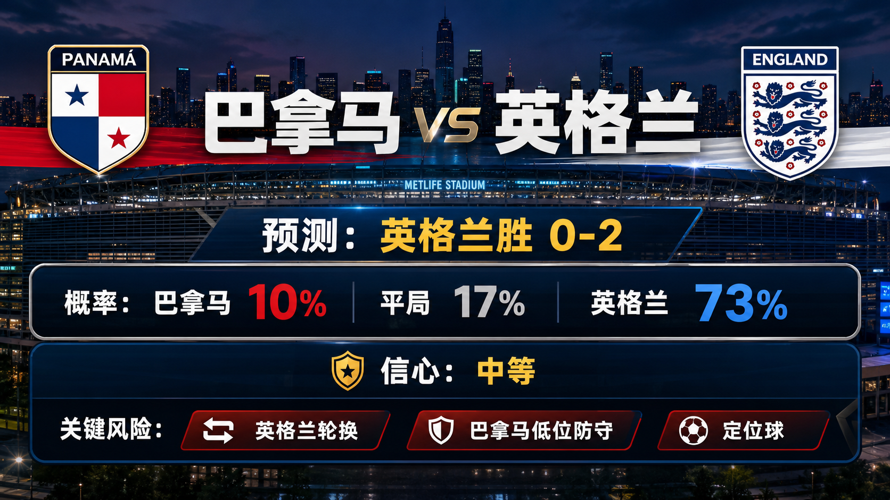
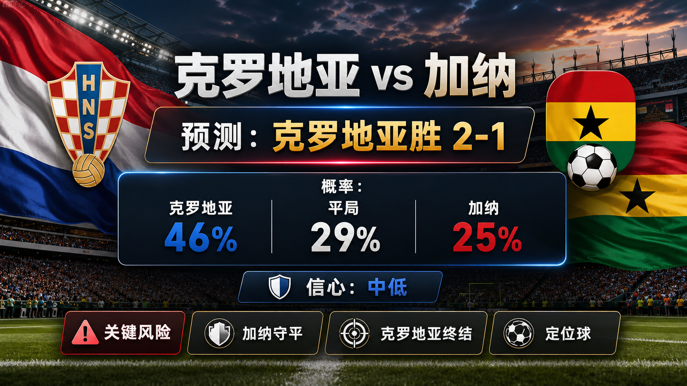
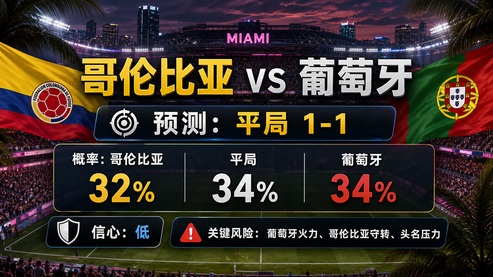
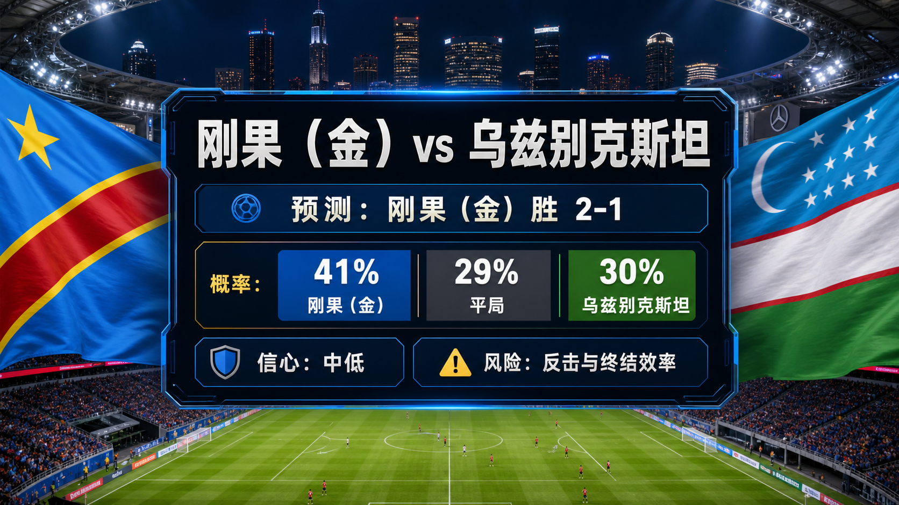
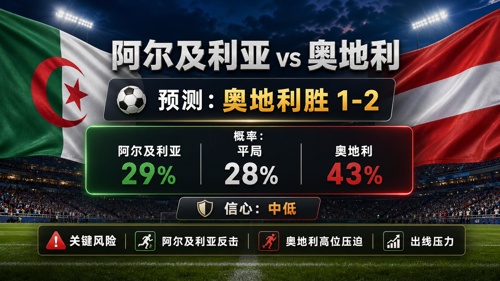
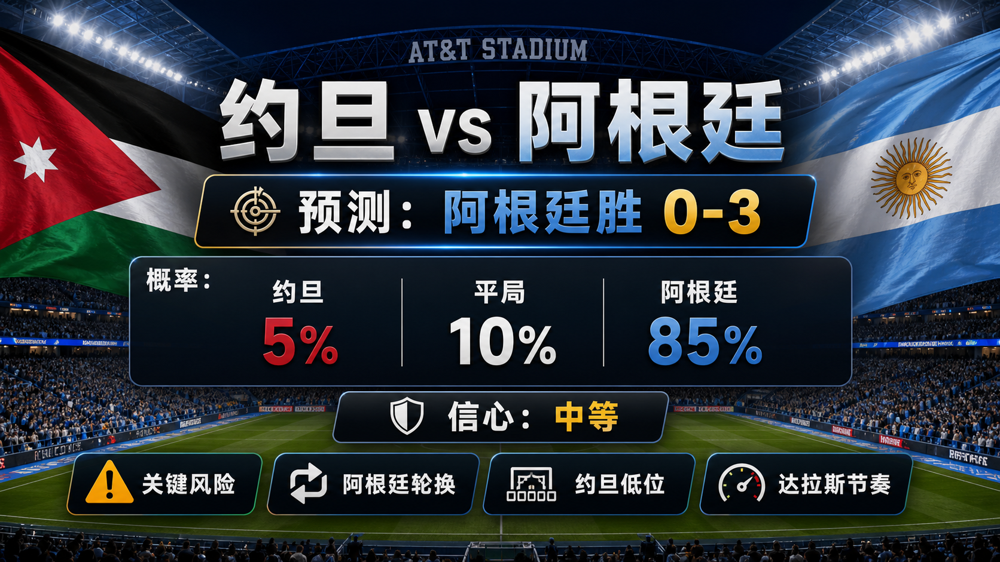

# Daily Report: 2026-06-28

[Dashboard](../../README.md) | [简体中文](2026-06-28.zh-CN.md) | [Sources](../../docs/sources.md)

## Snapshot

- Verification time: 2026-06-27T22:45:00+08:00.
- China-time target date: 2026-06-28.
- Repository-tracked matches: 72.
- Published predictions: 72.
- Final results tracked: 66.
- Published post-match reviews: 66.

## Share Images

Per-match share images:

## Summary Card Notes

The overview card summarizes the China-time 2026-06-28 predictions. It lists kickoff time, win/draw/loss probabilities, and three scoreline paths: `primary`, `conservative_draw_path`, and `upside_alternate`. The forecast uses fixture checks, FIFA ranking pages, prior group results, venue/weather notes, and review calibration through Match 066. Late lineups, medical news, match-hour weather, complete odds movement, and early goals can change the match script. This is a match prediction only and does not constitute investment advice. 仅为足球赛事预测，不构成任何投资建议。

## Next Matches

| Match | Stage | Kickoff | Venue | Prediction |
| --- | --- | --- | --- | --- |
| Panama vs England | Group L | 2026-06-27 21:00 UTC / 2026-06-28 05:00 China time | New York New Jersey Stadium | [England win, 0-2](../../predictions/match-067-pan-eng.md) / [简体中文](../../predictions/match-067-pan-eng.zh-CN.md) |
| Croatia vs Ghana | Group L | 2026-06-27 21:00 UTC / 2026-06-28 05:00 China time | Philadelphia Stadium | [Croatia win, 2-1](../../predictions/match-068-cro-gha.md) / [简体中文](../../predictions/match-068-cro-gha.zh-CN.md) |
| Colombia vs Portugal | Group K | 2026-06-27 23:30 UTC / 2026-06-28 07:30 China time | Miami Stadium | [Draw, 1-1](../../predictions/match-069-col-por.md) / [简体中文](../../predictions/match-069-col-por.zh-CN.md) |
| Congo DR vs Uzbekistan | Group K | 2026-06-27 23:30 UTC / 2026-06-28 07:30 China time | Atlanta Stadium | [Congo DR win, 2-1](../../predictions/match-070-cod-uzb.md) / [简体中文](../../predictions/match-070-cod-uzb.zh-CN.md) |
| Algeria vs Austria | Group J | 2026-06-28 02:00 UTC / 2026-06-28 10:00 China time | Kansas City Stadium | [Austria win, 1-2](../../predictions/match-071-alg-aut.md) / [简体中文](../../predictions/match-071-alg-aut.zh-CN.md) |
| Jordan vs Argentina | Group J | 2026-06-28 02:00 UTC / 2026-06-28 10:00 China time | Dallas Stadium | [Argentina win, 0-3](../../predictions/match-072-jor-arg.md) / [简体中文](../../predictions/match-072-jor-arg.zh-CN.md) |

## Predictions

| Match | Lean | Probability Summary | Key Risk |
| --- | --- | --- | --- |
| Panama vs England | England win, 0-2 | PAN 10%, draw 17%, ENG 73% | England rotation, Panama's low block, and set pieces. |
| Croatia vs Ghana | Croatia win, 2-1 | CRO 46%, draw 29%, GHA 25% | Ghana protecting a draw, Croatia finishing variance, and set pieces. |
| Colombia vs Portugal | Draw, 1-1 | COL 32%, draw 34%, POR 34% | Portugal's firepower, Colombia's rest defense, and first-place incentives. |
| Congo DR vs Uzbekistan | Congo DR win, 2-1 | COD 41%, draw 29%, UZB 30% | Uzbekistan counters, Congo DR finishing, and final-match pressure. |
| Algeria vs Austria | Austria win, 1-2 | ALG 29%, draw 28%, AUT 43% | Algeria counters, Austria pressing, and qualification pressure. |
| Jordan vs Argentina | Argentina win, 0-3 | JOR 5%, draw 10%, ARG 85% | Argentina rotation, Jordan's low block, and Dallas tempo. |

## Scoreline Scenario Overview

| Match | Scenario | Scoreline | Rationale |
| --- | --- | --- | --- |
| Panama vs England | primary | 0-2 | England's depth and table control create a clean two-goal path. |
| Panama vs England | conservative_draw_path | 0-0 | Panama's low block and England rotation slow the game. |
| Panama vs England | upside_alternate | 0-3 | If England score early, Panama's chase opens the margin. |
| Croatia vs Ghana | primary | 2-1 | Croatia's ranking and must-win pressure create enough late volume. |
| Croatia vs Ghana | conservative_draw_path | 1-1 | Ghana's compactness turns the match into a shared-point script. |
| Croatia vs Ghana | upside_alternate | 1-0 | Croatia edge a lower-tempo match through one set-play or box entry. |
| Colombia vs Portugal | primary | 1-1 | Two qualified-level sides trade control without needing full exposure. |
| Colombia vs Portugal | conservative_draw_path | 0-0 | Both protect table position and chance quality stays low. |
| Colombia vs Portugal | upside_alternate | 1-2 | Portugal's attacking quality wins if Colombia overprotect the draw. |
| Congo DR vs Uzbekistan | primary | 2-1 | Congo DR's physical edge turns pressure into two scoring phases. |
| Congo DR vs Uzbekistan | conservative_draw_path | 1-1 | Uzbekistan stay compact and punish one open transition. |
| Congo DR vs Uzbekistan | upside_alternate | 1-0 | A lower-tempo match still leaves Congo DR with the cleaner single chance. |
| Algeria vs Austria | primary | 1-2 | Austria's press and ranking edge narrowly beat Algeria's transition threat. |
| Algeria vs Austria | conservative_draw_path | 1-1 | Both teams protect against the decisive mistake. |
| Algeria vs Austria | upside_alternate | 0-2 | Austria score first and Algeria's chase opens the second goal. |
| Jordan vs Argentina | primary | 0-3 | Argentina's quality and depth eventually stretch Jordan's block. |
| Jordan vs Argentina | conservative_draw_path | 0-2 | Argentina rotate and control without chasing a larger margin. |
| Jordan vs Argentina | upside_alternate | 1-3 | Jordan find one set-piece response but Argentina still separate. |

## Reviews

| Match | Final Result | Rating | Review |
| --- | --- | --- | --- |
| Norway vs France | Norway 1-4 France | partial | [Review](../../reviews/match-061-nor-fra.md) / [简体中文](../../reviews/match-061-nor-fra.zh-CN.md) |
| Senegal vs Iraq | Senegal 5-0 Iraq | partial | [Review](../../reviews/match-062-sen-irq.md) / [简体中文](../../reviews/match-062-sen-irq.zh-CN.md) |
| Egypt vs IR Iran | Egypt 1-1 IR Iran | correct | [Review](../../reviews/match-063-egy-irn.md) / [简体中文](../../reviews/match-063-egy-irn.zh-CN.md) |
| New Zealand vs Belgium | New Zealand 1-5 Belgium | partial | [Review](../../reviews/match-064-nzl-bel.md) / [简体中文](../../reviews/match-064-nzl-bel.zh-CN.md) |
| Cabo Verde vs Saudi Arabia | Cabo Verde 0-0 Saudi Arabia | wrong | [Review](../../reviews/match-065-cpv-ksa.md) / [简体中文](../../reviews/match-065-cpv-ksa.zh-CN.md) |
| Uruguay vs Spain | Uruguay 0-1 Spain | correct | [Review](../../reviews/match-066-uru-esp.md) / [简体中文](../../reviews/match-066-uru-esp.zh-CN.md) |

## Platform Share Package

Use the prediction pages for full Douyin, Xiaohongshu, Weibo, and WeChat copy.

Disclaimer for all shares: This is a match prediction only and does not constitute investment advice. 仅为足球赛事预测，不构成任何投资建议。

## Source Checks

- FIFA/reputable schedule and result pages were checked for the reviewed matches and next prediction window.
- FIFA ranking pages and Climate Central match pages were checked for venue and team context.
