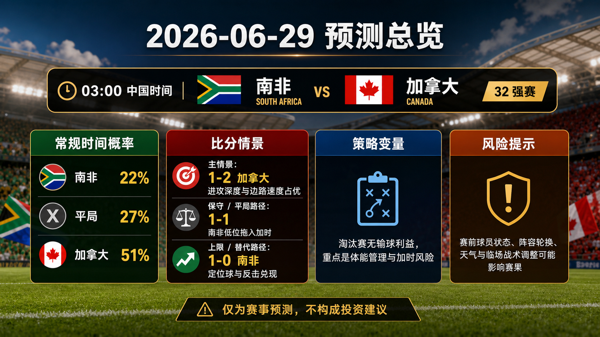

# Daily Report: 2026-06-29

[Dashboard](../../README.md) | [简体中文](2026-06-29.zh-CN.md) | [Sources](../../docs/sources.md)

## Snapshot

- Verification time: 2026-06-28T17:00:00+08:00.
- China-time target date: 2026-06-29.
- Repository-tracked matches: 73.
- Published predictions: 73.
- Final results tracked: 72.
- Published post-match reviews: 72.

## Share Images

Per-match share images:

## Summary Card Notes

The overview card summarizes the China-time 2026-06-29 prediction. It lists kickoff time, regulation-time probabilities, advancement lean, and three scoreline paths: `primary`, `conservative_draw_path`, and `upside_alternate`. The forecast uses current fixture checks, group results through Match 072, FIFA ranking pages, team-news reporting, bracket path checks, and review calibration through Match 072. Late lineups, medical news, match-hour weather, complete odds movement, and extra-time game state can change the forecast. This is a match prediction only and does not constitute investment advice. 仅为足球赛事预测，不构成任何投资建议。

## Next Match

| Match | Stage | Kickoff | Venue | Prediction |
| --- | --- | --- | --- | --- |
| South Africa vs Canada | Round of 32 | 2026-06-28 19:00 UTC / 2026-06-29 03:00 China time | Los Angeles Stadium | [Canada win, 1-2](../../predictions/match-073-rsa-can.md) / [简体中文](../../predictions/match-073-rsa-can.zh-CN.md) |

## Prediction

| Match | Lean | Probability Summary | Key Risk |
| --- | --- | --- | --- |
| South Africa vs Canada | Canada win, 1-2 | RSA 22%, draw 27%, CAN 51%; advancement CAN 62% | South Africa low block, Canada midfield fitness, and extra-time path. |

## Scoreline Scenario Overview

| Match | Scenario | Scoreline | Rationale |
| --- | --- | --- | --- |
| South Africa vs Canada | primary | 1-2 | Canada's attacking depth and left-side speed create the clearest regulation-time edge. |
| South Africa vs Canada | conservative_draw_path | 1-1 | South Africa's compact block and set-piece route can drag the match toward extra time. |
| South Africa vs Canada | upside_alternate | 1-0 | South Africa turn one restart or transition into an underdog knockout script. |

## Reviews

| Match | Final Result | Rating | Review |
| --- | --- | --- | --- |
| Panama vs England | Panama 0-2 England | correct | [Review](../../reviews/match-067-pan-eng.md) / [简体中文](../../reviews/match-067-pan-eng.zh-CN.md) |
| Croatia vs Ghana | Croatia 2-1 Ghana | correct | [Review](../../reviews/match-068-cro-gha.md) / [简体中文](../../reviews/match-068-cro-gha.zh-CN.md) |
| Colombia vs Portugal | Colombia 0-0 Portugal | correct | [Review](../../reviews/match-069-col-por.md) / [简体中文](../../reviews/match-069-col-por.zh-CN.md) |
| Congo DR vs Uzbekistan | Congo DR 3-1 Uzbekistan | correct | [Review](../../reviews/match-070-cod-uzb.md) / [简体中文](../../reviews/match-070-cod-uzb.zh-CN.md) |
| Algeria vs Austria | Algeria 3-3 Austria | wrong | [Review](../../reviews/match-071-alg-aut.md) / [简体中文](../../reviews/match-071-alg-aut.zh-CN.md) |
| Jordan vs Argentina | Jordan 1-3 Argentina | correct | [Review](../../reviews/match-072-jor-arg.md) / [简体中文](../../reviews/match-072-jor-arg.zh-CN.md) |

## Platform Share Package

Use the prediction page for full Douyin, Xiaohongshu, Weibo, and WeChat copy.

Disclaimer for all shares: This is a match prediction only and does not constitute investment advice. 仅为足球赛事预测，不构成任何投资建议。

## Source Checks

- FIFA/reputable schedule and result pages were checked for the reviewed matches and the next prediction window.
- Guardian/Opta-style team-news and bracket-path context were checked for South Africa vs Canada.
