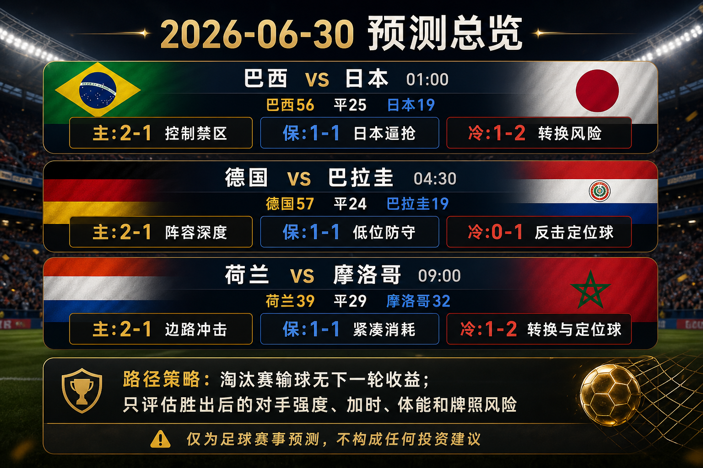

# 日报：2026-06-30

[仪表盘](../../docs/README.zh-CN.md) | [English](2026-06-30.md) | [来源](../../docs/sources.zh-CN.md)

## 快照

- 核验时间：2026-06-29T22:15:00+08:00。
- 中国时间目标日期：2026-06-30。
- 仓库已跟踪比赛：76。
- 已发布预测：76。
- 已跟踪完赛结果：73。
- 已发布赛后复盘：73。

## 分享图片

单场分享图片：

## 总览图说明

总览图汇总中国时间 2026-06-30 的 32 强赛预测窗口，包含巴西 vs 日本、德国 vs 巴拉圭、荷兰 vs 摩洛哥的开球时间、常规时间概率、晋级倾向和三条比分路径。本轮预测使用 FIFA 赛程核验、第 073 场以前已确认结果、FIFA 排名页、公开赔率和预览片段、天气 / 场地检查，以及赛程路径映射。临场首发、医疗消息、小时级天气、完整赔率变化和加时赛状态仍可能改变预测。仅为足球赛事预测，不构成任何投资建议。

## 近期比赛

| 比赛 | 阶段 | 开球 | 场地 | 预测 |
| --- | --- | --- | --- | --- |
| 巴西 vs 日本 | 32 强赛 | 2026-06-29 17:00 UTC / 2026-06-30 01:00 中国时间 | Houston Stadium | [巴西胜，2-1](../../predictions/match-076-bra-jpn.zh-CN.md) / [English](../../predictions/match-076-bra-jpn.md) |
| 德国 vs 巴拉圭 | 32 强赛 | 2026-06-29 20:30 UTC / 2026-06-30 04:30 中国时间 | Boston Stadium | [德国胜，2-1](../../predictions/match-074-ger-par.zh-CN.md) / [English](../../predictions/match-074-ger-par.md) |
| 荷兰 vs 摩洛哥 | 32 强赛 | 2026-06-30 01:00 UTC / 2026-06-30 09:00 中国时间 | Monterrey Stadium | [荷兰胜，2-1](../../predictions/match-075-ned-mar.zh-CN.md) / [English](../../predictions/match-075-ned-mar.md) |

## 预测

| 比赛 | 倾向 | 概率摘要 | 关键风险 |
| --- | --- | --- | --- |
| 巴西 vs 日本 | 巴西胜，2-1 | BRA 56%，平局 25%，JPN 19%；晋级倾向 BRA 66% | 淘汰赛输球没有路径收益；下一轮对手、加时、牌照和体能管理影响信心。 |
| 德国 vs 巴拉圭 | 德国胜，2-1 | GER 57%，平局 24%，PAR 19%；晋级倾向 GER 68% | 淘汰赛输球没有路径收益；下一轮对手、加时、牌照和体能管理影响信心。 |
| 荷兰 vs 摩洛哥 | 荷兰胜，2-1 | NED 39%，平局 29%，MAR 32%；晋级倾向 NED 56% | 淘汰赛输球没有路径收益；下一轮对手、加时、牌照和体能管理影响信心。 |

## 比分情景总览

| 比赛 | 情景 | 比分 | 理由 |
| --- | --- | --- | --- |
| 巴西 vs 日本 | 主情景 | 2-1 | 巴西禁区质量占优，但日本的协同压迫足以制造一球或持续压力。 |
| 巴西 vs 日本 | 保守 / 平局路径 | 1-1 | 日本协同压迫和巴西耐心控局让比赛进入低差距加时区间。 |
| 巴西 vs 日本 | 上限 / 替代路径 | 1-2 | 日本惩罚巴西后场出球失误或定位球，并守住末段领先。 |
| 德国 vs 巴拉圭 | 主情景 | 2-1 | 德国的阵容深度和机会创造能力压过巴拉圭的低位反击计划。 |
| 德国 vs 巴拉圭 | 保守 / 平局路径 | 1-1 | 巴拉圭用低位防守和降速把比赛拖入加时区间。 |
| 德国 vs 巴拉圭 | 上限 / 替代路径 | 0-1 | 如果德国压上后被定位球或转换惩罚，巴拉圭存在下风方取胜路线。 |
| 荷兰 vs 摩洛哥 | 主情景 | 2-1 | 荷兰依靠边路推进和后手进攻深度，在高质量对抗中小胜。 |
| 荷兰 vs 摩洛哥 | 保守 / 平局路径 | 1-1 | 摩洛哥的紧凑防守和转换纪律把比赛拖入加时区间。 |
| 荷兰 vs 摩洛哥 | 上限 / 替代路径 | 1-2 | 摩洛哥通过转换或定位球惩罚荷兰防线身后空间。 |

## 复盘

| 比赛 | 最终赛果 | 评级 | 复盘 |
| --- | --- | --- | --- |
| 南非 vs 加拿大 | 南非 0-1 加拿大 | correct | [复盘](../../reviews/match-073-rsa-can.zh-CN.md) / [English](../../reviews/match-073-rsa-can.md) |

## 平台发布包

各预测页包含完整抖音、小红书、微博和微信文案。统一策略表述：淘汰赛输球不会获得下一轮机会，因此赛程路径激励重点是胜出后的对手强度、旅行 / 休息、牌照、换人和加时暴露。

所有发布免责声明：This is a match prediction only and does not constitute investment advice. 仅为足球赛事预测，不构成任何投资建议。

## 来源检查

- 已用 FIFA / 可靠赛程和赛果页面核验第 073 场以及第 074-076 场。
- 已对每场新增预测检查排名、天气 / 场地、公开市场、专家预览和赛程路径来源。
