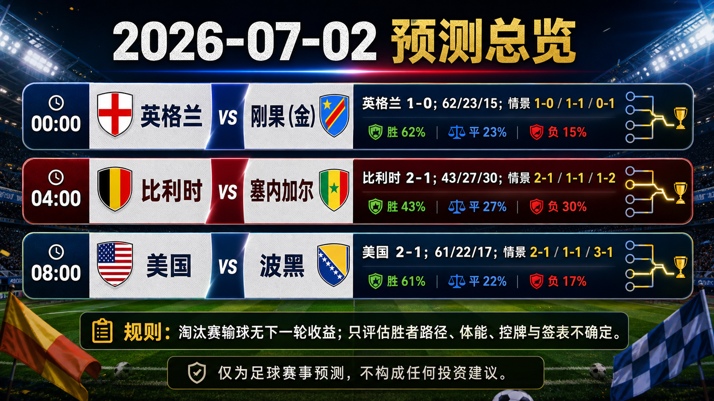
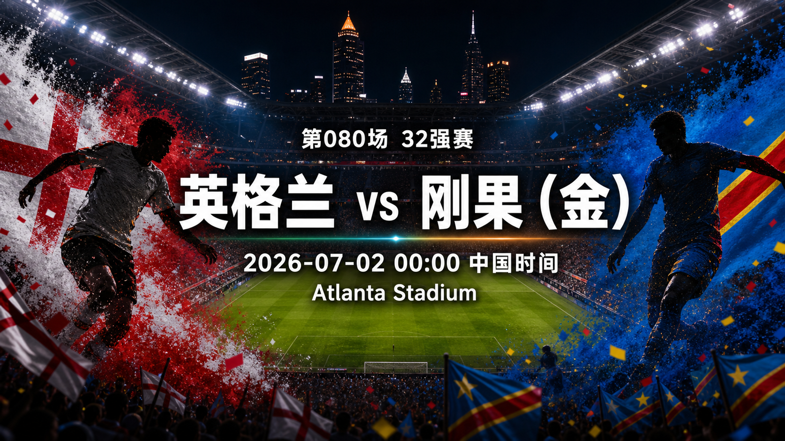
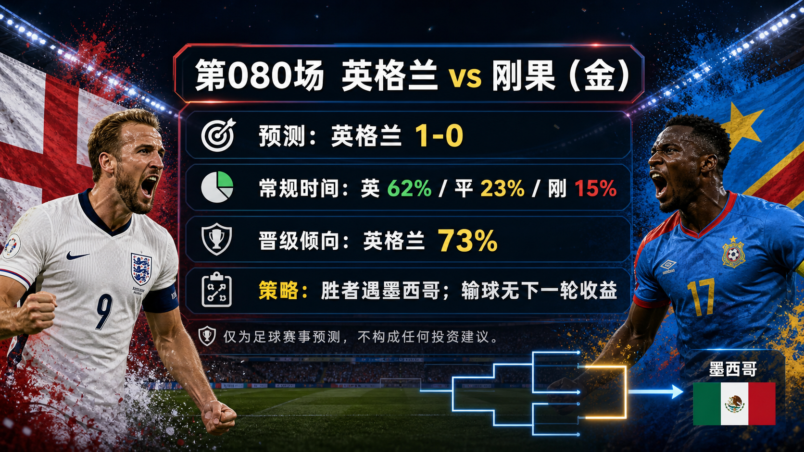
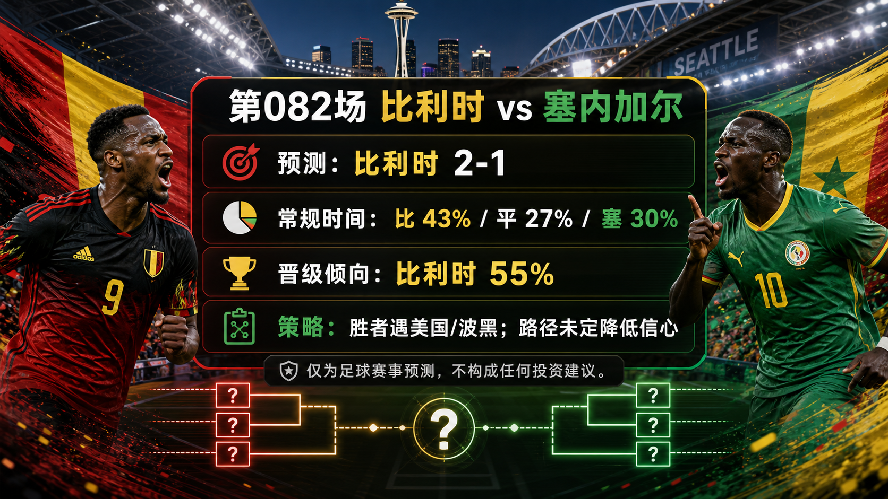
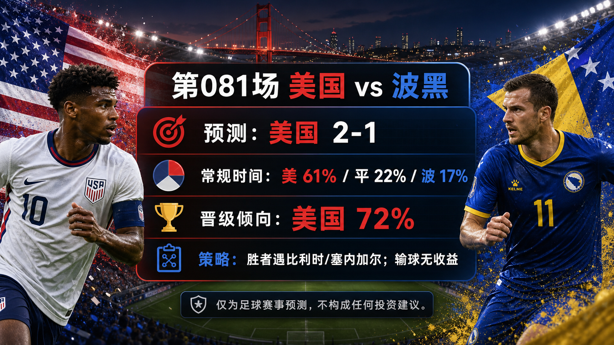

# Daily Report: 2026-07-02

[Dashboard](../../README.md) | [简体中文](2026-07-02.zh-CN.md) | [Sources](../../docs/sources.md)

## Snapshot

- Verification time: 2026-07-01T20:51:00+08:00.
- China-time target date: 2026-07-02.
- Repository-tracked matches: 82.
- Published predictions: 82.
- Final results tracked: 79.
- Published post-match reviews: 79.

## Share Images

Per-match share images:

## Summary Card Notes

The overview card summarizes the China-time 2026-07-02 Round of 32 prediction window. It lists kickoff time, regulation-time probabilities, advancement lean, and three scoreline paths for England vs Congo DR, Belgium vs Senegal, and USA vs Bosnia and Herzegovina. The forecast uses FIFA fixture/result checks, verified results through Match 079, FIFA ranking pages, public preview/probability snippets, weather/venue checks, and bracket-path mapping. Late lineups, medical news, suspensions, match-hour weather, complete odds movement, and extra-time or penalty game state can change the forecast. This is a match prediction only and does not constitute investment advice. 仅为足球赛事预测，不构成任何投资建议。

## Next Matches

| Match | Stage | Kickoff | Venue | Prediction |
| --- | --- | --- | --- | --- |
| England vs Congo DR | Round of 32 | 2026-07-01 16:00 UTC / 2026-07-02 00:00 China time | Atlanta Stadium | [England win, 1-0](../../predictions/match-080-eng-cod.md) / [简体中文](../../predictions/match-080-eng-cod.zh-CN.md) |
| Belgium vs Senegal | Round of 32 | 2026-07-01 20:00 UTC / 2026-07-02 04:00 China time | Seattle Stadium | [Belgium win, 2-1](../../predictions/match-082-bel-sen.md) / [简体中文](../../predictions/match-082-bel-sen.zh-CN.md) |
| USA vs Bosnia and Herzegovina | Round of 32 | 2026-07-02 00:00 UTC / 2026-07-02 08:00 China time | San Francisco Bay Area Stadium | [USA win, 2-1](../../predictions/match-081-usa-bih.md) / [简体中文](../../predictions/match-081-usa-bih.zh-CN.md) |

## Prediction

| Match | Lean | Probability Summary | Key Strategy Read |
| --- | --- | --- | --- |
| England vs Congo DR | England win, 1-0 | ENG 62%, draw 23%, COD 15%; advancement ENG 73% | Winner faces Mexico; knockout loss has no future benefit, so the path incentive is efficient win management. |
| Belgium vs Senegal | Belgium win, 2-1 | BEL 43%, draw 27%, SEN 30%; advancement BEL 55% | Winner faces USA/Bosnia; path uncertainty lowers confidence and raises extra-time cost. |
| USA vs Bosnia and Herzegovina | USA win, 2-1 | USA 61%, draw 22%, BIH 17%; advancement USA 72% | Winner faces Belgium/Senegal; W82 may be known by kickoff, but losing still has no benefit. |

## Scoreline Scenario Overview

| Match | Scenario | Scoreline | Rationale |
| --- | --- | --- | --- |
| England vs Congo DR | primary | 1-0 | England's control and set-piece pressure create one decisive chance while Congo DR keep the match compact. |
| England vs Congo DR | conservative_draw_path | 1-1 | Congo DR survive long spells without the ball and convert a transition or dead-ball chance. |
| England vs Congo DR | upside_alternate | 0-1 | England's possession becomes sterile, and Congo DR protect an early transition goal. |
| Belgium vs Senegal | primary | 2-1 | Belgium's final-third quality edges a volatile match, but Senegal's pace keeps the margin narrow. |
| Belgium vs Senegal | conservative_draw_path | 1-1 | Senegal's compactness and transition threat slow Belgium enough to force extra time. |
| Belgium vs Senegal | upside_alternate | 1-2 | Senegal attack Belgium's ageing defensive spaces and turn one transition into the decisive goal. |
| USA vs Bosnia and Herzegovina | primary | 2-1 | USA use home tempo and wide pressure to create enough chances, while Bosnia's set-piece threat keeps one goal live. |
| USA vs Bosnia and Herzegovina | conservative_draw_path | 1-1 | Bosnia slow the match, win aerial duels, and force extra-time pressure. |
| USA vs Bosnia and Herzegovina | upside_alternate | 3-1 | USA score first, press into transition chances, and stretch Bosnia late. |

## Reviews

| Match | Final Result | Rating | Review |
| --- | --- | --- | --- |
| France vs Sweden | France 3-0 Sweden | correct | [Review](../../reviews/match-077-fra-swe.md) / [简体中文](../../reviews/match-077-fra-swe.zh-CN.md) |
| Cote d'Ivoire vs Norway | Cote d'Ivoire 1-2 Norway | correct | [Review](../../reviews/match-078-civ-nor.md) / [简体中文](../../reviews/match-078-civ-nor.zh-CN.md) |
| Mexico vs Ecuador | Mexico 2-0 Ecuador | partial | [Review](../../reviews/match-079-mex-ecu.md) / [简体中文](../../reviews/match-079-mex-ecu.zh-CN.md) |

## Platform Share Package

Use each prediction page for full Douyin, Xiaohongshu, Weibo, and WeChat copy. Shared strategic framing: knockout losses do not create a next-round opportunity, so the bracket-path incentive analysis focuses on win-path opponent quality, rest/travel, cards, substitutions, extra-time exposure, and whether any Tian Ji-style path-selection hypothesis is evidence-backed.

Disclaimer for all shares: This is a match prediction only and does not constitute investment advice. 仅为足球赛事预测，不构成任何投资建议。

## Source Checks

- FIFA/reputable schedule and result pages were checked for Match 077-082.
- Ranking, weather/venue, public market, expert-preview, and bracket-path sources were checked for every new prediction.
- Post-match reviews were created for France vs Sweden, Cote d'Ivoire vs Norway, and Mexico vs Ecuador.
